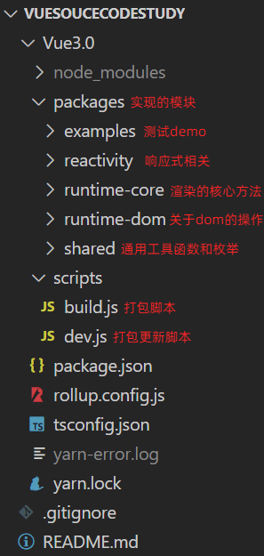
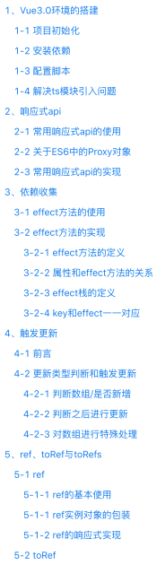
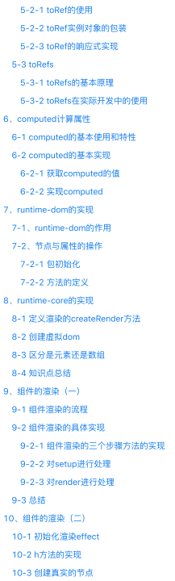
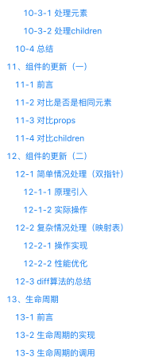
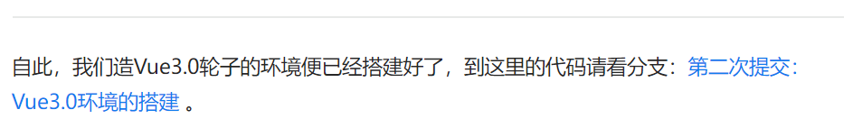

# VueSouceCodeStudy

## 1、项目介绍

### 1.1 项目概括

👉 项目 github 地址：https://github.com/XC0703/VueSouceCodeStudy

🔨 项目说明文档掘金地址：https://juejin.cn/post/7336865403300315188

（希望各位看官给本菜鸡的项目点个 star，不胜感激。）

本项目是本人学习 Vue3.0 核心源码的记录，包含 mini-vue3.0 的实现代码以及笔记等形式。参考教学视频：[【已完结】全网最详细 Vue3 源码解析！（一行行带你手写 Vue3 源码）](https://www.bilibili.com/video/BV1td4y1r76e/?share_source=copy_web&vd_source=238287d1a721e0d89c0c394344147e45)。

### 1.2 为什么要做这个项目？

[vue3](https://github.com/vuejs/core) 作为目前最出名的前端开源项目之一，大家除了学会如何使用以外，肯定是想在深入到源码里面，看看这些 nb 的功能到底是如何实现的，或者是增加自己的核心竞争力搞懂原理，面试的时候装个 13。但是当我们打开 [vue3 的源码](https://github.com/vuejs/core) 之后你会发现，代码量是如此之多。这个源码到底该从何读起。虽然 vue3 代码的可读性是很高的，但是架不住代码量大呀！！！但是 vue 火之后，一些优秀的程序员小伙伴秉持着**开源拯救世界**的精神，开源了一些项目/文章带大家去了解学习 vue 源码，其中最出名的莫过于崔效瑞老师的[mini-vue](https://github.com/cuixiaorui/mini-vue)项目，该项目还受到阮一峰大佬的推荐，不少小伙伴在该项目的指引下去了解学习了 vue 源码。

因此，本项目模仿[mini-vue](https://github.com/cuixiaorui/mini-vue)项目，从 0 到 1 实现了一个我自己的[mini-vue3.0](https://github.com/XC0703/VueSouceCodeStudy)项目（与崔老师的[mini-vue](https://github.com/cuixiaorui/mini-vue)项目相比，少了模版解析编译与单元测试的模块），同时附带一份总字数达 `3w+`的学习记录笔记，详细地带大家深入理解 vue3 设计原理。

**注意：本 mini-vue3 项目还不是很完善，比如缺少核心的模版编译模块与单元测试模块。但是，完整地实现本项目依然可以去了解学习 vue3 的设计思想原理，无论对于完善剩余的模块，还是去看完整的 vue 源码，都可以起到十分重要的帮助。**

### 1.3 实现的功能

- reactivity
  - [x] reactive（只支持普通对象和 Map、Set 对象的响应式代理）
  - [x] shallowReactive
  - [x] readonly
  - [x] shallowReadonly
  - [x] effect
  - [x] ref
  - [x] toRef
  - [x] toRefs
  - [x] computed
- runtime-core
  - [x] createAppAPI
  - [x] render（包括首次渲染与 diff 更新）
  - [x] h
  - [x] getCurrentInstance
  - [x] apilifecycle
    - [x] onBeforeMount
    - [x] onMounted
    - [x] onBeforeUpdate
    - [x] onUpdated
- runtime-dom
  - [x] createApp
  - [x] renderOptionDom（包括节点操作与属性操作）
- shared

  - [x] 基本的通用工具函数和枚举

**因此，该项目基本实现了 vue3.0 的响应式、组件渲染与更新以及生命周期等核心功能。**

## 2、项目开发教程

### 2.1 项目如何启动?

1. 先拉取本项目到本地：

   ```
   git clone git@github.com:XC0703/VueSouceCodeStudy.git
   ```

2. 用 VScode 等编辑器打开本项目并进入项目：

   ```
   cd Vue3.0
   ```

3. 依赖安装

   ```
   yarn install
   ```

4. 执行

   ```
   npm run build
   ```

   此时推荐用`Live Server` 打开`Vue3.0\packages\examples`下面的任意一个测试 demo 网页，即可以在浏览器看到效果。

### 2.2 项目整体结构



项目整体采用和 vue3 源码相同的 monorepo 前端项目管理，源码结构、函数名和 vue3 基本一致。

> monorepo 介绍：monorepo 是一种将多个 package 放在一个 repo 中的代码管理模式。（每个 package 都有自己的 package.json 文件，比如编译模块的包、响应式模块的包等，相互隔离开来，方便更新修改）

同时项目采用的技术栈与 vue3 源码一致（ts 实现+rollup 打包），但是因为我们的目的只是去搞清楚 vue3.0 的原理，更多的是逻辑方面的实现，像类型强制与边界处理这些细节是要被我们去忽略的。

### 2.3 项目开发笔记部分

这部分也是该项目的重中之重，因为直接去看代码的话可能会导致一头雾水。仓库中的`个人前端学习笔记_Vue3源码解析学习笔记.pdf`是本人在实现该项目时的一些笔记：





该笔记总字数达 `3w+`，清晰地将项目分成十几步去实现，并且每步结束之后都有文字提示找到对应的分支代码（代码注释充分）：

这样便使得每次跟着笔记一步步地去实现时，如果遇到问题，可以去源码里面立即定位看看哪里不同。

## 3、写在最后

### 3.1 后续计划

#### 3.1.1 完善项目

后续想完善模版编译模块，毕竟现在这个 mini-vue 过于 mini 了，显得不伦不类了。下面是详细教程：

- [编译模块的视频](https://www.bilibili.com/video/BV1564y1s7s5?p=9) 这个视频可以参照集成进自己的项目中

- 一个大佬总结的编译方面的文章可以去看看:

  - [beggar-vue](https://github.com/tim101010101/beggar-vue) 这是那个大佬实现的 mini-vue
  - [编译模块 1: 一些前置知识](https://juejin.cn/post/7031908854388490248)
  - [编译模块 2: parse 准备](https://juejin.cn/post/7031909256702099493)
  - [编译模块 3: parse 实现](https://juejin.cn/post/7031909316227498020)
  - [编译模块 4: transform 实现](https://juejin.cn/post/7031910167784456205)
  - [编译模块 5: directiveTransforms 实现](https://juejin.cn/post/7031910475411816485)
  - [编译模块 6: codegen 实现](https://juejin.cn/post/7031911112102969358)
  - [编译模块 7: compile 实现](https://juejin.cn/post/7031911369238642701)

- 崔大佬的 [mini-vue](https://github.com/cuixiaorui/mini-vue) 也实现了编译模块，功能有点少。可以对比着看，可以将里面的功能集成到自己的 mini-vue 中
- [霍春阳大佬的 Compiler 优化文章](https://zhuanlan.zhihu.com/p/150732926)

#### 3.1.2 深入源码

做完这个项目，笔者对于 vue3 源码的结构、源码运行流程、模块间的配合算是比较清楚了。由于知识断层已经补充完毕，接下来就可以深入研究 vue3 源码甚至其它 vue 生态库源码的细节，剩下的只能看自己的理解能力。

#### 3.1.3 书籍阅读

关于 vue3 源码讲解的书籍，最出名的莫过于 Vue.js 官方团队成员霍春阳大佬写的一本关于 vue3 源码的书籍 《vue.js 设计与实现》，这本书对 vue3 原理写的非常的详细，满满的干货，可惜笔者目前为止还没有完整看过，后面得定个计划看完，才能 对 vue 原理进一步了解学习。

### 3.2 总结

在学习完成之后一定要记得反复反复地看自己实现的 mini-vue ，不然你就会发现你学了这个模块忘了那个模块，这样得不偿失。同时学习过程中，笔记一定要跟上，以便以后复习。

上面便是本人学习 vue3 源码的一些记录，没什么创新性的东西，只是一份记录，提供给大家学习的思路，请各位小伙伴多多支持。由于笔者语言描述能力不是太强，文章或者笔记有错误请多批评指正。

✨ 本人掘金博客地址：http://www.xucong.zone

🎨 github 主页地址：https://github.com/XC0703

🏰 gitee 主页地址：https://gitee.com/fish-in-jiangan-river

上面是一些笔者技术社区主页的地址，欢迎各位看官给小弟点个赞，与诸君共勉。
