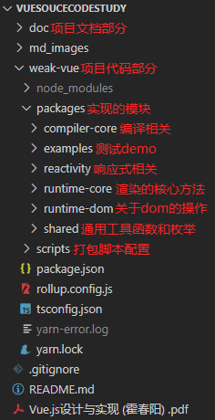

# VueSouceCodeStudy

## 1、项目介绍

### 1.1 项目概括

👉 项目 `Github` 地址：<https://github.com/XC0703/VueSouceCodeStudy>

🔨 项目说明文档掘金地址：<https://juejin.cn/post/7336865403300315188>

✨ 本项目是本人学习 `Vue3` 核心源码的记录，包含简易版 `Vue3` 的实现代码以及笔记等形式。

🎨 项目亮点：

- 仿照 `Vue` 源码的 `Monorepo` 架构，并利用 `Rollup` 进行打包，便于模块隔离、依赖管理与代码更新。
- 基于 `Proxy` 实现了响应式系统，包含常用的响应式 `API`、`Effect` 依赖收集与更新等模块。
- 基于虚拟 `DOM` 实现了运行时系统，包含 `Render` 渲染、`Diff` 更新以及生命周期等模块。
- 基于 `AST` 实现了编译系统，包含 `Parse` 模版解析、`Transfrom` 加工以及 `Generate` 渲染函数生成等模块。
- 项目代码注释充分且清晰明确，同时附带一份加上了自己的理解且总字数达 `5w+` 的学习记录笔记。

（希望各位看官给本菜鸡的项目点个 `Star`，不胜感激。）

### 1.2 为什么要做这个项目？

[vue3](https://github.com/vuejs/core) 作为目前最出名的前端开源项目之一，大家除了学会如何使用以外，肯定是想在深入到源码里面，看看这些 nb 的功能到底是如何实现的，或者是增加自己的核心竞争力搞懂原理，面试的时候装个 13。但是当我们打开 [vue3 的源码](https://github.com/vuejs/core) 之后你会发现，代码量是如此之多。这个源码到底该从何读起。虽然 vue3 代码的可读性是很高的，但是架不住代码量大呀！！！但是 vue 火之后，一些优秀的程序员小伙伴秉持着**开源拯救世界**的精神，开源了一些项目/文章带大家去了解学习 vue 源码，其中最出名的莫过于崔效瑞老师的 [mini-vue](https://github.com/cuixiaorui/mini-vue) 项目，该项目还受到阮一峰大佬的推荐，不少小伙伴在该项目的指引下去了解学习了 vue 源码。

因此，本项目模仿 [mini-vue](https://github.com/cuixiaorui/mini-vue) 项目，从 0 到 1 实现了一个我自己的 [weak-vue](https://github.com/XC0703/VueSouceCodeStudy) 项目，同时附带一份总字数达 `5w+`的学习记录笔记，详细地带大家深入理解 vue3 设计原理。

### 1.3 学习本项目的好处

虽然本项目是 vue3 的最简化模型，但是”麻雀虽小，肝胆俱全“，功能基本完善，代码量也足够，跟着做完也会受益颇丰：

- **进一步学习了解 vue 的核心原理和逻辑：比如订阅发布响应式系统的实现，diff 算法的具体逻辑，组件渲染的过程，模版编译的流程等；**
- **了解到工业级代码库优秀的设计：比如 monorepo 的代码组织架构，订阅发布模式、策略模式、工厂模式等设计模式在源码中的运用，shapeFlag、patchFlag 的设计方式等；**
- **巩固基础知识：比如原生 js 对 dom 和各种数据类型的处理，正则表达式的书写，proxy 代理的实现等；**
- **掌握”测试驱动开发“的思想，提高自己的代码编写及调试能力；**
- **了解 monorepo、rollup 的配置，拓宽技术栈；**
- **提高自己文档撰写和总结的能力。**

### 1.4 实现的功能

- reactivity
  - [x] reactive
  - [x] shallowReactive
  - [x] readonly
  - [x] shallowReadonly
  - [x] effect
  - [x] ref
  - [x] toRef
  - [x] toRefs
  - [x] computed
- runtime-core
  - [x] render（包括首次渲染与 diff 更新）
  - [x] createVNode
  - [x] h
  - [x] getCurrentInstance
  - [x] apilifecycle
    - [x] onBeforeMount
    - [x] onMounted
    - [x] onBeforeUpdate
    - [x] onUpdated
- runtime-dom
  - [x] createApp
  - [x] renderOptionDom（包括节点操作与属性操作）
- compiler-core
  - [x] parse
  - [x] transfrom
    - [x] transformElement
    - [x] transformText
    - [x] vBind
    - [x] vOn
  - [x] codegen（generate 渲染函数的生成）
- shared
  - [x] 基本的通用工具函数和枚举

**因此，该项目实现了 vue3 的响应式系统、运行时系统与编译系统的基本功能。**

## 2、项目开发教程

### 2.1 项目如何启动?

1. 先拉取本项目到本地：

   ```bash
   git clone git@github.com:XC0703/VueSouceCodeStudy.git
   ```

2. 用 VScode 等编辑器打开本项目并进入项目：

   ```bash
   cd weak-vue
   ```

3. 依赖安装

   ```bash
   yarn install
   ```

4. 执行

   ```bash
   npm run build
   ```

   此时推荐用`Live Server` 插件打开`weak-vue\packages\examples`下面的任意一个测试 demo 网页，即可以在浏览器看到效果。

### 2.2 项目整体结构



项目整体采用和 vue3 源码相同的 `monorepo` 前端项目管理，源码结构、函数名和 vue3 基本一致。

> **monorepo 介绍**：`monorepo` 是一种将多个 package 放在一个 repo 中的代码管理模式。（每个 package 都有自己的 package.json 文件，比如编译模块的包、响应式模块的包等，相互隔离开来，方便更新修改）

同时项目采用的技术栈与 vue3 源码一致（ts 实现 + rollup 打包），但是因为我们的目的只是去搞清楚 vue3 的原理，更多的是逻辑方面的实现，像类型强制与边界处理这些细节是要被我们去忽略的。

### 2.3 项目开发笔记部分

这部分也是该项目的重中之重，因为直接去看代码的话可能会导致一头雾水。仓库中的`doc`是本人在实现该项目时的一些笔记：</br>

该笔记总字数达 `5w+`，清晰地将项目分成十几步去实现，并且每步结束之后都有文字提示找到对应的分支代码（且代码注释充分）：</br>

这样便使得每次跟着笔记一步步地去实现时，如果遇到问题，可以去源码里面立即定位看看哪里不同。

## 3、写在最后

### 3.1 后续计划

#### 3.1.1 深入源码

做完这个项目，笔者对于 vue3 源码的结构、源码运行流程、模块间的配合算是比较清楚了。由于知识断层已经补充完毕，接下来就可以深入研究 vue3 源码甚至其它 vue 生态库源码的细节，剩下的只能看自己的理解能力。

#### 3.1.2 书籍阅读

关于 vue3 原理讲解的书籍，最出名的莫过于 vue.js 官方团队成员霍春阳大佬写的《vue.js 设计与实现》。这本书对 vue3 原理写的非常的详细，满满的干货，可惜笔者目前为止还没有完整看过，后面得定个计划看完，才能 对 vue 原理进一步了解学习。（**注意：该书的 PDF 文档也已放在项目目录下，需要的读者可以自行下载使用。**

### 3.2 总结

在学习完成之后一定要记得反复反复地看自己实现的 weak-vue ，不然你就会发现你学了这个模块忘了那个模块，这样得不偿失。同时学习过程中，笔记一定要跟上，以便以后复习。

上面便是本人学习 vue3 源码的一些记录，没什么创新性的东西，只是一份记录，提供给大家学习的思路，请各位小伙伴多多支持。由于笔者语言描述能力不是太强，文章或者笔记有错误请多批评指正。

✨ 本人掘金博客地址：http://www.xucong.zone

🎨 Github 主页地址：https://github.com/XC0703

🏰 Gitee 主页地址：https://gitee.com/fish-in-jiangan-river

上面是一些笔者技术社区主页的地址，欢迎各位看官给小弟点个赞，与诸君共勉。
