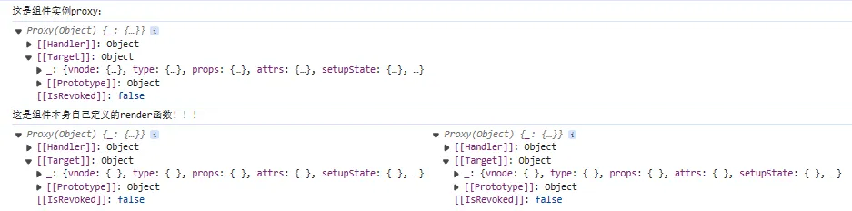
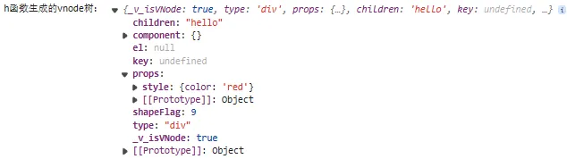
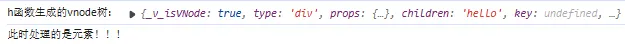
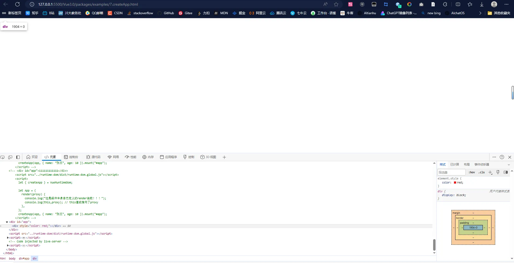
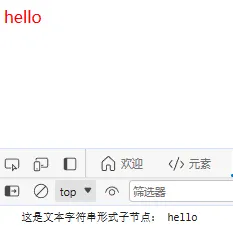
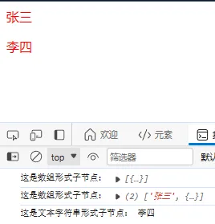
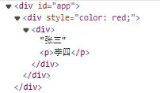

## 10-1 初始化渲染 effect

在上面我们实现了组件渲染的大体流程，接下来的工作便是真正的渲染了，即怎么渲染真实节点到页面上。

针对不同的类型采取不同的渲染方式（`vnode` 有一个 `shapeFlag` 标识来标识**组件/元素**，元素直接用 `h` 函数渲染，组件要更复杂地处理），同时组件创建分为**初次渲染和更新**两种情况。

初次渲染的步骤为：1、生成组件的实例对象；2、解析数据到这个实例对象中；3、创建一个 `effect` 让 `render` 函数执行。

除了最后一个创建一个 `effect` 让 `render` 函数执行的 `setupRenderEffect` 方法，这些内容都在我们的 `weak-vue\packages\runtime-core\src\render.ts` 文件实现过了。所以下面我们来实现这个 `setupRenderEffect` 方法。

```typescript
// weak-vue\packages\runtime-core\src\render.ts
// 创建一个effect让render函数执行(响应式)
function setupRenderEffect(instance) {
  // 创建effect(原理可以回前面的内容找)
  effect(function componentEffect() {
    // 判断是否是初次渲染
    if (!instance.isMounted) {
      // 获取到render返回值
      const proxy = instance.proxy; // 已经代理了组件，可以访问到组件的所有属性和所有方法
      console.log(proxy);
      instance.render.call(proxy, proxy); // render函数执行，即调用render函数，第一个参数表示render函数的this指向组件实例proxy，第二个参数表示执行render函数的参数也是proxy
    }
  });
}
```

此时去执行我们的测试用例：

```html
<!-- weak-vue\packages\examples\7.createApp.html -->
<div id="app">111111111111</div>
<script src="../runtime-dom/dist/runtime-dom.global.js"></script>
<script>
  let { createApp } = VueRuntimeDom;

  let App = {
    render(proxy) {
      console.log("这是组件本身自己定义的render函数！！！");
      console.log(this, proxy); // this值被指向了proxy
    },
  };
  createApp(App, { name: "张三", age: 10 }).mount("#app");
</script>
```

可以看到打印结果符合预期（三个都表示组件实例）：<br />

执行 `render` 方法是为了渲染节点==>`h`函数。

## 10-2 h 方法的实现

注意，我们前面在测试用例使用过一个 `h` 函数来进行组件的渲染。实际上它也进行了创建虚拟 dom 的操作，本质也是调用了 `createVNode` 方法：

```typescript
// h函数的使用（可能有多种情况）
h("div", { style: { color: "red" }, onClick: fn }, `hello ${proxy.state.age}`);

// h函数可能有下面几种使用情况
h("div", "hello");
h("div", {});
h("div", [h("span")]);
h("div", {}, "hello");
h("div", {}, ["lis"]);
h("div", {}, [h("span")]);
h("div", {}, "1", "2", "3");
```

可以看到，第一个参数不一定为根组件而是元素，第二个参数是包含一些属性的对象，第三个参数为渲染的子内容（可能是文本/元素/自内容数组），对此我们的 `createVNode` 方法在参数上都作出了更改，同时生成的虚拟 dom 也据此作出了区分。

```typescript
// weak-vue\packages\runtime-core\src\vnode.ts
export const createVNode = (type, props, children = null) => {};
```

`h` 函数的核心之一是根据参数不同情况采取不同的处理：

```typescript
// weak-vue\packages\runtime-core\src\h.ts
// h函数的作用==>生成vnode（createVNode原理可以回去前面的内容看），核心之一==>处理参数
export function h(type, propsOrChildren, children) {
  // 先根据参数个数来处理
  const i = arguments.length;
  if (i === 2) {
    // 情况1：元素+属性(传入一个对象)
    if (isObject(propsOrChildren) && !isArray(propsOrChildren)) {
      if (isVnode(propsOrChildren)) {
        // 排除h("div",[h("span")])这种情况，因为h函数返回值也是一个对象，但不是属性
        return createVNode(type, null, [propsOrChildren]);
      }
      return createVNode(type, propsOrChildren); // 没有儿子
    } else {
      // 情况2：元素+children
      return createVNode(type, null, propsOrChildren);
    }
  } else {
    if (i > 3) {
      children = Array.prototype.slice.call(arguments, 2); // 第二个参数后面的所有参数，都应该放在children数组里面
    } else if (i === 3 && isVnode(children)) {
      children = [children];
    }
    return createVNode(type, propsOrChildren, children);
  }
}
```

此时在 `weak-vue\packages\runtime-dom\src\index.ts` 文件中导出，即实现在 `VueRuntimeDom` 模块中导出，打包后即可在 html 文件中使用了：

```html
<!-- weak-vue\packages\examples\7.createApp.html -->
<div id="app">111111111111</div>
<script src="../runtime-dom/dist/runtime-dom.global.js"></script>
<script>
  let { createApp, h } = VueRuntimeDom;

  let App = {
    render(proxy) {
      return h("div", { style: { color: "red" } }, "hello");
    },
  };
  createApp(App, { name: "张三", age: 10 }).mount("#app");
</script>
```

此时在我们 `weak-vue\packages\runtime-core\src\render.ts` 文件的 `setupRenderEffect` 方法中打印出生成的 `vnode` 树：

```typescript
// weak-vue\packages\runtime-core\src\render.ts
const subTree = instance.render.call(proxy, proxy);
console.log("h函数生成的vnode树：", subTree);
```



打印正确，说明我们此时 `h` 函数的思路正确。

---

<a name="yUSfg"></a>

## 10-3 创建真实的节点

### 10-3-1 处理元素

前面我们实现了一个 `patch` 方法用来渲染 `vnode`：

```typescript
// weak-vue\packages\runtime-core\src\render.ts
// 真正实现渲染的函数（渲染vnode)
let render = (vnode, container) => {
  // 第一次渲染（三个参数：旧的节点、当前节点、位置）
  patch(null, vnode, container); // 渲染vnode（此时是元素的vnode）
};

// patch函数负责根据vnode的不同情况（组件、元素）来实现对应的渲染
const patch = (n1, n2, container) => {
  // 针对不同的类型采取不同的渲染方式（vonode有一个shapeFlag标识来标识组件/元素）
  const { shapeFlag } = n2;
  // 等效于shapeFlag && shapeFlag === ShapeFlags.ELEMENT
  if (shapeFlag & ShapeFlags.ELEMENT) {
    // 处理元素(h函数)
    console.log("此时处理的是元素！！！");
  } else if (shapeFlag & ShapeFlags.STATEFUL_COMPONENT) {
    // 处理组件
    processComponent(n1, n2, container);
  }
};
```

因为我们上面实现的 `subTree` 也是一棵 `vnode`，所以我们此时也可以去用 `patch` 方法来渲染 `subTree`：

```typescript
// weak-vue\packages\runtime-core\src\render.ts
console.log("h函数生成的vnode树：", subTree);
patch(null, subTree, container); // 渲染vnode
```

此时执行测试用例可以看到打印结果：<br /><br />说明此时处理元素的链路是正确的。我们上面实现了组件的处理方法 `processComponent`，我们类似地要实现一个元素处理方法 `processElement`（同样分为第一次挂载和更新两种情况）。

剩下的步骤是关于元素的具体处理（关于元素的处理方面前面我们已经实现过了，即 `renderOptionDom`）：

```typescript
// weak-vue\packages\runtime-core\src\render.ts
/** ---------------处理元素--------------- */
const processElement = (n1, n2, container) => {
  if (n1 === null) {
    // 元素第一次挂载
    mountElement(n2, container);
  } else {
    // 更新
  }
};

const mountElement = (vnode, container) => {
  // 递归渲染子节点==>dom操作==》挂载到container/页面上
  const { shapeFlag, props, type, children } = vnode;
  // 1、创建元素--记得把真实dom挂载到vnode上，方便后面更新时使用
  let el = (vnode.el = hostCreateElement(type));
  // 2、创建元素的属性
  if (props) {
    for (const key in props) {
      hostPatchProp(el, key, null, props[key]);
    }
  }
  // 3、放入到对应的容器中
  hostInsert(el, container);
};
```

此时可以重新打包后去执行我们的测试用例：<br /><br />可以看到我们的页面中出现了该元素，并且 `style` 属性也成功赋上去了。

### 10-3-2 处理 children

上面我们实现了元素和属性的挂载，接下来的工作是处理 `children`。由于 `h` 函数的 `children` 可以传多种情况，因此要具体情况具体处理。

```typescript
// weak-vue\packages\runtime-core\src\render.ts
// 3、处理children
if (children) {
  if (shapeFlag & ShapeFlags.TEXT_CHILDREN) {
    console.log("这是文本字符串形式子节点：", children);
    hostSetElementText(el, children); // 文本形式子节点，比如这种情况：h('div',{},'张三')，将children直接插入到el中
  } else if (shapeFlag & ShapeFlags.ARRAY_CHILDREN) {
    // 递归渲染子节点
    console.log("这是数组形式子节点：", children);
    mountChildren(el, children); // 数组形式子节点，比如这种情况：h('div',{},['张三',h('p',{},'李四')])，将children递归渲染插入到el中
  }
}
```

此时去执行测试用例：<br /><br />可以看到此时渲染正确。下面是递归渲染子节点的方法：

```typescript
// weak-vue\packages\runtime-core\src\render.ts
// 递归渲染子节点
const mountChildren = (container, children) => {
  for (let i = 0; i < children.length; i++) {
    // children[i]两种情况：1、['张三']这种元素，字符串的形式；2、h('div',{},'张三')这种元素，对象的形式（vnode）
    // 但两种情况都需要转换成vnode来处理，方便借助patch函数来渲染
    const child = (children[i] = CVnode(children[i])); // 第一种情况转换成vnode，记得将children[i]重新赋值
    // 递归渲染子节点（vnode包含了元素、组件、文本三种情况）
    patch(null, child, container);
  }
};
```

我们知道，我们前面实现过的 `patch` 函数是负责根据 `vnode` 的不同情况（组件、元素）来实现对应的渲染，但此时我们的 `child` 还可能是文本的 `vnode`，因此 `patch` 方法要增加对这种类型的处理：

```typescript
// weak-vue\packages\runtime-core\src\render.ts
/** ---------------处理文本--------------- */
const processText = (n1, n2, container) => {
  if (n1 === null) {
    // 创建文本==>直接渲染到页面中（变成真实dom==>插入）
    hostInsert((n2.el = hostCreateText(n2.children)), container);
  } else {
    // 更新文本
    if (n2.children !== n1.children) {
      const el = (n2.el = n1.el!); // el是上面初次创建的真实文本节点
      hostSetText(el, n2.children as string);
    }
  }
};
```

此时去执行我们的测试用例：

```html
<!-- weak-vue\packages\examples\7.createApp.html -->
<div id="app">111111111111</div>
<script src="../runtime-dom/dist/runtime-dom.global.js"></script>
<script>
  let { createApp, h } = VueRuntimeDom;

  let App = {
    render(proxy) {
      return h(
        "div",
        { style: { color: "red" } },
        h("div", {}, ["张三", h("p", {}, "李四")])
      );
    },
  };
  createApp(App, { name: "张三", age: 10 }).mount("#app");
</script>
```

可以看到打印及渲染正确：<br />

## 10-4 总结

这个章节中，我们主要实现了 `h` 函数，用于创建 `vnode`（即 `render` 的返回值），然后将 `vnode` 根据不同情况进行处理，即进行 dom 的操作来渲染到页面上。

到这里，组件渲染的具体措施讲得差不多了，源码请看提交记录：[10、组件的渲染（二）](https://github.com/XC0703/VueSouceCodeStudy/commit/9f49f6050cfd9a1088b4f94b6e060c03ba6e5d52)
