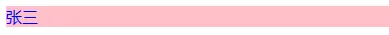

## 11-1 前言

在前面我们实现了组件的初始化（首次生成 `vnode` 并渲染成真实 `dom` 在页面上），这个章节我们主要讲组件的更新，借助 `diff` 算法实现高效更新。

---

首先将响应式模块从 `runtime-core` 模块导出，方便我们在 `VueRuntimeDom` 模块中使用：

```typescript
// weak-vue\packages\runtime-core\src\index.ts
export * from "@vue/reactivity";
```

此时去执行我们的测试用例，可以看到正确地渲染响应式数据的内容了：

```html
<!-- weak-vue\packages\examples\8.diff.html -->
<div id="app">111111111111</div>
<script src="../runtime-dom/dist/runtime-dom.global.js"></script>
<script>
  let { createApp, h, reactive } = VueRuntimeDom;

  let App = {
    setup(props, context) {
      let state = reactive({
        name: "张三",
        age: 10,
      });

      // return {
      //   state,
      // };

      return () => {
        return h(
          "div",
          { style: { color: "red" } },
          h("div", {}, [state.name, h("p", {}, "李四")]) // 正确渲染了state.name，setup函数一个函数返回的形式，这个函数就是render函数，与注释的代码等效
        );
      };
    },

    // render(proxy) {
    //   return h(
    //     "div",
    //     { style: { color: "red" } },
    //     h("div", {}, [proxy.state.name, h("p", {}, "李四")]) // 正确渲染了proxy.state.name
    //   );
    // },
  };
  createApp(App, { name: "模版里面的张三，TODO的部分", age: 10 }).mount(
    // 传入的参数对象还未处理，看Vue3\packages\runtime-core\src\component.ts里面的finishComponentSetup函数
    "#app"
  );
</script>
```

此时若将测试用例代码改成下面这样：

```html
<!-- weak-vue\packages\examples\8.diff.html -->
<div id="app">111111111111</div>
<script src="../runtime-dom/dist/runtime-dom.global.js"></script>
<script>
  let { createApp, h, reactive } = VueRuntimeDom;

  let App = {
    setup(props, context) {
      let state = reactive({
        name: "张三",
        age: 10,
      });
      // 模拟更新
      let i = 0;
      const update = () => {
        state.name = "更新张三" + i++;
      };

      return () => {
        return h(
          "div",
          { style: { color: "red" }, onClick: update },
          h("div", {}, [state.name, h("p", {}, "李四")])
        );
      };
    },
  };
  createApp(App).mount("#app");
</script>
```

可以看到此时的渲染内容重复，老的内容并没有清除：<br />

这是因为我们创建一个 `effect` 让 `render` 函数执行时，`instance.isMounted` 字段的值在首次渲染之后没有改变且还没有作更新处理。

```typescript
// weak-vue\packages\runtime-core\src\render.ts
// 创建一个effect让render函数执行(响应式)
const setupRenderEffect = (instance, container) => {
  // 创建effect(原理可以回前面的内容找)
  effect(function componentEffect() {
    // 判断是否是初次渲染
    if (!instance.isMounted) {
      // 获取到render返回值
      const proxy = instance.proxy; // 已经代理了组件，可以访问到组件的所有属性和所有方法
      // console.log("这是组件实例proxy：");
      // console.log(proxy);
      const subTree = instance.render.call(proxy, proxy); // render函数执行，即调用render函数，第一个参数表示render函数的this指向组件实例proxy，第二个参数表示执行render函数的参数也是proxy
      // console.log("h函数生成的vnode树：", subTree);
      patch(null, subTree, container); // 渲染vnode（此时是元素的vnode）
    } else {
      // TODO: 更新
    }
  });
};
```

此时加上了，便不会再渲染，直接走 TODO 里面的逻辑。因此要实现渲染更新，接下来的工作便是联系前面实现过的 `effect` 依赖更新。在 TODO 里面实现相应 `diff` 逻辑。

```typescript
// weak-vue\packages\runtime-core\src\render.ts
// console.log("更新");
// 对比新旧vnode--diff算法
let proxy = instance.proxy;
const prevVnode = instance.subTree; // 旧vnode，记得上面首次渲染在实例上挂载
const nextVnode = instance.render.call(proxy, proxy); // 新vnode
instance.subTree = nextVnode;
patch(prevVnode, nextVnode, container); // 此时在patch方法中会对比新旧vnode，然后更新
```

## 11-2 对比是否是相同元素

此时去到我们的 `patch` 方法，在更新渲染时传入的旧 `vnode` 不再是 `null`，因此要作出 `diff` 对比。

```typescript
// weak-vue\packages\runtime-core\src\render.ts
// 判断是否是同一个元素
const isSameVnode = (n1, n2) => {
  return n1.type === n2.type && n1.key === n2.key;
};
// 卸载老的元素
const unmount = (vnode) => {
  hostRemove(vnode.el);
};

// diff算法
// 1、判断是不是同一个元素
// console.log("n1:", n1, "n2:", n2);
if (n1 && n2 && !isSameVnode(n1, n2)) {
  // 卸载老的元素
  unmount(n1);
  n1 = null; // n1置空，可以重新走组件挂载了，即传给processElement的n1为null，走mountElement方法
}
// 2、如果是同一个元素，对比props、children，此时传给processElement的n1为老的vnode，走patchElement方法
```

## 11-3 对比 props

我们前面实现过处理元素的方法 `processElement`，不过前面只处理了首次挂载的情况。现在加上更新的情况。

```typescript
// weak-vue\packages\runtime-core\src\render.ts
/** ---------------处理元素--------------- */
const processElement = (n1, n2, container) => {
  if (n1 === null) {
    // 元素第一次挂载
    mountElement(n2, container);
  } else {
    // 更新
    console.log("同一个元素更新！！！");
    patchElement(n1, n2, container);
  }
};
```

第一步是对比 `props`，第二步是对比子节点：

```typescript
// weak-vue\packages\runtime-core\src\render.ts
// 元素的更新方法
const patchElement = (n1, n2, container) => {
  const oldProps = n1.props || {};
  const newProps = n2.props || {};
  // 1、对比属性
  let el = (n2.el = n1.el); // 获取真实dom
  patchProps(el, oldProps, newProps);
  // 2、对比子节点--与初次挂载一样，需要将可能的字符串也要转换成vnode
  n1.children = n1.children.map((item) => {
    return CVnode(item);
  });
  n2.children = n2.children.map((item) => {
    return CVnode(item);
  });
  patchChildren(n1, n2, el);
};
```

其中，`props` 的对比分为三种情况：

```typescript
// weak-vue\packages\runtime-core\src\render.ts
// 对比属性有三种情况：
// 1、新旧属性都有，但是值不一样
// 2、旧属性有，新属性没有
// 3、新属性有，旧属性没有
const patchProps = (el, oldProps, newProps) => {
  if (oldProps !== newProps) {
    // 1、新旧属性都有，但是值不一样
    for (const key in newProps) {
      const prev = oldProps[key];
      const next = newProps[key];
      if (prev !== next) {
        hostPatchProp(el, key, prev, next); // 替换属性
      }
    }
    // 2、新属性有，旧属性没有
    for (const key in oldProps) {
      if (!(key in newProps)) {
        hostPatchProp(el, key, oldProps[key], null); // 删除属性
      }
    }
    // 3、旧属性有，新属性没有
    for (const key in newProps) {
      if (!(key in oldProps)) {
        hostPatchProp(el, key, null, newProps[key]); // 新增属性
      }
    }
  }
};
```

此时去执行我们的测试用例：

```html
<!-- weak-vue\packages\examples\8.diff.html -->
<div id="app">111111111111</div>
<script src="../runtime-dom/dist/runtime-dom.global.js"></script>
<script>
  let { createApp, h, reactive } = VueRuntimeDom;

  let App = {
    setup(props, context) {
      let state = reactive({
        flag: false,
        name: "张三",
        age: 10,
      });
      // 模拟更新（非响应式的，手动更新）
      const update = () => {
        state.flag = !state.flag;
        if (state.flag) state.name = "更新的张三";
        else state.name = "张三";
      };
      return {
        state,
        update,
      };
    },

    render(proxy) {
      if (proxy.state.flag) {
        return h(
          "div",
          {
            style: { color: "red", background: "none" },
            onClick: proxy.update,
          },
          `${proxy.state.name}`
        );
      } else {
        return h(
          "div",
          {
            style: { color: "blue", background: "pink" },
            onClick: proxy.update,
          },
          `${proxy.state.name}`
        );
      }
    },
  };
  createApp(App, { name: "模版里面的张三，TODO的部分", age: 10 }).mount("#app");
</script>
```

可以看到点击样式变了：<br /><br /><br />但此时我们显示的文字却没有变，这是因为我们对子节点还未作处理。
<a name="MJ5kk"></a>

## 11-4 对比 children

对比 `children` 的核心是分情况讨论，我们此时先去处理最简单的一种情况，即新的子节点为纯文本：

```typescript
// weak-vue\packages\runtime-core\src\render.ts
// 对比子节点有四种情况：
// 1、旧的有子节点，新的没有子节点
// 2、旧的没有子节点，新的有子节点
// 3、旧的有子节点，新的也有子节点，但是是文本节点（最简单的情况）
// 4、旧的有子节点，新的也有子节点，但是可能是数组
const patchChildren = (n1, n2, el) => {
  const c1 = n1.children;
  const c2 = n2.children;
  const prevShapeFlag = n1.shapeFlag;
  const newShapeFlag = n2.shapeFlag;
  // 处理情况3
  if (newShapeFlag & ShapeFlags.TEXT_CHILDREN) {
    // 新的是文本节点，直接替换
    if (c2 !== c1) {
      hostSetElementText(el, c2);
    } else {
    }
  }
};
```

此时去执行我们上面的测试用例，可以看到文字也被替换了。<br />另一种情况也比较简单，即旧的是文本节点，此时将文本节点清空，然后再将新的节点进行渲染即可，最复杂的是旧的也为数组，新的也为数组。

```typescript
// weak-vue\packages\runtime-core\src\render.ts
 else {
      // 新的是数组，此时要判断旧的
      if (prevShapeFlag & ShapeFlags.ARRAY_CHILDREN) {
        // 旧的也是数组（较复杂）
        patchKeyChildren(c1, c2, el);
      } else {
        // 旧的是文本节点，将文本节点清空，然后再将新的节点进行渲染
        hostSetElementText(el, "");
        mountChildren(el, c2);
      }
    }
```

---

自此，关于组件的更新流程我们就讲得差不多了，处理了一些基本的更新情况，到这里的源码请看分支：[11、组件的更新（一）](https://github.com/XC0703/VueSouceCodeStudy/commit/5473fa2a693d00d342a67b2221521c3eab06c8c1)
