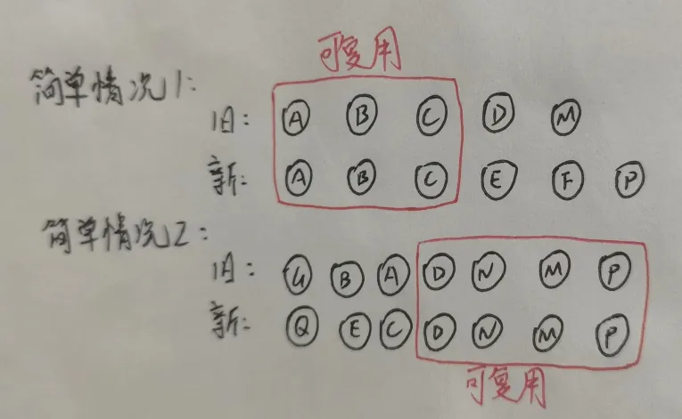
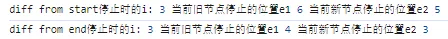
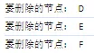
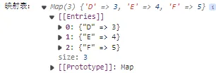
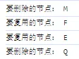
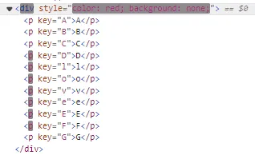
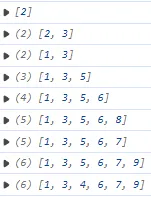
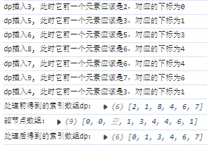
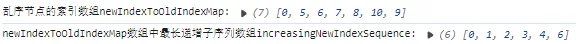
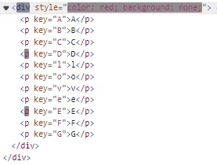

前面我们处理了一些基本的更新情况，这里我们开始复杂更新的处理（比如 `patchKeyChildren` 方法，处理新旧子节点都是数组的情况）。

## 12-1 简单情况处理（双指针）

### 12-1-1 原理引入

- vue2 中使用的是**基于递归双指针**的 diff 算法，即**双端 diff**，会对整个组件树进行完整的遍历和比较。详细讲解见：[https://segmentfault.com/a/1190000042197936#item-4-4](https://segmentfault.com/a/1190000042197936#item-4-4)
- 双端 diff 的目的是为了尽可能的复用节点，通过移动指针的方式来复用节点
- vue3 中使用的是**基于数组动态规划**的 diff 算法。vue 3 的算法效率更高，因为它使用了一些优化技巧，例如按需更新、静态标记等，会跳过静态子树的比较减少比较次数。
- 下面是 patchKeyChildren 方法处理新旧子节点都是数组且头部或者尾部节点可复用的的情况：



```typescript
// weak-vue\packages\runtime-core\src\render.ts
const patchKeyChildren = (c1, c2, el) => {
  // 下面是vue3的diff算法，处理简单情况时也用到了双端diff：

  let i = 0;
  let e1 = c1.length - 1;
  let e2 = c2.length - 1;
  // 1、diff from start，即从头开始对比--简单情况1：旧的排列和新的排列前面节点一致，这些节点是可以复用的
  while (i <= e1 && i <= e2) {
    const n1 = c1[i];
    const n2 = c2[i];
    if (isSameVnode(n1, n2)) {
      // 递归对比子节点，先渲染出来，相当于重新走一次流程
      patch(n1, n2, el);
    } else {
      break;
    }
    i++;
  }
  console.log(
    "diff from start停止时的i:",
    i,
    "当前旧节点停止的位置e1",
    e1,
    "当前新节点停止的位置e2",
    e2
  );
  // 2、diff from end，即从尾开始对比--简单情况2：旧的排列和新的排列后面节点一致，这些节点是可以复用的
  while (i <= e1 && i <= e2) {
    const n1 = c1[e1];
    const n2 = c2[e2];
    if (isSameVnode(n1, n2)) {
      // 递归对比子节点，先渲染出来，相当于重新走一次流程
      patch(n1, n2, el);
    } else {
      break;
    }
    e1--;
    e2--;
  }
  console.log(
    "diff from end停止时的i:",
    i,
    "当前旧节点停止的位置e1",
    e1,
    "当前新节点停止的位置e2",
    e2
  );
};
```

此时去执行测试用例：

```html
<!-- weak-vue\packages\examples\8.diff.html -->
<div id="app">111111111111</div>
<script src="../runtime-dom/dist/runtime-dom.global.js"></script>
<script>
  let { createApp, h, reactive } = VueRuntimeDom;

  let App = {
    setup(props, context) {
      let state = reactive({
        flag: false,
        name: "张三",
        age: 10,
      });
      // 模拟更新（非响应式的，手动更新）
      const update = () => {
        state.flag = !state.flag;
      };
      return {
        state,
        update,
      };
    },

    render(proxy) {
      if (proxy.state.flag) {
        return h(
          "div",
          {
            style: { color: "red", background: "none" },
            onClick: proxy.update,
          },
          [
            h("p", { key: "A" }, "A"),
            h("p", { key: "B" }, "B"),
            h("p", { key: "C" }, "C"),
            h("p", { key: "D" }, "D"), // diff from start 应该在这里停止（e1和e2还未变，分别为各自的长度），此时i=3
            h("p", { key: "O" }, "O"),
            h("p", { key: "P" }, "P"),
          ]
        );
      } else {
        return h(
          "div",
          {
            style: { color: "blue", background: "pink" },
            onClick: proxy.update,
          },
          [
            h("p", { key: "A" }, "A"),
            h("p", { key: "B" }, "B"),
            h("p", { key: "C" }, "C"),
            h("p", { key: "E" }, "E"),
            h("p", { key: "M" }, "M"), // diff from end 应该在这里停止(i不变），此时e1=4，e2=3
            h("p", { key: "O" }, "O"),
            h("p", { key: "P" }, "P"),
          ]
        );
      }
    },
  };
  createApp(App, { name: "模版里面的张三，TODO的部分", age: 10 }).mount("#app");
</script>
```

可以看到更新时的打印结果：<br /><br />可以看到打印结果符合预期，体现了先复用前面相同节点、再复用后面相同节点这两种最简单情况的处理原理。

---

<a name="JtzkW"></a>

### 12-1-2 实际操作

上面我们讲解了简单情况下的处理原理，但是还没有实际地操作节点。

先分为两种情况：1、新的子节点数量多；2、新的子节点数量少。

首先看第一种情况：

```typescript
// 新：A B C D E F G
// 旧：A B C G
```

此时可以看出前面的 A、B、C 节点是可以复用的，后面的 G 节点是可以复用的，中间的 D、E、F 节点要新增插入进去，可以很快知道这些要新增的节点插入时又可以分为两种情况：1、新增的节点在旧的节点之前，2、新增的节点在旧的节点之后。

我们知道该种情况经过我们上面的原理提及的处理后（即**跳过可复用节点**），i 变成了 3，e1 变成了 2，e2 变成 5。i 为新旧子节点前面的部分开始不同的位置，e1 为旧子节点后面的部分开始不可复用的位置，e2 为新子节点后面的部分开始不可复用的位置。如果 i > e1，则说明此时新的子节点中间存在不可复用的节点，这些节点要插入处理。至于**这些新子节点应该插入到哪个位置，则只需确认其后一个子节点即可**。为此，我们为 `patch` 渲染函数引入了第四个参数 `ancher`，用来表示其后一个子节点。

这是因为我们前面在实现对真实 dom 的操作中（具体见 Vue3\packages\runtime-dom\src\nodeOps.ts 文件），实现了插入元素的方法，我们最终渲染元素会走到这个方法：

```typescript
// weak-vue\packages\runtime-dom\src\nodeOps.ts
  // 插入元素
  insert: (child, parent, ancher = null) => {
    parent.insertBefore(child, ancher); // ancher为空相当于appendchild
  },
```

那我们怎么确认 `ancher` 节点呢？

首先我们得确认需要新增的节点，即从 i 到 e2 的节点都应该插入（即上面的 D、E、F 节点）。从左到右遍历插入，插入 D 时，应该在 C、G 中间；插入 E 时，应该在 D、G 中间；插入 F 时，应该在 E、G 中间。这三个新节点的 ancher 节点都是 G，其实就是 e2+1 表示的节点，如果 e2+1 大于 c2 了，说明前面的节点为空。

```typescript
// weak-vue\packages\runtime-core\src\render.ts
if (i > e1) {
  const nextPos = e2 + 1; // e2+1要么表示后面部分可复用的节点的倒数最后一个，要么为null（即后面部分没有可复用的节点）
  const anchor = nextPos < c2.length ? c2[nextPos].el : null;
  while (i <= e2) {
    console.log(
      "要插入的节点：",
      c2[i].key,
      "，插入到：",
      anchor || "null",
      "节点之前"
    );
    patch(null, c2[i], el, anchor); // 记得给patch函数以及里面使用的相关方法传入anchor参数
    i++;
  }
}
```

此时去执行我们上面写的第一种情况例子，可以看到打印结果符合预期：<br />

---

对于第二种即旧的子节点多的情况，便存在删除。先看例子：

```typescript
// 新：A B C G
// 旧：A B C D E F G
```

可以知道此时 D、E、F 节点是要删除的，即 i 到 e1 的节点。删除情况比较简单，直接删除即可：

```typescript
// // weak-vue\packages\runtime-core\src\render.ts
else if (i > e2) {
      // 2、旧的子节点数量多的情况--要删除
      while (i <= e1) {
        console.log("要删除的节点：", c1[i].key);
        unmount(c1[i]);
        i++;
      }
}

  // 卸载老的元素
  const unmount = (vnode) => {
    hostRemove(vnode.el);
  };

```

此时去执行我们的测试用例可以看到打印结果正确：<br />
<a name="aYlgj"></a>

## 12-2 复杂情况处理（映射表）

### 12-2-1 操作实现

上面我们看到，对于中间的一些子节点，我们只考虑了顺序的情况，要么都要新增，要么都要删除。但实际有些节点是可以复用的只是顺序变了，有些要新增，有些则要删除。像下面这样：

```typescript
// 新：A B C D E F G
// 旧：A B C M F E Q G
```

上面这种复杂情况，新子节点序列中的 D、E、F 节点，旧子节点序列中的 M、F、E、Q 节点，D 节点是要新增的，E、F 节点是要复用的但顺序改变，M 节点是要删除的。如果此时去仅用我们上面实现的方法去执行我们的测试用例，可以看到无法更新，新旧替换也一样，因为并没有走我们上面顺序插入或者顺序删除的流程直接阻塞停止了。

对于这种复杂情况，Vue 的处理是通过映射表来处理。

```typescript
// weak-vue\packages\runtime-core\src\render.ts
// 3、乱序，并不是简单将中间乱序节点全部删除再全部新增，而是要尽可能的复用节点
// 解决思路：（1）以新的乱序个数创建一个映射表；（2）再用旧的乱序的数据去映射表中查找，如果有，说明是可以复用的，如果没有，说明是该旧节点需要删除的
const s1 = i; // 旧的乱序开始位置
const s2 = i; // 新的乱序开始位置
// 创建表
let keyToNewIndexMap = new Map();
// 用新的乱序数据去创建映射表
for (let i = s2; i <= e2; i++) {
  const nextChild = c2[i];
  keyToNewIndexMap.set(nextChild.key, i);
}
console.log("映射表：", keyToNewIndexMap);
```

此时执行测试用例打印结果：<br />

---

继续处理：

```typescript
// weak-vue\packages\runtime-core\src\render.ts
// 新：A B C D E F G==>乱序映射表：D=>3，E=>4，F=>5。
// 旧：A B C M F E Q G==>乱序映射表：M=>3，F=>4，E=>5，Q=>6。
// 去旧的乱序数据中查找
for (let i = s1; i <= e1; i++) {
  const oldChildVnode = c1[i];
  const newIndex = keyToNewIndexMap.get(oldChildVnode.key);
  if (!newIndex) {
    // 说明旧的节点需要删除（即M和Q）
    console.log("要删除的节点：", oldChildVnode.key);
    unmount(oldChildVnode);
  } else {
    console.log("要复用的节点：", oldChildVnode.key);
    patch(oldChildVnode, c2[newIndex], el);
  }
}
```

此时执行测试用例打印结果：<br /><br />此时页面渲染结果为：A B C F E G。

---

可以看出此时存在两个问题：1、复用的节点 E、F 渲染位置不对；2、要新增的节点 D 没有插入

因此要特殊处理这两个问题：

```typescript
// weak-vue\packages\runtime-core\src\render.ts
// 解决两个问题：1、复用的节点渲染位置不对；2、要新增的节点没有插入。
const toBePatched = e2 - s2 + 1; // 新的乱序的数量
const newIndexToOldIndexMap = new Array(toBePatched).fill(0); // 新的乱序的数量的数组，每个元素都是0

newIndexToOldIndexMap[newIndex - s2] = i + 1; // 现在将复用的节点的位置改为旧的乱序的位置+1
console.log("newIndexToOldIndexMap:", newIndexToOldIndexMap);
```

此时执行测试用例打印结果正确：<br />

---

此时根据这个位置数组去判断是移动还是新增我们的节点：

```typescript
// weak-vue\packages\runtime-core\src\render.ts
// 此时根据这个位置数组去移动或者新增我们的节点(从后往前处理)
for (let i = toBePatched - 1; i >= 0; i--) {
  const currentIndex = s2 + i; // 当前要处理的新的乱序的节点的位置
  const anchor = currentIndex + 1 < c2.length ? c2[currentIndex + 1].el : null;
  if (newIndexToOldIndexMap[i] === 0) {
    // 说明是新增的节点
    console.log(
      "新增的节点：",
      c2[currentIndex].key,
      "，插入到：",
      anchor || "null",
      "节点之前"
    );
    patch(null, c2[currentIndex], el, anchor); // 比如从后往前遍历到D时，插入到E的前面。
  } else {
    // 说明是要移动的可复用节点
    console.log(
      "要移动的节点：",
      c2[currentIndex].key,
      "，移动到：",
      anchor || "null",
      "节点之前"
    );
    hostInsert(c2[currentIndex].el, el, anchor); // 比如从后往前遍历到F时，应该移动到G的前面；从后往前遍历到E时，应该移动到F的前面。此时已渲染序列为A B C E F G
  }
}
```

此时页面渲染正确，打印结果为：<br />

---

<a name="CjtCy"></a>

### 12-2-2 性能优化

上面虽然渲染正确，但一个个节点重新编排在大量节点情况下会存在性能问题。如果已经有序，是可以一次性将有序的序列移动的。比如像下面这样：

```typescript
// 新：A B C D l o v e E F G
// 旧：A B C M l o v e F E Q G
```

此时若用我们上面的方法， l o v e 这四个节点也需要一个个地去倒序判断并复用，极端情况下会有性能问题。



优化措施是**最长递增子序列**的思路，借助我们上面的 `newIndexToOldIndexMap` 数组，来找到符合可复用的最长子区段长度，然后一次性复用。

---

> （[力扣 300. 最长递增子序列](https://leetcode.cn/problems/longest-increasing-subsequence/description/)）
>
> - 这个算法题比较容易想得到的思路就是动态规划，核心是两次循环遍历，每次循环会得到以 arr[i]为结尾的最长递增子序列长度。
> - 可以用贪心+二分查找思路优化。只有一次循环遍历，我们维护一个数组 dp 用来表示当前的最长递增子序列。若想让该序列尽可能地长，则需要每次末尾添加的数尽可能地小。我们遍历到一个数 arr[i]，如果 arr[i]大于 dp[dp.length-1]，则此时直接追加 arr[i]在 dp 末尾即可；如果不是，则为了让数组从左到右尽可能地小，则此时需要将 arr[i]插入到 dp 中，取代第一个比它大的数（改变了原始序列，但不影响长度，可以用二分来优化这个查找过程）。代码如下：

```typescript
/**
 * @param {number[]} nums
 * @return {number}
 */
var lengthOfLIS = function (nums) {
  const len = nums.length;
  if (len <= 1) return len;
  let dp = [nums[0]];
  for (let i = 0; i < len; i++) {
    if (nums[i] > dp[dp.length - 1]) {
      // 直接追加
      p[dp.length - 1] = i;
    } else {
      // 二分查找
      let left = 0;
      let right = dp.length - 1;
      while (left < right) {
        let mid = (left + right) >> 1;
        if (dp[mid] < nums[i]) {
          left = mid + 1;
        } else {
          right = mid;
        }
      }
      // 直接替换
      dp[left] = nums[i]; // 此时dp前面的元素都比nums[i]小
    }
    console.log(dp);
  }
  console.log("真正需要记住的索引数组：", p);
  return dp.length;
};

lengthOfLIS([2, 3, 1, 5, 6, 8, 7, 9, 4]);
```

打印结果如下：<br />

可以看到最终 dp 数组长度是正确的（对应的索引是[2, 1, 8, 4, 6, 7]），但是元素不一定对，正确的 dp 应该是[2, 3, 5, 6, 7, 9]（对应的索引是[0, 1, 3, 4, 6, 7]）。这是因为二分查找时，nums[i]直接替换了原有的 dp[left]。

**在快速 diff 算法中，求解最长递增子序列的目的是对子节点重新编号**，所以肯定不只是求解出长度即可。那怎么样才能使得 dp 内容也是正确呢？我们维护一个数组 p，p[i]表示往 dp 插入某个下标 Q 时，dp 中此时 Q 前一个元素的值，该真实值要记住以便后面倒序处理 dp 时，能正确地放入真实值。

```typescript
/**
 * @param {number[]} nums
 * @return {number}
 */
var lengthOfLIS = function (nums) {
  const len = nums.length;
  if (len <= 1) return len;
  let dp = [0];
  let p = [0];
  for (let i = 0; i < len; i++) {
    if (nums[i] > nums[dp[dp.length - 1]]) {
      // 直接追加
      console.log(
        `dp插入${nums[i]}, 此时它前一个元素应该是${
          nums[dp[dp.length - 1]]
        }，对应的下标为${dp[dp.length - 1]}`
      );
      p[i] = dp[dp.length - 1];
      dp.push(i);
    } else {
      // 二分查找
      let left = 0;
      let right = dp.length - 1;
      while (left < right) {
        let mid = (left + right) >> 1;
        if (nums[dp[mid]] < nums[i]) {
          left = mid + 1;
        } else {
          right = mid;
        }
      }
      // 直接替换
      if (left > 0) {
        console.log(
          `dp插入${nums[i]}, 此时它前一个元素应该是${
            nums[dp[left - 1]]
          }，对应的下标为${dp[left - 1]}`
        );
        p[i] = dp[left - 1];
      }
      dp[left] = i; // 此时dp前面的元素都比nums[i]小
    }
  }
  console.log("处理前得到的索引数组dp：", dp); //  [2, 1, 8, 4, 6, 7]
  console.log("驱节点数组：", p); // [0, 0, 空, 1, 3, 4, 4, 6, 1]
  let u = dp.length;
  let v = dp[u - 1]; // dp的最后一个元素肯定是真实的，直接放入进去就可以了
  while (u-- > 0) {
    dp[u] = v;
    v = p[v]; // 去拿到前一个真实的元素来插入
  }
  console.log("处理后得到的索引数组dp：", dp); // [0, 1, 3, 4, 6, 7]
  return dp.length;
};

lengthOfLIS([2, 3, 1, 5, 6, 8, 7, 9, 4]);
```



---

按照这个算法思路，去优化我们的 diff 算法。

```typescript
// weak-vue\packages\runtime-core\src\render.ts
// 获取最长递增子序列的索引
console.log("乱序节点的索引数组newIndexToOldIndexMap:", newIndexToOldIndexMap);
const increasingNewIndexSequence = getSequence(newIndexToOldIndexMap);
console.log(
  "newIndexToOldIndexMap数组中最长递增子序列数组increasingNewIndexSequence:",
  increasingNewIndexSequence
);
let j = increasingNewIndexSequence.length - 1;
```

```typescript
// weak-vue\packages\runtime-core\src\render.ts
// 这个插入需要一个个的插入，大量情况下会可能导致性能问题。
// 用最长递增子序列去优化，如果在区间内，就不用移动，如果不在区间内，就移动。
if (i !== increasingNewIndexSequence[j]) {
  hostInsert(c2[currentIndex].el, el, anchor); // 比如从后往前遍历到F时，应该移动到G的前面；从后往前遍历到E时，应该移动到F的前面。此时已渲染序列为A B C E F G
} else {
  j--;
}
```

此时去执行我们的测试用例：

```typescript
// 新：A B C D l o v e E F G
// 旧：A B C M l o v e F E Q G
```

打印结果为：<br />

更新渲染过程为：<br />

此时可以看到优化成功。

---

自此，关于组件的更新我们已经处理完毕，到这里的源码请看提交记录：[12、组件的更新（二）](https://github.com/XC0703/VueSouceCodeStudy/commit/c20c398c56e07178d1e51beaa7a6e5dfc3840ea3)

## 12-3 diff 算法的总结

这个问题在面试中会经常被问到，我们上面处理了组件更新的全部过程，我们这里可以总结一下以便回答面试。

1. 首先 vue 组件的渲染借助了虚拟 dom 的原理，组件更新时，因为响应式的存在，会去重新生成一个 vnode。
2. 此时，进入新老两个 vnode 比较阶段，首先会对比是否是相同元素，如果不是相同元素，则之间卸载老的节点，重新走 mountElement 方法去挂载渲染节点。
3. 如果是相同元素，则会去对比 props 参数， props 不同有三种情况（依据实际情况进行对属性进行处理即可）：
   1. 属性在新旧中都有，但是值不一样
   2. 在旧的组件中有，在新的中没有
   3. 在新的组件中有，在旧的中没有
4. props 对比介绍之后，便会去对比 children 子节点，这也是 diff 算法中最复杂最核心的内容。children 子节点本质上是一个可以嵌套的数组，对于嵌套子节点的处理，直接走递归即可。对于同一层级下的新旧对比，又分为简单情况和复杂情况的处理。
   - 简单情况是利用了双端 diff 算法，本质是利用双指针的原理，处理新旧子节点都是数组且头部或者尾部节点可复用的情况，其中新的子节点数量的时候要插入，旧的子节点数量多的时候要删除。处理这种简单情况时，我们只考虑了顺序的情况，要么都要新增，要么都要删除。
   - 但实际有些节点是可以复用的只是顺序变了，有些要新增，有些则要删除。对于这种复杂情况的处理，vue 引入了映射表，即以新的乱序节点为基准创建一个映射表；再遍历旧的乱序节点过程中去该映射表查找是否已存在，如果有，说明是可以复用的，如果没有，说明是该旧节点需要删除的。
   - 此时再用一个数组 newIndexToOldIndexMap 来表示新的节点在旧的节点数组中的索引+1，默认为 0 表示该节点不存在旧的节点序列中。
   - 之后倒序遍历该数组，如果值为 0 表示要新增该节点，如果不为 0 则要移动节点到正确的位置。移动时默认是一个个移动的，产生了一些没有必要的性能损耗，比如某个区段的子节点顺序都没有变，可以不用操作这部分节点。
   - 因此 vue 中引入了最长递增子序列的原理，在移动某个节点前，判断该节点是否在最长递增子序列中，在则不用移动跳过即可，继续操作前一个节点。
5. vue 3 的算法效率更高，因为它使用了一些优化技巧，例如按需更新、静态标记等，会跳过静态子树的比较减少比较次数。
