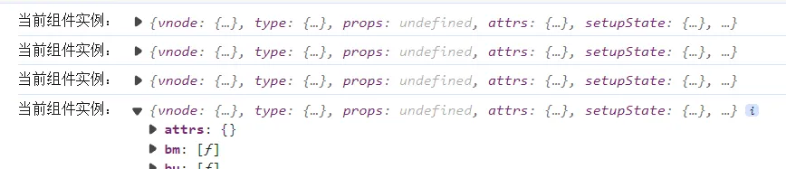
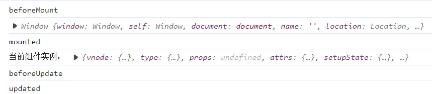

## 13-1 前言

**注意：**<br />1、`setup` 相当于 vue2 中的 `beforeCreate` 和 `created`      <br />2、vue3 中的生命周期方法都是在 setup 中使用的       <br />3、vue2 中的生命周期方法中的 this 指向当前组件实例，而 vue3 中的生命周期方法的 `this` 指向 `window`，但 vue3 提供了一个获取组件实例的 api：`getCurrentInstance`。

**问题：**
**vue3.x 中的生命周期是怎么调用的？**

- 方法：每一个组件都有一个实例 `instance`，调用过程就是将组件的生命周期与这个组件实例产生关联

**那什么时候产生关联？**

- 在调用 setup 之前将这个实例暴露到全局 `instance` 上，在 setup 调用之后，内部执行调用生命周期之后使得全局 `instance` 赋 null，再调用 `getCurrentInstance` 获取到当前最新的组件实例并更新挂载到全局。
  <a name="q6cDI"></a>

## 13-2 生命周期的实现

创建组件实例的方法在 `weak-vue\packages\runtime-core\src\component.ts` 文件中，将全局的组件实例暴露出去：

```typescript
// weak-vue\packages\runtime-core\src\component.ts
export let currentInstance;

if (setup) {
  // setup执行之前，要创建全局的currentInstance
  currentInstance = instance;
  const setupContext = createContext(instance); // 返回一个上下文对象
  const setupResult = setup(instance.props, setupContext); // 实际执行的setup函数（实参）

  // setup执行完毕，currentInstance要赋空null
  currentInstance = null;
  // setup返回值有两种情况：1、对象；2、函数==>根据不同情况进行处理
  handlerSetupResult(instance, setupResult); // 如果是对象，则将值放在instance.setupState；如果是函数，则就是render函数
}
```

新建一个 `weak-vue\packages\runtime-core\src\apilifecycle.ts` 文件（因为生命周期钩子函数依然是在 `VueRuntimeDom` 模块导出）：

```typescript
// weak-vue\packages\runtime-core\src\apilifecycle.ts
import { currentInstance } from "./component";

// 处理生命周期
const enum lifeCycle {
  BEFOREMOUNT = "bm",
  MOUNTED = "m",
  BEFOREUPDATE = "bu",
  UPDATED = "u",
}

// 常用的生命周期钩子——柯里化操作
export const onBeforeMount = createHook(lifeCycle.BEFOREMOUNT);
export const onMounted = createHook(lifeCycle.MOUNTED);
export const onBeforeUpdate = createHook(lifeCycle.BEFOREUPDATE);
export const onUpdated = createHook(lifeCycle.UPDATED);

// 创建生命周期钩子
function createHook(lifecycle: lifeCycle) {
  // 返回一个函数,这个函数接收两个参数，hook和target。hook是生命周期中的方法，target是当前组件实例
  return function (hook, target = currentInstance) {
    // 获取到当前组件的实例，然后和生命周期产生关联
    injectHook(lifecycle, hook, target);
  };
}

// 注入生命周期钩子
function injectHook(lifecycle: lifeCycle, hook, target = currentInstance) {
  console.log("当前组件实例：", target);
  // 注意：vue3.x中的生命周期都是在setup中使用的
  if (!target) {
    console.warn(`lifecycle: ${lifecycle} is used outside of setup`);
    return;
  }
  // 给这个实例添加生命周期
  const hooks = target[lifecycle] || (target[lifecycle] = []);

  hooks.push(hook);
}
```

**注意，此时我们在当前组件示例中注入了生命周期钩子，即将其作为组件实例对象的一个属性（默认值为空数组）。**

但是，为了可以在生命周期中获取到组件实例，vue3 通过**切片**的手段实现（**即函数劫持的思路，修改传入的 hook，使得 hook 执行前设置当前组件实例到全局**）。

```typescript
// weak-vue\packages\runtime-core\src\apilifecycle.ts
// 注意：vue3.x中获取组件示例是通过getCurrentInstance()方法获取的
// 为了可以在生命周期中获取到组件实例，vue3.x通过切片的手段实现（即函数劫持的思路，修改传入的hook，使得hook执行前设置当前组件实例到全局）
const rap = (hook) => {
  setCurrentInstance(target);
  hook(); // 执行生命周期钩子前存放一下当前组件实例
  setCurrentInstance(null);
};

hooks.push(rap);
```

其中，获取到当前组件实例和设置当前组件实例的方法如下：

```typescript
// weak-vue\packages\runtime-core\src\component.ts
// 获取到当前组件实例
export const getCurrentInstance = () => {
  return currentInstance;
};

// 设置当前组件实例
export const setCurrentInstance = (target) => {
  currentInstance = target;
};
```

此时，去执行我们的测试用例：

```html
<!-- weak-vue\packages\examples\9.lifecycle.html -->
<div id="app">111111111111</div>
<script src="../runtime-dom/dist/runtime-dom.global.js"></script>
<script>
  let {
    createApp,
    reactive,
    h,
    onMounted,
    onBeforeMount,
    onUpdated,
    onBeforeUpdate,
    getCurrentInstance,
  } = VueRuntimeDom;

  let App = {
    setup() {
      let state = reactive({ count: 0 });
      onMounted(() => {
        console.log(this); // window
        console.log("mounted");
        const instance = getCurrentInstance();
        console.log("当前组件实例：", instance);
      });
      onBeforeMount(() => {
        console.log("beforeMount");
      });
      onUpdated(() => {
        console.log("updated");
      });
      onBeforeUpdate(() => {
        console.log("beforeUpdate");
      });
      const fn = () => {
        state.count++;
      };
      return () => {
        return h("div", {}, [
          h("div", {}, state.count),
          h(
            "button",
            {
              onClick: fn,
            },
            "+"
          ),
        ]);
      };
    },
  };
  createApp(App).mount("#app");
</script>
```

可以看到打印结果：<br />

可以看到，此时四个生命周期都已经注入示例成功（**但还没有执行对应的回调函数，打印结果是注入时的打印。**）
<a name="fZuZi"></a>

## 13-3 生命周期的调用

生命周期的调用即在组件渲染的不同阶段执行对应的回调函数。组件渲染的定义在 `weak-vue\packages\runtime-core\src\render.ts` 文件中，因为此时已经将生命周期放在实例上了，所以直接获取调用即可：

```typescript
// weak-vue\packages\runtime-core\src\render.ts
// 判断是否是初次渲染
if (!instance.isMounted) {
  // 渲染之前的阶段
  let { bm, m } = instance;
  if (bm) {
    invokeArrayFns(bm);
  }
} else {
  let { bu, u } = instance;
  if (bu) {
    invokeArrayFns(bu);
  }
}
```

其中，因为从上面打印的当前组件实例可以看到，`instance` 上面挂载的声明周期钩子方法是一个数组，每个数组元素都是一个要执行的回调方法。执行 `hook` 的 `invokeArrayFns `方法定义如下：

```typescript
// weak-vue\packages\runtime-core\src\apilifecycle.ts
// 生命周期的执行
export function invokeArrayFns(fns) {
  fns.forEach((fn) => fn());
}
```

此时再去执行我们的测试用例：

可以看到，打印结果符合预期。

---

自此，关于生命周期我们已经处理完毕，到这里的源码请看提交记录：[13、生命周期](https://github.com/XC0703/VueSouceCodeStudy/commit/b1d89cba424dac76808ed0b4d0c905fe2546eeff) 。
