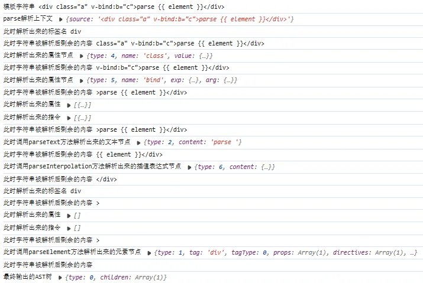

## 14-1 前言

到现在为止，我们已经实现了 Vue 三大系统中的两个（**响应式系统**与**渲染系统**），还剩一个**编译系统**我们没实现，主要用于将 `template` 模版转化成我们前面实现的 `render` 函数。

模版编译的步骤如下：

- **parse**：原始的模板代码就是一段字符串，通过解析 `parse` 转换为原始 `AST` 抽象语法树。
- **transfrom**：`AST` 经过 `transfrom`，生成一个 `codegenNode`。`codegenNode` 是 `AST` 到生成渲染函数代码的中间步骤，它由解析原始 `AST` 的语义而得来。比如对于原始 `AST` 来说：

  ```vue
  div v-if="ok"/>
  <div id="ok" />
  ```

  没有什么区别，都是一个元素，带有一个不同的属性而已。然而 `v-if` 是带有特殊语义的，不能像一般的纯元素节点一样采用同样的代码生成方式。`transform` 的作用就在于此，一方面解析原始 `AST` 的语义，另一方面要为生成代码做准备。因此这一部分也是整个 `compiler` 模块中最复杂的部分。

- **codegen**：即是 `code generate`。遍历 `codegenNode`，递归地生成最终的渲染函数代码。

---

明白模版编译的步骤之后，接下来便进入写代码环节，第一步是仿照前面新建一个 `compiler-core` 模块目录：


## 14-2 parse

### 14-2-1 类型定义

`parse` 做的事情简单来说就是将模板字符串中有用的信息以各种方式提取出来，并形成一个个节点，最终构建成一棵 `AST`。

`AST` 节点需要一些属性来储存数据，方便后续步骤，那么我们需要哪些节点，这些节点又需要哪些属性呢？

首先我们定义的 `AST` 节点类型如下：

```typescript
// weak-vue\packages\compiler-core\src\ast.ts
// AST节点类型
export const NodeTypes = {
  ROOT: "ROOT", // 表示根节点
  ELEMENT: "ELEMENT", // 表示元素节点，可能是div、span等原生标签，也可能是自定义组件
  TEXT: "TEXT", // 表示文本节点
  SIMPLE_EXPRESSION: "SIMPLE_EXPRESSION", // 表示简单表达式节点
  ATTRIBUTE: "ATTRIBUTE", // 表示属性节点
  DIRECTIVE: "DIRECTIVE", // 表示指令节点
  INTERPOLATION: "INTERPOLATION", // 表示插值节点
};
```

上面说到，还要区分标签是原生标签，还是自定义组件：

```typescript
// weak-vue\packages\compiler-core\src\ast.ts
// 标签类型
export const enum ElementTypes {
  ELEMENT,
  COMPONENT,
}
```

那如何区分呢？vue 源码直接使用**穷举+映射**的思路：

```typescript
// weak-vue\packages\shared\src\domTagConfig.ts
import { makeMap } from "./general";

// 所有 html 标准原生标签
const HTML_TAGS =
  "html,body,base,head,link,meta,style,title,address,article,aside,footer," +
  "header,h1,h2,h3,h4,h5,h6,hgroup,nav,section,div,dd,dl,dt,figcaption," +
  "figure,picture,hr,img,li,main,ol,p,pre,ul,a,b,abbr,bdi,bdo,br,cite,code," +
  "data,dfn,em,i,kbd,mark,q,rp,rt,rtc,ruby,s,samp,small,span,strong,sub,sup," +
  "time,u,var,wbr,area,audio,map,track,video,embed,object,param,source," +
  "canvas,script,noscript,del,ins,caption,col,colgroup,table,thead,tbody,td," +
  "th,tr,button,datalist,fieldset,form,input,label,legend,meter,optgroup," +
  "option,output,progress,select,textarea,details,dialog,menu," +
  "summary,template,blockquote,iframe,tfoot";

// 一些自闭合标签，不写 "/>" 也可以的自闭合标签
// 即 <br/> 合法，<br> 也合法
const VOID_TAGS =
  "area,base,br,col,embed,hr,img,input,link,meta,param,source,track,wbr";

export const isHTMLTag = makeMap(HTML_TAGS);
export const isVoidTag = makeMap(VOID_TAGS);
```

其中建立映射的 `map` 方法如下：

```typescript
// weak-vue\packages\shared\src\general.ts
// 创建map映射关系
export function makeMap(
  str: string,
  expectsLowerCase?: boolean
): (key: string) => boolean {
  const set = new Set(str.split(","));
  return expectsLowerCase
    ? (val) => set.has(val.toLowerCase())
    : (val) => set.has(val);
}
```

一个标签名是否作为属性存在于 `map` 上，即可得知这个标签是否属于这一类别。

### 14-2-2 baseParse 流程

`baseParse` 模块负责将传入的参数处理成 `AST` 并返回，第一步是创建 `AST` 的 `root` 的节点：

```typescript
// weak-vue\packages\compiler-core\src\ast.ts
// 创建AST的根节点
export const createRoot = (children) => {
  return {
    type: NodeTypes.ROOT,
    children,
  };
};
```

而在处理成 `AST` 的过程中我们会需要一个编译上下文 `parseContext`，里面保存模板字符串以及一些编译的配置：

```typescript
// weak-vue\packages\compiler-core\src\parse.ts
import { createRoot } from "./ast";

// 创建parse解析上下文
export const createParserContext = (content) => {
  return {
    source: content, // 模板字符串
    // 源码中还有很多
    // 比如
    // options,
    // column: 1,
    // line: 1,
    // offset: 0,
    // 但这里只用到了 source
  };
};

// 生成完整的AST
export const baseParse = (content) => {
  const context = createParserContext(content);
  // 具体的解析逻辑
  const children = parseChildren(context);
  return createRoot(children);
};

// 解析模板字符串
function parseChildren(context) {
  // TODO: 具体的解析逻辑，需要调用多个工具函数根据实际情况解析
}
```

新建一个 `weak-vue\packages\compiler-core\src\compile.ts` 文件用来导入我们的 `baseParse` 方法，用于编译的第一步：

```typescript
// weak-vue\packages\compiler-core\src\compile.ts
import { baseParse } from "./parse";

// 完整编译过程：template -> ast -> codegen -> render
export const baseCompile = (template, options) => {
  // 第一步：将模板字符串转换成AST
  const ast = baseParse(template);
  // 第二步：AST加工
  // 第三步：将AST转换成渲染函数，最终得到一个render渲染函数
};
```

最终 `baseCompile` 会作为模块的核心方法导出：

```typescript
// weak-vue\packages\compiler-core\src\index.ts
export { baseCompile } from "./compile";
```

> `parse` 做的事情不难理解，就是不断的解析信息，解析完成就将这部分删掉，再解析。

### 14-2-3 用到的一些工具函数

```typescript
// weak-vue\packages\compiler-core\src\parse.ts
/**
 * ----------------解析模板字符串用到的一些工具函数----------------
 */
// 分割字符串
const advanceBy = (context, numberOfCharacters) => {
  const { source } = context;
  context.source = source.slice(numberOfCharacters);
};
// 删除空格
const advanceSpaces = (context) => {
  const spacesReg = /^[\t\r\n\f ]+/;
  const match = spacesReg.exec(context.source);
  if (match) {
    advanceBy(context, match[0].length);
  }
};
// 判断字符串是否以 xxx 开头
const startsWith = (source, searchString) => {
  return source.startsWith(searchString);
};
// 判断字符串是否解析结束（为空或者是否以 </ 开头）
const isEnd = (context) => {
  const s = context.source;
  return !s || startsWith(s, "</");
};
// 分割文本数据
const parseTextData = (context, length) => {
  const rawText = context.source.slice(0, length);
  advanceBy(context, length);
  return rawText;
};
```

### 14-2-4 parse 具体实现

#### 14-2-4-1 parseChildren

上面的步骤都是铺垫，到现在这步才是编译真正的开始，在这里面我们需要编译整个模板字符串，将一个个标签、属性、指令、内容、插值表达式识别出来，并封装成节点存入一个数组返回，即实现我们上面定义的 `parseChildren` 方法。

模版是一个长长的存在嵌套的字符串，我们需要递归的解析，同一层级的节点（此处只处理元素、插值表达式、文本节点等几种情况）处理后 push 进一个数组进行保存：

```typescript
// weak-vue\packages\compiler-core\src\parse.ts
// 解析模板字符串
const parseChildren = (context) => {
  // 具体的解析逻辑，需要调用多个工具函数根据实际情况解析
  // 模版是一个长长的存在嵌套的字符串，我们需要递归的解析
  const nodes = [];
  while (!isEnd(context)) {
    const s = context.source;

    let node;

    // 此处做了简化
    // 源码这里有一大串的 if else if else
    // 但是很多都是处理比如
    // '<!--' '<!DOCTYPE' '<![CDATA['
    // 还有很多容错处理

    // 以 < 开头则是元素
    if (s[0] === "<") {
      node = parseElement(context);
    }
    // 以 {{ 开头则是插值表达式
    else if (startsWith(s, "{{")) {
      node = parseInterpolation(context);
    }
    // 否则就是文本节点
    else {
      node = parseText(context);
    }

    // 源码中写了个 pushNode 方法来控制，这里直接写出来了
    nodes.push(node);
  }

  return nodes;
};
```

---

#### 14-2-4-2 解析元素节点

我们字符串中第一个节点往往都是元素节点，在这里我们需要做的事情就是解析出节点内容，包括标签名、是否自闭合、属性、指令等，并且挂载在一个 `element` 节点身上返回。

##### 14-2-4-2-1 parseElement

此时去实现我们负责解析元素的方法 `parseElement`，不考虑嵌套的情况，一个简单的标签长这样：

```html
<div class="a" v-bind:b="c">parse {{ element }}</div>
```

可以看出，整个标签从左到右可以分成明显的三部分：左侧标签开头（包含‘<’开头、标签名、属性、指令等）、中间包裹的内容、右侧标签闭合。

- 对于左侧的部分，我们可以写一个 `parseTag` 方法来解析标签名，并返回一个 `ELEMENT` 类型的节点，而这个 `parseTag` 里面也得解析标签的属性和指令（内部调用一个 `parseAttributes`方法，用来解析属性/指令并挂载到要返回的`element` 节点上）。
- 对于中间的部分很好处理，只要递归调用 `parseChildren` 即可。
- 对于右边部分，分成两种情况：
  - 一种是像上面这样属于闭合标签，要处理但不用解析，因为闭合标签没必要单独作为一个节点存在，只需要把他分割掉就可以了；
  - 另一种是像`<br />`这样属于自闭合标签，因此定义一个 `isSelfClosin` 来表示这个节点是否是自闭合标签，而自闭合标签不会有子节点，也不会有闭合标签，那么只要加一层判断即可。

```typescript
// weak-vue\packages\compiler-core\src\parse.ts
// 解析元素节点
const parseElement = (context) => {
  // 返回一个对象结构表示解析出来的元素节点
  const element = parseTag(context);

  // 如果是自闭合标签就不用解析子节点和闭合标签了
  // 但是 <br /> 合法，<br> 也是合法的
  // 因此用 isVoidTag 判断一下
  if (element.isSelfClosing || isVoidTag(element.tag)) {
    return element;
  }

  element.children = parseChildren(context);

  // 里面要负责一个功能：只是要分割掉闭合标签 </div>，因此不用接收
  parseTag(context);

  return element;
};
```

##### 14-2-4-2-2 parseTag

```typescript
// weak-vue\packages\compiler-core\src\parse.ts
// 解析标签内容
// 进来时长这样
// <div class="a" v-bind:b="c">parse {{ element }}</div>
const parseTag = (context) => {
  // 这个正则下面解释
  const tagReg = /^<\/?([a-z][^\t\r\n\f />]*)/i;

  // tagReg.exec() 方法会返回一个数组作为匹配结果，其中第一个元素是整个匹配到的字符串，而后面的元素则是每个捕获组（如果有的话）匹配到的内容。
  // 这时的 match 是 ['<div', 'div']
  const match = tagReg.exec(context.source);
  const tag = match[1];

  advanceBy(context, match[0].length);
  advanceSpaces(context);

  // 此时 context.source
  // class="a" v-bind:b="c">parse {{ element }}</div>

  // parseAttributes 下面再实现
  const { props, directives } = parseAttributes(context);

  // 此时 context.source 会变成
  // >parse {{ element }}</div>

  const isSelfClosing = startsWith(context.source, "/>");

  // 分割掉 "/>" 或 ">"
  advanceBy(context, isSelfClosing ? 2 : 1);

  // 判断是组件还是原生元素
  const tagType = isHTMLTag(tag)
    ? ElementTypes.ELEMENT
    : ElementTypes.COMPONENT;

  return {
    type: NodeTypes.ELEMENT,
    tag,
    tagType,
    props,
    directives,
    isSelfClosing,
    children: [],
  };
};
```

> **^**：匹配字符串的开头
> **<\/?**：匹配斜杠和标签名前面的可选斜杠（表示闭合标签）
> **([a-z][^\t\r\n\f />]\_)**：匹配标签名，以小写字母开头，[^\t\r\n\f />]\_ 表示匹配零个或多个不是制表符、回车符、换行符、换页符、斜杠或右尖括号的字符
> **/i**：表示忽略大小写

此处解释一下上面那个用来匹配标签名的正则 `/^<\/?([a-z][^\t\r\n\f />]_)/i`，这里使用了一个捕捉组来缓存匹配到的内容，就是 `([a-z][^\t\r\n\f />]\_)`，这里的意思是匹配小写字母开头并且不是空白字符、/、> 的任意多个字符，并把这里匹配到的内容缓存下来，后面再通过 `exec` 来获取捕捉组内容，因此 `match` 数组的第一项就是匹配到的内容 `<div`，而第二项就是捕捉组缓存的内容 `div`，也就是标签名了。


##### 14-2-4-2-3 parseAttributes

在上面的 `parseElement` 方法中，返回了一个像下面这个对象结构一样的对象来表示解析出的节点对象：

```typescript
{
  type: NodeTypes.ELEMENT,
  tag,
  tagType,
  props,
  directives,
  isSelfClosing,
  children: [],
};
```

其中 `props` 和 `directives` 这两个属性是通过我们的 `parseAttributes` 方法解析出来的，分别表示属性和自定义指令。

`parseAttributes` 方法的实现如下：

```typescript
// weak-vue\packages\compiler-core\src\parse.ts
// 解析所有属性
// 进来时长这样
// class="a" v-bind:b="c">parse {{ element }}</div>
const parseAttributes = (context) => {
  const props = [];
  const directives = [];

  // 循环解析
  // 遇到 ">" 或者 "/>" 或者 context.source 为空字符串了才停止解析
  while (
    context.source.length > 0 &&
    !startsWith(context.source, ">") &&
    !startsWith(context.source, "/>")
  ) {
    // 调用前
    // class="a" v-bind:b="c">parse {{ element }}</div>
    // parseAttributes 下面再实现
    const attr = parseAttribute(context);
    // 调用后
    // v-bind:b="c">parse {{ element }}</div>

    if (attr.type === NodeTypes.DIRECTIVE) {
      directives.push(attr);
    } else {
      props.push(attr);
    }
  }

  return { props, directives };
};
```

##### 14-2-4-2-4 parseAttribute

根据上一步可知，`parseAttribute` 会解析形如`a="b"`的单个属性并封装成节点返回，不过这里有一个需要注意的，要如何区分指令和属性呢？

属性和指令最明显的区别就是指令名称全部都以 `v-` 或者一些特殊符号开头如`@`、`#` 等，因此只需要对这个属性的名称进行处理即可，因此就出现了一个先后顺序的问题，如下：

```typescript
// weak-vue\packages\compiler-core\src\parse.ts
// 解析单个属性
// 进来时长这样
// class="a" v-bind:b="c">parse {{ element }}</div>
const parseAttribute = (context) => {
  // 匹配属性名的正则
  const namesReg = /^[^\t\r\n\f />][^\t\r\n\f />=]*/;

  // match 这时是 ["class"]
  const match = namesReg.exec(context.source);
  const name = match[0];

  // 分割掉属性名和前面的空格
  advanceBy(context, name.length);
  advanceSpaces(context);
  // context.source 这时是
  // ="a" v-bind:b="c">parse {{ element }}</div>

  let value;
  if (startsWith(context.source, "=")) {
    // 分割掉 "="
    advanceBy(context, 1);
    advanceSpaces(context);

    // parseAttributeValue 负责解析属性值，后面再实现
    // 调用前
    // "a" v-bind:b="c">parse {{ element }}</div>
    value = parseAttributeValue(context);
    advanceSpaces(context);
    // 调用后
    // v-bind:b="c">parse {{ element }}</div>
  }

  // 上面获取了属性名 name 和属性值 value
  // TODO--解析指令

  // Attribute
  return {
    type: NodeTypes.ATTRIBUTE,
    name,
    value: value && {
      type: NodeTypes.TEXT,
      content: value,
    },
  };
};
```

可以看到上面代码中我们解析了属性，分别获得属性名和属性值并将他们从源代码中分割掉即可，那么我们在取得属性名属性值之后来处理指令就会变得非常简单，在预留的 TODO 位置开始写即可：

```typescript
// weak-vue\packages\compiler-core\src\parse.ts
// 上面获取了属性名 name 和属性值 value
// TODO--解析指令
if (/^(:|@|v-[A-Za-z0-9-])/.test(name)) {
  let dirName, argContent;

  // 类似 <div :a="b" />
  if (startsWith(name, ":")) {
    dirName = "bind";
    argContent = name.slice(1);
  }

  // 类似 <div @click="a" />
  else if (startsWith(name, "@")) {
    dirName = "on";
    argContent = name.slice(1);
  }

  // 类似 <div v-bind:a="b" />
  else if (startsWith(name, "v-")) {
    [dirName, argContent] = name.slice(2).split(":");
  }

  // 返回指令节点
  return {
    type: NodeTypes.DIRECTIVE,
    name: dirName,
    exp: value && {
      type: NodeTypes.SIMPLE_EXPRESSION,
      content: value,
      isStatic: false,
    },
    arg: argContent && {
      type: NodeTypes.SIMPLE_EXPRESSION,
      content: argContent,
      isStatic: true,
    },
  };
}
```

这里可以看到，开头的正则表达式 `/^(:|@|v-[A-Za-z0-9-])/` 会匹配 `@` 或者 `v-` 开头的内容，匹配到了则认为是指令，之后再根据开头的字符进行判断，按照不同的类型获取 `dirName` 和 `argContent`，之后直接返回一个 `DIRECTIVE` 类型的指令节点。

##### 14-2-4-2-5 parseAttributeValue

此时只剩下一个 `parseAttributeValue` 了，这个只需要获取属性值即可，如下：

```typescript
// weak-vue\packages\compiler-core\src\parse.ts
// 获取属性值
// 进来时是这样的
// "a" v-bind:b="c">parse {{ element }}</div>
const parseAttributeValue = (context) => {
  // 获取引号的第一部分
  const quote = context.source[0];

  // 分割掉引号的第一部分
  // a" v-bind:b="c">parse {{ element }}</div>
  advanceBy(context, 1);

  // 找到匹配的结尾引号
  const endIndex = context.source.indexOf(quote);

  // 获取属性值
  const content = parseTextData(context, endIndex);

  // 分割掉结尾引号前面的部分
  advanceBy(context, 1);

  return content;
};
```

目前我们已经完成了 `parseElement` 的流程，接着还剩下解析文本节点 `parseText` 和解析插值表达式节点 `parseInterpolation`。

#### 14-2-4-2 解析插值表达式

插值表达式的解析和 `parseAttributeValue` 很像，都是从形如 `"aba"` 的结构中取出 `"b"` ，直接开始写就可以了：

```typescript
// weak-vue\packages\compiler-core\src\parse.ts
/**
 * ----------------解析文本节点parseInterpolation----------------
 */
// 解析插值表达式
// 进来时是这样的
// {{ element }}</div>
const parseInterpolation = (context) => {
  const [open, close] = ["{{", "}}"];

  advanceBy(context, open.length);
  // 这时变成
  //  element }}</div>

  // 找 "}}" 的索引
  const closeIndex = context.source.indexOf(close, open.length);

  const content = parseTextData(context, closeIndex).trim();
  advanceBy(context, close.length);
  // 这时变成
  // </div>

  return {
    type: NodeTypes.INTERPOLATION,
    content: {
      type: NodeTypes.SIMPLE_EXPRESSION,
      isStatic: false,
      content,
    },
  };
};
```

#### 14-2-4-3 解析文本节点

如果前面的元素节点解析都看懂了，那么解析文本节点应该也能有思路了，先来看看什么情况下会进入 parseText：

```typescript
parse {{ element }}</div>
parse</div>
```

而我们需要的只是 `parse` 这个字符串，也就意味这我们只要解析到插值表达式或者闭合标签就可以了，那么这里就可以用两个 `endToken` 来标识这次解析的终点，分别是 `<` 和 `{{`，意思就是只要看到这两个东西中任意一个就停止解析，并且应该以最靠前的一个为准，那么实现起来就会是下面这样：

```typescript
// weak-vue\packages\compiler-core\src\parse.ts
/**
 * ----------------解析文本节点parseText----------------
 */
// 解析文本节点
// 进来时是这样的
// parse {{ element }}</div>
const parseText = (context) => {
  // 两个结束标识
  const endTokens = ["<", "{{"];
  let endIndex = context.source.length;

  for (let i = 0; i < endTokens.length; i++) {
    // 找结束标识
    const index = context.source.indexOf(endTokens[i]);

    // 找最靠前的一个结束标识
    if (index !== -1 && index < endIndex) {
      endIndex = index;
    }
  }

  // 把结束标识前的所有内容分割出来
  const content = parseTextData(context, endIndex);

  return {
    type: NodeTypes.TEXT,
    content,
  };
};
```

## 14-3 总结

我们以下面这个标签为例，解析模版，从创建根节点到输出完整的 `AST` 树，逐步进行 `console.log` 调试（打印可以看到本章的源码）

```html
<div class="a" v-bind:b="c">parse {{ element }}</div>
```

新建一个 `weak-vue\packages\examples\10.compiler.html` 文件：

```html
<!-- weak-vue\packages\examples\10.compiler.html -->
<!DOCTYPE html>
<html lang="en">
  <head>
    <meta charset="UTF-8" />
    <meta http-equiv="X-UA-Compatible" content="IE=edge" />
    <meta name="viewport" content="width=device-width, initial-scale=1.0" />
    <title>10.compiler.html</title>
  </head>
  <body>
    <script src="../compiler-core/dist/compiler-core.global.js"></script>
    <script>
      const { baseCompile } = VueCompilerCore;
      const template = `<div class="a" v-bind:b="c">parse {{ element }}</div>`;
      baseCompile(template);
    </script>
  </body>
</html>
```

此时看到打印结果：<br />

最终生成的 `AST` 树如下：

```json
{
  "type": 0,
  "children": [
    {
      "type": 1,
      "tag": "div",
      "tagType": 0,
      "props": [
        {
          "type": 4,
          "name": "class",
          "value": {
            "type": 2,
            "content": "a"
          }
        }
      ],
      "directives": [
        {
          "type": 5,
          "name": "bind",
          "exp": {
            "type": 3,
            "content": "c",
            "isStatic": false
          },
          "arg": {
            "type": 3,
            "content": "b",
            "isStatic": true
          }
        }
      ],
      "isSelfClosing": false,
      "children": [
        {
          "type": 2,
          "content": "parse "
        },
        {
          "type": 6,
          "content": {
            "type": 3,
            "isStatic": false,
            "content": "element"
          }
        }
      ]
    }
  ]
}
```

---

可以看到 `AST` 解析正确，此时就基本完成了 `parse` 方法，到这里的源码请看提交记录：[14、模版的处理（一）](https://github.com/XC0703/VueSouceCodeStudy/commit/d5fcdffe6aafdfcfe1fb03fd967c3866b982d96f)。
