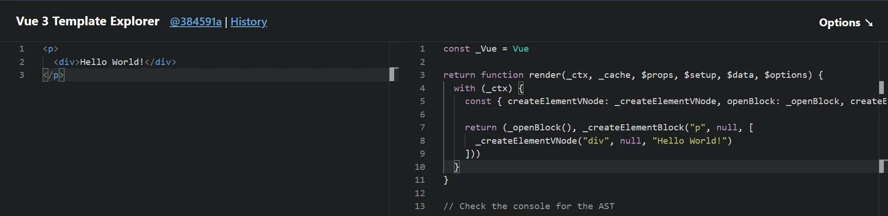
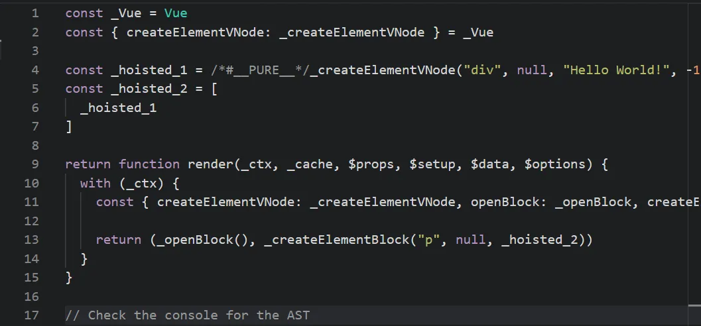
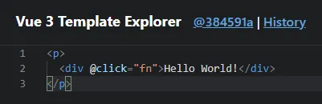
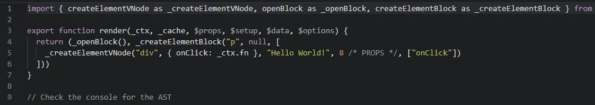
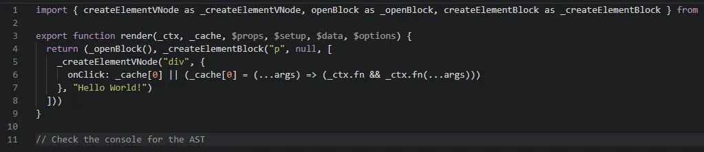
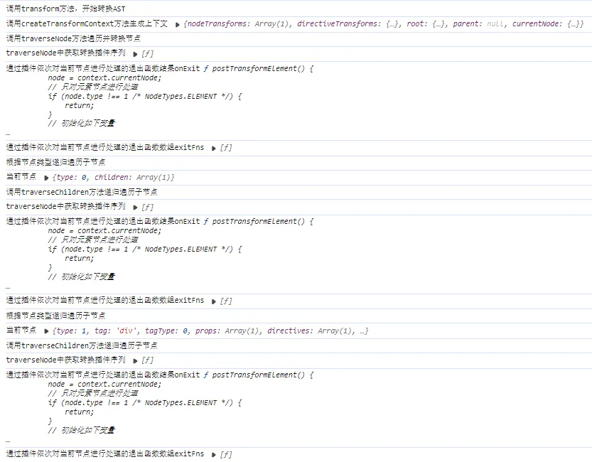
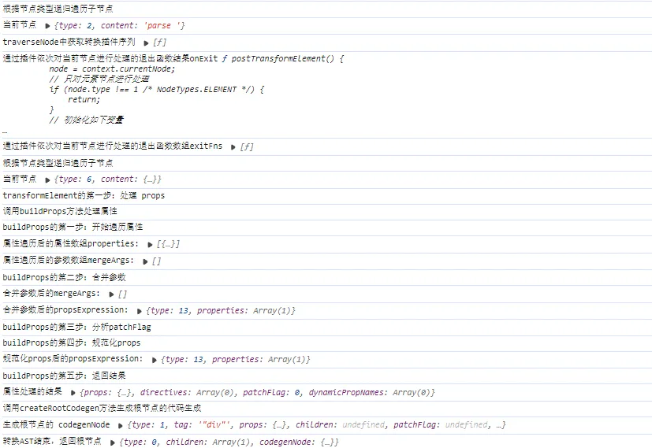

本章主要讲解 `transform` 的实现。

通过我们上面实现的 `parse` 已经生成了一棵 `AST`，已经可以直接用这棵 `AST` 来生成目标代码，但是在前置知识中也有提到，并不是为了生成 `AST` 而生成 `AST`，实际上我们可以很方便的对 `AST` 进行修改，以实现一些其他的需求，这里的 `transform` 就是做这个的。

整个 `transform` 的过程非常复杂，而最关键的是整个 `transform` 模块内聚程度很高，变量彼此联系非常紧密，难以彻底简化，因此我这里的实现其实非常粗糙生硬，但也是保留了最关键的核心逻辑，能看懂我的代码，应该就能勉强看懂源码了，同时由于 `transform` 模块较为复杂，因此写了大量注释逐步分析，希望能有耐心看完。

## 15-1 transform 的作用

关于 `transform` 的作用，努力概括的话还是可以简单概括为以下几点：

- 对 `AST` 部分可优化结构进行优化
- 处理指令
- 生成 `patchFlag`
- 生成 `codegenNode` 节点

其中第三点和第四点非常非常重要，以下详细解释。

- **patchFlag**
  `patchFlag` 其实和前面 `runtime` 中的 `shapeFlag` 很像，都是一个枚举，不过 `patchFlag` 标记的是 `diff` 的方式，也就是根据节点需要进行的 `diff` 类型进行标记，在源码中，`patchFlag` 长这样：

  ```typescript
  // https://github.com/vuejs/core/blob/main/packages/shared/src/patchFlags.ts
  export const enum PatchFlags {
    TEXT = 1,
    CLASS = 1 << 1,
    STYLE = 1 << 2,
    PROPS = 1 << 3,
    FULL_PROPS = 1 << 4,
    HYDRATE_EVENTS = 1 << 5,
    STABLE_FRAGMENT = 1 << 6,
    KEYED_FRAGMENT = 1 << 7,
    UNKEYED_FRAGMENT = 1 << 8,
    NEED_PATCH = 1 << 9,
    DYNAMIC_SLOTS = 1 << 10,
    DEV_ROOT_FRAGMENT = 1 << 11,

    HOISTED = -1,
    BAIL = -2,
  }
  ```

  而后续组件更新时，`diff` 会根据这个 `patchFlag` 来减少计算量，实现靶向更新，这个部分后面会详细讲解。

- **codegenNode**
  `codegenNode` 顾名思义就是用来生成代码的，没错，后面的 `codegen` 代码生成时，就是使用这个 `codegenNode` 生成，`codegenNode` 会记录经过 `transform` 转换之后的信息，包括结构转换、类型转换、`patchFlag` 等，而之后 `codegen` 就会根据 `codegenNode` 来生成最终的目标代码，而具体的转换方式后面再说，简言之就是，`codegenNode` 表示的其实是节点的结构和内容，以此来简化 `generate` 代码生成环节。

## 15-2 transform 的分析

抛开茫茫多的接口定义，在 [transform.ts](https://github.com/vuejs/core/blob/main/packages/compiler-core/src/transform.ts) 的 125 行，可以看到一个 `createTransformContext` 函数，这个是用来创建整个 `transform` 模块的上下文的，会将一些需要用到的数据保存在其中，方便实现多个函数之间的数据共享，此外提一嘴，在 `parse`、`transform`、`codegen` 都有 `createxxxContext` 函数，大家可以学习一下这种组织思路。

那么来粗略看一下其中几个需要解释的参数：

```typescript
// https://github.com/vuejs/core/blob/main/packages/compiler-core/src/transform.ts r125
export function createTransformContext(
  root,
  {
    hoistStatic = false,
    cacheHandlers = false,
    nodeTransforms = [],
    directiveTransforms = {},
  }
) {
  const context = {
    // options
    hoistStatic, // 是否开启静态变量提升
    cacheHandlers, // 是否开启事件缓存
    nodeTransforms, // 节点转换函数序列
    directiveTransforms, // 指令转换函数序列

    // state
    root, // 根节点
    helpers: new Map(), // 助手函数
    components: new Set(), // 组件序列
    directives: new Set(), // 指令序列
    hoists: [], // 提升序列
    parent: null, // 父节点
    currentNode: root, // 当前操作节点

    // methods
    helper(name) {
      // TODO
    },
    helperString(name) {
      // TODO
    },
    hoist(exp) {
      // TODO
    },
    cache(exp, isVNode = false) {
      // TODO
    },
  };
  return context;
}
```

### 15-2-1 helper

顾名思义助手，整个 transform 过程中基本到处都有它，借助[官方工具](https://template-explorer.vuejs.org/)来看看 helper 是干嘛的。

如下图，这个工具会根据左侧输入的模板结构，将编译结果展示在右侧：

图中的 `_createElementVNode` 函数、`_openBlock 函数`、`_createElementBlock` 函数就是一个个 `helper`，会提前引入以确保可以正常使用。这些 `helper` 函数实际上都是在其他地方定义好并暴露出来，可以正常使用的，只不过通过 `helper` 引入而已，因此 `helper` 实际上就是一些需要提前引入以确保生成的代码能够正常运行的函数，下面是列举出的一些 `helper` 函数：

```typescript
// https://github.com/vuejs/core/blob/main/packages/compiler-core/src/runtimeHelpers.ts
export const FRAGMENT = Symbol(__DEV__ ? `Fragment` : ``);
export const OPEN_BLOCK = Symbol(__DEV__ ? `openBlock` : ``);
export const CREATE_BLOCK = Symbol(__DEV__ ? `createBlock` : ``);
export const CREATE_ELEMENT_BLOCK = Symbol(__DEV__ ? `createElementBlock` : ``);
export const CREATE_VNODE = Symbol(__DEV__ ? `createVNode` : ``);
export const CREATE_ELEMENT_VNODE = Symbol(__DEV__ ? `createElementVNode` : ``);
// ......

export const helperNameMap: any = {
  [OPEN_BLOCK]: `openBlock`,
  [CREATE_BLOCK]: `createBlock`,
  [CREATE_ELEMENT_BLOCK]: `createElementBlock`,
  [CREATE_VNODE]: `createVNode`,
  [CREATE_ELEMENT_VNODE]: `createElementVNode`,
  // .............
};

// 用来将 helper 函数注入当前生产环境
export function registerRuntimeHelpers(helpers: any) {
  Object.getOwnPropertySymbols(helpers).forEach((s) => {
    helperNameMap[s] = helpers[s];
  });
}
```

### 15-2-2 hoistStatic

这个变量决定是否开启静态提升，静态提升顾名思义就是将一些静态数据提升到函数体外部提前声明，相当于进行缓存，这样在多次引用时就不需要每次都计算，直接拿来把你即可，具体效果如下图 。

还是刚才那个模版结构，在那个工具的右上角 **Options** 按钮处勾选了 `hoistStatic` 后，因为这整个 p 节点实际上就是一个静态节点，因为其中的内容没有改变的机会，所以全部都可以提升：<br />

可以看到 `_hoisted_1` 创建了一个文本节点，并且 `_hoisted_2` 将其封装进数组，表示子节点，而在使用时直接使用 `_hoisted_2` 即可，这就是静态提升，后续如果还要用到这个 p 节点就不需要重新创建，直接使用 `_hoisted_1` 即可。

此外提一嘴，`/*#**PURE**_/` 表示这个函数是一个没有副作用的纯函数，用来引导 `tree-shaking`，`-1_ HOISTED_ `就是这个节点的 `patchFlag`。

### 15-2-3 nodeTransforms

这个 `nodeTransforms` 是节点转换函数序列，其中保存了需要执行的转换函数，在 `transform` 函数中其实并没有显式的进行节点转换，而是将这些函数保存在 `nodeTransforms` 中，时机成熟再一次性执行，那么我说的时机成熟指的是什么呢？

前面提到，`transform` 做的事情其中有一项，生成 `codegenNode`，而这个 `codegenNode` 中当然也需要保存节点的基本信息，其中就包括子节点，而子节点又有自己的 `codegenNode`，如此嵌套形成一个复杂的树状结构。那么生成 `codegenNode` 的顺序最合适的应该是从叶节点往根节点逆序生成，如此就可以保证 `codegenNode` 中的 `children` 都有自己的 `codegenNode`。

那么这个执行的时机实际上就是在子节点的 `codegenNode` 生成之后再来执行，而源码中是怎么做的呢，如下：

```typescript
// https://github.com/vuejs/core/blob/main/packages/compiler-core/src/transform.ts#L411
export function traverseNode(
  node: RootNode | TemplateChildNode,
  context: TransformContext
) {
  context.currentNode = node;
  // apply transform plugins
  const { nodeTransforms } = context;
  const exitFns = [];
  for (let i = 0; i < nodeTransforms.length; i++) {
    const onExit = nodeTransforms[i](node, context);
    if (onExit) {
      exitFns.push(onExit);
    }
  }

  switch (node.type) {
    // ...............
    case NodeTypes.IF_BRANCH:
    case NodeTypes.FOR:
    case NodeTypes.ELEMENT:
    case NodeTypes.ROOT:
      // traverseChildren 里会递归调用 traverseNode
      traverseChildren(node, context);
      break;
  }

  // exit transforms
  context.currentNode = node;
  let i = exitFns.length;
  while (i--) {
    exitFns[i]();
  }
}
```

以上是简化后的代码，可以看到尤大很贴心的注释了一句 `"apply transform plugins"`，意思是应用转换插件，for 循环遍历 `nodeTransforms`，将返回结果压入 `exitFns` 中，而在 `switch-case` 递归结束之后，开始依次调用 `exitFns` 的栈顶函数，因此才叫退出函数。换个角度说，`codegenNode` 实际上是在 `"transform plugins"` 转化插件中生成。

### 15-2-4 directiveTransforms

经过了上面 `nodeTransforms` 的分析，实际上 `directiveTransforms` 也是转换插件的一类，用来处理指令的，只不过这个调用时机比较特殊，指令的转换是在元素转换中进行的，不过多进行赘述。

### 15-2-5 exitFns

这里稍微提一下退出函数是个什么东西，以下是元素转换插件 `transformElement` 的代码结构：

```typescript
export const transformElement: NodeTransform = (node, context) => {
  // perform the work on exit, after all child expressions have been
  // processed and merged.
  return function postTransformElement() {
    // TODO
  }
```

可以看到 `transformElement` 是一个高阶函数，返回了一个 `postTransformElement` 函数，`codegenNode` 生成以及 `patchFlag` 分析其实都是在返回的这个退出函数当中进行的。额外提一嘴，这里将 `postTransformElement` 所需的上下文环境缓存了下来，因此执行时只需要直接 `exitFns[i]()` 执行即可。

### 15-2-6 cacheHandlers

这个 `cacheHandlers` 挺有说法的，其实主要是针对事件处理函数 `eventHandler` 的缓存，如下：

给一个元素注册一个点击事件：<br />

默认情况下会被编译为：<br />

开启了事件缓存之后会编译成下面这样：<br />

放在一起对比如下：

```typescript
// 无事件缓存
{
  onClick: _ctx.fn;
}

// 开启事件缓存
{
  onClick: _cache[0] || (_cache[0] = (...args) => _ctx.fn && _ctx.fn(...args));
}
```

也就是说，开启时会尝试将事件处理函数 `eventHandler` 缓存在 `_cache` 中，后面再用到的时候就不需要再重新定义这个 `eventHandler`。

## 15-3 transform 的实现

**`transform` 模块实现的主要思路是创建处理上下文——>遍历 `AST`，递归处理每个节点，根据不同情况进行不同的处理**。

### 15-3-1 基本逻辑的实现

我们先实现上面提到的用来创建整个 `transform` 模块上下文的 `createTransformContext` 函数。下面是一个不含任何优化策略、只负责核心逻辑的实现：

```typescript
// weak-vue\packages\compiler-core\src\transform.ts
// 创建处理节点的上下文
export function createTransformContext(
  root,
  { nodeTransforms = [], directiveTransforms = {} }
) {
  const context = {
    // plugin
    nodeTransforms,
    directiveTransforms,

    // state
    root,
    parent: null,
    currentNode: root,
  };
  return context;
}
```

---

`transform` 函数需要做的事情如下：

- 获取上下文
- 遍历处理每个节点
- 生成根节点的 `codegenNode`

```typescript
// weak-vue\packages\compiler-core\src\transform.ts
// 转换节点
export function transform(root, options) {
  const context = createTransformContext(root, options);
  traverseNode(root, context);
  createRootCodegen(root);
}
```

---

`traverseNode` 中需要遍历处理每个节点，而这里的"处理"其实指的就是通过上文提到的转换插件 `transform plugins` 来处理节点，因此这里要做的事情也是很清晰的

- 获取转换插件序列
- 通过插件依次对当前节点进行处理
- 获取退出函数并缓存
- 根据节点类型递归遍历子节点
- 执行退出函数

具体实现如下：

```typescript
// weak-vue\packages\compiler-core\src\transform.ts
// 转换节点
export function transform(root, options) {
  const context = createTransformContext(root, options);
  traverseNode(root, context);
  createRootCodegen(root);
}

// 遍历并转换节点
export function traverseNode(node, context) {
  context.currentNode = node;
  // 获取转换插件序列
  const { nodeTransforms } = context;
  const exitFns = [];
  // 通过插件依次对当前节点进行处理
  for (let i = 0; i < nodeTransforms.length; i++) {
    // 获取退出函数并缓存
    const onExit = nodeTransforms[i](node, context);
    if (onExit) {
      if (isArray(onExit)) {
        exitFns.push(...onExit);
      } else {
        exitFns.push(onExit);
      }
    }
    if (!context.currentNode) {
      return;
    } else {
      node = context.currentNode;
    }
  }
  // 根据节点类型递归遍历子节点
  switch (node.type) {
    case NodeTypes.ELEMENT:
    case NodeTypes.ROOT:
      traverseChildren(node, context);
      break;

    case NodeTypes.INTERPOLATION:
    case NodeTypes.TEXT:
      // TODO：处理插值节点和文本节点
      break;
  }

  context.currentNode = node;

  // 执行退出函数
  // 从叶子节点往根节点执行
  let i = exitFns.length;
  while (i--) {
    exitFns[i]();
  }
}
```

这里的 `nodeTransforms` 插件后面再来实现，先放放。

---

遍历子节点就比较简单，只需要遍历其 `children` 节点即可，而需要注意的是，如果子节点是一个字符串的话就直接跳过不处理，其他情况就可以放心递归了：

```typescript
// weak-vue\packages\compiler-core\src\transform.ts
// 遍历子节点
export function traverseChildren(parent, context) {
  for (let i = 0; i < parent.children.length; i++) {
    const child = parent.children[i];
    if (isString(child)) continue;
    context.parent = parent;
    traverseNode(child, context);
  }
}
```

---

这样就可以实现递归遍历 `AST` 中的每个节点了，而在经过转换插件处理后，需要 `codegenNode` 的节点会生成自己的 `codegenNode`，可是此时根节点 `NodeTypes.ROOT` 还需要 `codegenNode` 来作为 `generate` 的入口，如下：

```typescript
// weak-vue\packages\compiler-core\src\transform.ts
// 生成根节点的 codegenNode
export function createRootCodegen(root) {
  const { children } = root;
  if (children.length === 1) {
    const child = children[0];
    if (child.type === NodeTypes.ELEMENT && child.codegenNode) {
      const codegenNode = child.codegenNode;

      root.codegenNode = codegenNode;
    } else {
      root.codegenNode = child;
    }
  }

  // 源码中实现了多根节点的支持
  // else if (children.length > 1) {}
}
```

由于偷懒没支持多根节点组件的情况，因此这里的实现就非常简单，只需要拿子节点的 `codegenNode` 挂载到 root 身上即可，

这里提一嘴，vue3 支持多根节点组件其实是将所有根节点用一个 `fragment` 包裹实现，这个是从 `runtime` 模块开始就偷的懒了，因此在这里也不做实现。

此时，`transform` 的基本逻辑我们就串联起来了，剩下的工作便是具体处理逻辑的一些核心函数的实现。

### 15-3-2 核心功能的实现

接着就是来实现真正的核心功能了，可以看到上面整个 `transform` 函数写完都没有出现过 `codegenNod`e 的创建，实际上是在 `transformElement` 中生成的，这只是其中一个转换插件，但这个比较重要，就优先实现它。

#### 15-3-2-1 用到的一些工具函数

在实现 `transformElement` 之前需要做一些准备，在 `weak-vue\packages\compiler-core\src\ast.ts` 中定义如下工具函数，当然也要添加相应的 `NodeTypes` 属性，这些是后面要用到的函数：

```typescript
// weak-vue\packages\compiler-core\src\ast.ts
/**
 * 下面是与创建codegenNode相关的工具函数
 */
// 创建一个简单的表达式节点
export const createSimpleExpression = (content, isStatic = false) => {
  return {
    type: NodeTypes.SIMPLE_EXPRESSION,
    content,
    isStatic,
  };
};
// 创建一个对象属性节点
export const createObjectProperty = (key, value) => {
  return {
    type: NodeTypes.JS_PROPERTY,
    key: isString(key) ? createSimpleExpression(key, true) : key,
    value,
  };
};
// 创建一个函数调用表达式节点
export const createCallExpression = (args = []) => {
  return {
    type: NodeTypes.JS_CALL_EXPRESSION,
    arguments: args,
  };
};
// 创建一个对象表达式节点
export const createObjectExpression = (properties) => {
  return {
    type: NodeTypes.JS_OBJECT_EXPRESSION,
    properties,
  };
};
// 这个函数是用来生成 codegenNode 的
export const createVNodeCall = (
  type,
  tag,
  props,
  children,
  patchFlag,
  dynamicProps,
  directives,
  isComponent
) => {
  // 源码这里还会处理 helper，这里为了方便暂不处理
  return {
    // 源码这里是 type：NodeTypes.VNODE_CALL，这里为了方便后面处理直接赋值为原本的节点类型
    type,
    tag,
    props,
    children,
    patchFlag,
    dynamicProps,
    directives,
    isComponent,
  };
};
```

#### 15-3-2-2 transformElement 的作用与结构

上文有介绍过，因此不过多赘述，`transformElement` 中需要做的事情其实只有一件事，那就是生成 `codegenNode`，不过反反复复提到 `codegenNode`，它到底是什么样的呢，下面这个是官方源码 `codegenNode` 的接口：

```typescript
// https://github.com/vuejs/core/blob/main/packages/compiler-core/src/ast.ts#L323
export interface VNodeCall extends Node {
  type: NodeTypes.VNODE_CALL;
  tag: string | symbol | CallExpression;
  props: PropsExpression | undefined;
  children:
    | TemplateChildNode[] // multiple children
    | TemplateTextChildNode // single text child
    | SlotsExpression // component slots
    | ForRenderListExpression // v-for fragment call
    | SimpleExpressionNode // hoisted
    | undefined;
  patchFlag: string | undefined;
  dynamicProps: string | SimpleExpressionNode | undefined;
  directives: DirectiveArguments | undefined;
  isBlock: boolean;
  disableTracking: boolean;
  isComponent: boolean;
}
```

可以看到，他的属性其实和之前生成的 `AST` 节点差不多，几个差别大致介绍一下

- **patchFlag**: 引导 `diff` 类型
- **dynamicProps**: 保存动态属性
- **directives**: 保存运行时指令的编译结果(通过 `directiveTransforms` )

在 `transformElement` 中我们要做的全部围绕着这几个 `codegenNode` 属性，步骤如下：

- 处理 `props`
  - 分析属性/指令
  - 合并参数
  - 分析 `patchFlag`
  - 规范化 `props`
- 处理子节点 children
- 处理 patchFlag
- 返回 codegenNode

---

`transfromElement` 的逻辑过于复杂，并且细碎的处理特别多，因此在这里只挑关键点实现，`transformElement` 需要返回一个退出函数 `postTransformElement`，所有的逻辑都在这个退出函数中执行，那么大致的结构就出来了：

```typescript
// weak-vue\packages\compiler-core\src\transforms\transformElement.ts
// 负责创建 codegenNode 的函数，主要工作有处理 props、children、patchFlag然后最终返回一个codegenNode 对象
export const transformElement = (node, context) => {
  return function postTransformElement() {
    node = context.currentNode;

    // 只对元素节点进行处理
    if (node.type !== NodeTypes.ELEMENT) {
      return;
    }

    // 初始化如下变量
    const { tag, props } = node;
    const isComponent = node.tagType === ElementTypes.COMPONENT;

    let vnodeTag = `"${tag}"`;
    let vnodeProps;
    let vnodeChildren;
    let vnodePatchFlag;
    let patchFlag = 0;
    let vnodeDynamicProps;
    let dynamicPropNames;
    let vnodeDirectives;

    // TODO 处理 props

    // TODO 处理 children

    // TODO 处理 patchFlag

    node.codegenNode = createVNodeCall(
      node.type,
      vnodeTag,
      vnodeProps,
      vnodeChildren,
      vnodePatchFlag,
      vnodeDynamicProps,
      vnodeDirectives,
      isComponent
    );
  };
};
```

三个 TODO，我们接下来一个个地去实现。

---

#### 15-3-2-3 处理 props

这里 `props` 的处理可以说是非常麻烦，因为需要做的事情很多，并且都很繁琐，源码中单独抽离一个 `buildProps` 函数来专门处理 `props`，而 `props` 分为静态属性和动态属性，并且还有指令，因此需要分别进行分析，再定义一个 `analyzePatchFlag` 来做一些特殊的处理，如下。

##### 15-3-2-3-1 buildProps

```typescript
// weak-vue\packages\compiler-core\src\transforms\transformElement.ts
// 处理 props(这里跟源码的处理不同，源码的parse将所有属性都处理成了props，我们前面实现的parse分开处理props和directives)
// 所以可以将directives也合并到props中，这样就可以一起处理了
const buildProps = (
  node,
  context,
  props = [...node.props, ...node.directives]
) => {
  // 初始化一些变量
  const isComponent = node.tagType === ElementTypes.COMPONENT;
  let properties = []; // 遍历 props 生成的属性数组
  const mergeArgs = []; // 用于存储需要合并到组件属性中的参数。比如在 Vue 中，可以通过 v-bind 或者简写 : 来绑定一个对象作为组件的属性，这些对象的属性需要被合并到最终的属性对象中。
  const runtimeDirectives = []; // 用于存储运行时指令。在 Vue 中，指令（如 v-if, v-for, v-model 等）是特殊的标记，它们会在运行时对 DOM 元素进行额外的处理。这个数组将存储这些指令的相关信息。

  // 再初始化一些变量
  let patchFlag = 0; // 用于标记属性是否发生了变化，以及变化的类型。用于 diff算法。
  // 这两个布尔值用于标记节点是否有绑定的 class 或 style 属性。这些属性在 Vue 中是特殊的，因为它们可以绑定一个对象或者数组，而不是单个的字符串。
  let hasClassBinding = false;
  let hasStyleBinding = false;
  let hasHydrationEventBinding = false; // 用于标记是否有事件绑定需要在 hydration（Vue 3 中的服务器端渲染过程中的客户端激活）阶段处理。
  let hasDynamicKeys = false; // 用于标记是否有动态 key 属性，这对于列表渲染和虚拟 DOM 的高效更新非常重要。
  const dynamicPropNames = []; // 用于存储动态绑定的属性名。

  const analyzePatchFlag = ({ key }) => {
    // TODO 处理一些绑定了的属性（此处只用到了内置指令）
  };

  for (let i = 0; i < props.length; i++) {
    const prop = props[i];
    if (prop.type === NodeTypes.ATTRIBUTE) {
      // TODO 处理静态属性
    } else {
      // TODO 处理指令
    }
  }

  // TODO 合并参数

  // TODO 分析 patchFlag

  // TODO 规范化 props
};
```

以上就是大致的骨架，接下来一点一点说，一共六个 TODO 等着我们去实现。

##### 15-3-2-3-2 analyzePatchFlag

从上一步给出的代码中可以看到，`analyzePatchFlag` 是 `buildProps` 里面定义的一个方法，主要负责处理一些绑定了的属性。这里面会对当前节点上的一些属性进行分析，并根据分析结果来赋值上面的参数，如 `hasClassBinding`、`hasStyleBinding` 等，后面的分析 `patchFlag` 就会参照这些分析结果来进行，具体如下：

```typescript
// weak-vue\packages\compiler-core\src\transforms\transformElement.ts
// analyzePatchFlag 在下面的属性遍历中被用于处理内置指令，来为后面的 patchFlag 分析过程提供参照标准
const analyzePatchFlag = ({ key }) => {
  // isStatic 会判断传入节点是否是静态的简单表达式节点 (SIMPLE_EXPRESSION)
  if (isStaticExp(key)) {
    const name = key.content;
    // isOn 会判断传入属性是否是 onXxxx 事件注册
    const isEventHandler = isOn(name);

    if (
      !isComponent &&
      isEventHandler &&
      name.toLowerCase() !== "onclick"
      // 源码这里还会忽略 v-model 双向绑定
      // 源码这里还会忽略 onVnodeXXX hooks
    ) {
      hasHydrationEventBinding = true;
    }

    // 源码在这里会忽略 cacheHandler 以及有静态值的属性

    // 这里根据属性的名称进行分析
    if (name === "class") {
      hasClassBinding = true;
    } else if (name === "style") {
      hasStyleBinding = true;
    } else if (name !== "key" && !dynamicPropNames.includes(name)) {
      dynamicPropNames.push(name);
    }

    // 将组件上绑定的类名以及样式视为动态属性
    if (
      isComponent &&
      (name === "class" || name === "style") &&
      !dynamicPropNames.includes(name)
    ) {
      dynamicPropNames.push(name);
    }
  } else {
    // 属性名不是简单表达式 (SIMPLE_EXPRESSION) 的话
    // 则视为有动态键名
    hasDynamicKeys = true;
  }
};
```

##### 15-3-2-3-3 静态属性处理

这一步要做的事情就是将静态属性筛选出来并封装成相应的节点，不过由于我前面偷了懒，基本也没什么动态属性，像 ref、is 之类的我都没有进行实现，因此这一步实现起来就会变成下面这样：

```typescript
// weak-vue\packages\compiler-core\src\transforms\transformElement.ts
for (let i = 0; i < props.length; i++) {
  const prop = props[i];
  // 处理静态属性static attribute
  if (prop.type === NodeTypes.ATTRIBUTE) {
    const { name, value } = prop;
    let valueNode = createSimpleExpression(value || "", true);

    properties.push(
      createObjectProperty(createSimpleExpression(name, true), valueNode)
    );
  } else {
    // TODO 处理指令directives
  }
}
```

就是将静态属性包装成不同类型的节点再存入 `properties` 数组中。

##### 15-3-2-3-4 指令处理

这一步的指令处理是分为两个部分，一个是针对无参数的 `v-bind` 以及 `v-on` 进行处理，第二个是由 `directiveTransforms` 中的指令解析插件来进行运行时指令的处理 处理结果会放入一个 `mergeArgs` 数组。

```typescript
// weak-vue\packages\compiler-core\src\transforms\transformElement.ts
// 处理指令directives
const { name, arg, exp } = prop;
const isVBind = name === "bind";
const isVOn = name === "on";

// 源码这里会跳过以下指令
// v-slot
// v-once/v-memo
// v-is/:is
// SSR 环境下的 v-on

// 处理无参数的 v-bind 以及 v-on（比如 v-bind="obj"此时上面绑定的内容可以动态更换，有参数的情况是 v-bind:xxx="obj"）
if (!arg && (isVBind || isVOn)) {
  // 有动态的键
  hasDynamicKeys = true;

  // 有值的话，则进行处理
  if (exp) {
    if (properties.length) {
      mergeArgs.push(createObjectExpression(properties));
      properties = [];
    }

    if (isVBind) {
      // 是 v-bind
      mergeArgs.push(exp);
    } else {
      // 是 v-on
      mergeArgs.push({
        type: NodeTypes.JS_CALL_EXPRESSION,
        arguments: [exp],
      });
    }
  }
  continue;
}

// 运行时指令处理
const directiveTransform = context.directiveTransforms[name];
if (directiveTransform) {
  // 内置指令
  const { props, needRuntime } = directiveTransform(prop, node, context);
  // 每个属性都去执行一遍 analyzePatchFlag
  props.forEach(analyzePatchFlag);
  properties.push(...props);
  if (needRuntime) {
    runtimeDirectives.push(prop);
  }
} else {
  // 自定义指令
  runtimeDirectives.push(prop);
}
```

##### 15-3-2-3-5 合并参数

在这一步会根据参数不同进一步进行封装，`mergeArgs` 只会在处理无参数的 `v-bind`、`v-on` 时才会进行处理，因此这一步合并的其实就是 `v-bind` 和 `v-on` 。

```typescript
// weak-vue\packages\compiler-core\src\transforms\transformElement.ts
// 合并参数
let propsExpression = undefined; // propsExpression 是一个表达式，它代表了组件的属性（props）的最终形式。
// 如果有 v-bind
if (mergeArgs.length) {
  // 如果有其他属性，那么将它们合并到 mergeArgs 中，因为最终的 propsExpression 是通过 mergeArgs 创建的。
  if (properties.length) {
    mergeArgs.push(createObjectExpression(properties));
  }

  if (mergeArgs.length > 1) {
    propsExpression = createCallExpression(mergeArgs);
  } else {
    // 只有一个 v-bind
    propsExpression = mergeArgs[0];
  }
} else if (properties.length) {
  propsExpression = createObjectExpression(properties);
}
```

下面举一个实际例子来说明它发挥的作用。

假设我们有一个 vue 组件的模板如下：

```vue
<template>
  <ChildComponent
    v-bind="{ prop1: 'value1', prop2: 'value2' }"
    additionalProp="extraValue"
  />
</template>
```

转化出来的 `AST` 在经过我们上面两步的处理后（静态属性与指令），生成两个数组：

- `mergeArgs`: 包含了通过 `v-bind/v-on` 传递的对象 `[{ prop1: 'value1'}, {prop2: 'value2' }]`。
- `properties`: 包含了直接绑定的属性 `['additionalProp']`。

之后会进行合并，生成类似下面的结构：（合并处理，结构只是类似并不是像下面这样，后面测试时再打印实际的结构）

```typescript
propsExpression = this.$createElement("ChildComponent", {
  prop1: "value1",
  prop2: "value2",
  additionalProp: "extraValue",
});
```

此时更便于后面的 `generate` 函数生成，最终便于真实节点渲染。

##### 15-3-2-3-6 分析 patchFlag

`patchFlag` 在 `vue3` 中被用于静态标记，是 `vue3` 相比于 `vue2` 新增的一个性能优化点。在 `vue2` 中，每次更新 `diff`，都是全量对比，而 `vue3` 则只对比带有标记的，这样大大减少了非动态内容的对比消耗。

根据所包含的属性的不同定义不同的 `patchFlag`，而这里用到的位运算符的相关知识在前面讲 `VNode` 的时候已经讲过了就不过多赘述：

```typescript
// weak-vue\packages\compiler-core\src\transforms\transformElement.ts
// 分析 patchFlag
if (hasDynamicKeys) {
  patchFlag |= PatchFlags.FULL_PROPS;
} else {
  if (hasClassBinding && !isComponent) {
    patchFlag |= PatchFlags.CLASS;
  }
  if (hasStyleBinding && !isComponent) {
    patchFlag |= PatchFlags.STYLE;
  }
  if (dynamicPropNames.length) {
    patchFlag |= PatchFlags.PROPS;
  }
  if (hasHydrationEventBinding) {
    patchFlag |= PatchFlags.NEED_HYDRATION;
  }
}

// 这里在源码中还会考虑 ref 以及 vnodeHook
if (
  (patchFlag === 0 || patchFlag === PatchFlags.NEED_HYDRATION) &&
  runtimeDirectives.length > 0
) {
  patchFlag |= PatchFlags.NEED_PATCH;
}
```

下面是作出解释的 `PatchFlags`：

```typescript
// weak-vue\packages\shared\src\patchFlags.ts
export const enum PatchFlags {
  TEXT = 1, // 1 动态的文本节点
  CLASS = 1 << 1, // 2 动态的 class
  STYLE = 1 << 2, // 4 动态的 style
  PROPS = 1 << 3, // 8 动态属性，不包括类名和样式
  FULL_PROPS = 1 << 4, // 16 动态 key，当 key 变化时需要完整的 diff 算法做比较
  NEED_HYDRATION = 1 << 5, // 32 表示带有事件监听器的节点
  STABLE_FRAGMENT = 1 << 6, // 64 一个不会改变子节点顺序的 Fragment
  KEYED_FRAGMENT = 1 << 7, // 128 带有 key 属性的 Fragment
  UNKEYED_FRAGMENT = 1 << 8, // 256 子节点没有 key 的 Fragment
  NEED_PATCH = 1 << 9, // 512  表示只需要non-props修补的元素 (non-props不知道怎么翻才恰当~)
  DYNAMIC_SLOTS = 1 << 10, // 1024 动态的solt
  DEV_ROOT_FRAGMENT = 1 << 11, //2048 表示仅因为用户在模板的根级别放置注释而创建的片段。 这是一个仅用于开发的标志，因为注释在生产中被剥离。

  //以下两个是特殊标记
  HOISTED = -1, // 表示已提升的静态vnode,更新时调过整个子树
  BAIL = -2, // 指示差异算法应该退出优化模式
}
```

##### 15-3-2-3-7 规范化 props

这一步简单来说就是要对 `propsExpression` 进行处理，根据不同的情况包装成不同的 `JS_CALL_EXPRESSION` 对象：

```typescript
// weak-vue\packages\compiler-core\src\transforms\transformElement.ts
// 规范化 props
if (propsExpression) {
  switch (propsExpression.type) {
    // 说明 props 中没有 v-bind，只需要处理动态的属性绑定
    case NodeTypes.JS_OBJECT_EXPRESSION:
      let classKeyIndex = -1;
      let styleKeyIndex = -1;
      let hasDynamicKey = false;

      // 遍历所有 props，获取类名以及样式的索引
      // 并判断是否有动态键名
      for (let i = 0; i < propsExpression.properties.length; i++) {
        const key = propsExpression.properties[i].key;
        // 是静态键名
        if (isStaticExp(key)) {
          if (key.content === "class") {
            classKeyIndex = i;
          } else if (key.content === "style") {
            styleKeyIndex = i;
          }
        }
        // 是动态键名
        else if (!key.isHandlerKey) {
          hasDynamicKey = true;
        }
      }

      const classProp = propsExpression.properties[classKeyIndex];
      const styleProp = propsExpression.properties[styleKeyIndex];

      // 没有动态键名
      if (!hasDynamicKey) {
        // 类名的值是动态的话则包装一下类名的值
        if (classProp && !isStaticExp(classProp.value)) {
          classProp.value = createCallExpression([classProp.value]);
        }

        // 样式的值是动态的则包装一下样式的值
        if (
          styleProp &&
          !isStaticExp(styleProp.value) &&
          (hasStyleBinding ||
            styleProp.value.type === NodeTypes.JS_ARRAY_EXPRESSION)
        ) {
          styleProp.value = createCallExpression([styleProp.value]);
        }
      }

      // 有动态键名则直接包装整个 propsExpression
      else {
        propsExpression = createCallExpression([propsExpression]);
      }
      break;

    // 合并属性，不需要处理
    case NodeTypes.JS_CALL_EXPRESSION:
      break;

    // 只有 v-bind 直接包装整个 propsExpression
    default:
      propsExpression = createCallExpression([
        createCallExpression([propsExpression]),
      ]);
      break;
  }
}
```

这一步是为了方便后续的 `generate` 代码生成环节，将属性进一步细分为不同的表达式，生成代码是就可以直接根据节点类型生成不同的结构。

##### 15-3-2-3-8 返回结果

```typescript
// weak-vue\packages\compiler-core\src\transforms\transformElement.ts
// 返回结果
return {
  props: propsExpression,
  directives: runtimeDirectives,
  patchFlag,
  dynamicPropNames,
};
```

自此，我们的 `buildProps` 函数就完成了。`transformElement` 方法的三个 TODO 中的第一个——**处理 props** 也便完成：

```typescript
// weak-vue\packages\compiler-core\src\transforms\transformElement.ts
// 处理 props
// 获取属性解析结果
const propsBuildResult = buildProps(node, context);
vnodeProps = propsBuildResult.props;
patchFlag = propsBuildResult.patchFlag;
dynamicPropNames = propsBuildResult.dynamicPropNames;
vnodeDirectives = propsBuildResult.directives;
```

##### 15-3-2-3-9 测试

我们上面关于处理 `props` 写了很多代码，但是并没有进行测试。现在模仿 `parse` 的逐步打点测试。

首先在我们的 `weak-vue\packages\compiler-core\src\compile.ts` 文件进行 `transform` 调用：

```typescript
// weak-vue\packages\compiler-core\src\compile.ts
import { extend, isString } from "@vue/shared";
import { baseParse } from "./parse";
import { transform } from "./transform";
import { transformElement } from "./transforms/transformElement";

export const getBaseTransformPreset: () => [any[], {}] = () => {
  // 插件预设
  return [[transformElement], {}];
};

// 完整编译过程：template -> ast -> codegen -> render
export const baseCompile = (template, options: any = {}) => {
  // 第一步：将模板字符串转换成AST
  const ast = isString(template) ? baseParse(template) : template;
  // 第二步：AST加工
  const [nodeTransforms, directiveTransforms] = getBaseTransformPreset();
  transform(
    ast,
    extend({}, options, {
      nodeTransforms: [...nodeTransforms, ...(options.nodeTransforms || [])],
      directiveTransforms: extend(
        {},
        directiveTransforms,
        options.directiveTransforms || {} // user transforms
      ),
    })
  );

  // 第三步：将AST转换成渲染函数，最终得到一个render渲染函数
};
```

此时再去我们前面写好的代码里面逐步加上相应的 `console.log`(具体可看本章对应的代码提交记录），然后运行我们上一章的测试用例，可以看到控制台打印结果：

```html
<div class="a" v-bind:b="c">parse {{ element }}</div>
```





我们只看最后转化的 `AST`，多了一个 `codegenNode` 子节点：

```json
{
  "type": 0,
  "children": [
    {
      "type": 1,
      "tag": "div",
      "tagType": 0,
      "props": [
        {
          "type": 4,
          "name": "class",
          "value": {
            "type": 2,
            "content": "a"
          }
        }
      ],
      "directives": [
        {
          "type": 5,
          "name": "bind",
          "exp": {
            "type": 3,
            "content": "c",
            "isStatic": false
          },
          "arg": {
            "type": 3,
            "content": "b",
            "isStatic": true
          }
        }
      ],
      "isSelfClosing": false,
      "children": [
        {
          "type": 2,
          "content": "parse "
        },
        {
          "type": 6,
          "content": {
            "type": 3,
            "isStatic": false,
            "content": "element"
          }
        }
      ],
      "codegenNode": {
        "type": 1,
        "tag": "\"div\"",
        "props": {
          "type": 13,
          "properties": [
            {
              "type": 10,
              "key": {
                "type": 3,
                "content": "class",
                "isStatic": true
              },
              "value": {
                "type": 3,
                "content": {
                  "type": 2,
                  "content": "a"
                },
                "isStatic": true
              }
            }
          ]
        },
        "directives": [],
        "isComponent": false
      }
    }
  ],
  "codegenNode": {
    "type": 1,
    "tag": "\"div\"",
    "props": {
      "type": 13,
      "properties": [
        {
          "type": 10,
          "key": {
            "type": 3,
            "content": "class",
            "isStatic": true
          },
          "value": {
            "type": 3,
            "content": {
              "type": 2,
              "content": "a"
            },
            "isStatic": true
          }
        }
      ]
    },
    "directives": [],
    "isComponent": false
  }
}
```

此时还剩两个`TODO` —— **处理 `children`** 与**处理 `patchFlag`**。

#### 15-3-2-4 处理 children

这一步需要处理一些内置组件，分析其中的动态内容，并获取 `vnodeChildren`，源码中处理了 `keep alive`、`teleport`，不过这些我都没实现，因此就十分简单了，如下：

```typescript
// weak-vue\packages\compiler-core\src\transforms\transformElement.ts
// 处理 children
if (node.children.length > 0) {
  if (node.children.length === 1) {
    const child = node.children[0];
    const type = child.type;

    // 分析是否存在动态文本子节点，插值表达式和复合文本节点
    const hasDynamicTextChild =
      type === NodeTypes.INTERPOLATION ||
      type === NodeTypes.COMPOUND_EXPRESSION;

    // 有动态文本子节点则修改 patchFlag
    if (hasDynamicTextChild) {
      patchFlag |= PatchFlags.TEXT;
    }

    // 获取 vnodeChildren
    if (hasDynamicTextChild || type === NodeTypes.TEXT) {
      vnodeChildren = child;
    } else {
      vnodeChildren = node.children;
    }
  } else {
    vnodeChildren = node.children;
  }
}
```

#### 15-3-2-5 处理 patchFlag

此时来到了 `transformElement` 的最后一个 TODO —— **处理 `patchFlag`**。

这里的**处理 `patchFlag`** 应该说是**格式化**，`patchFlag` 的赋值截止到这一步已经完成了，这里主要是打上开发环境的标识方便查看和调试，具体如下：

```typescript
// weak-vue\packages\compiler-core\src\transforms\transformElement.ts
// 处理 patchFlag
if (patchFlag !== 0) {
  // patchFlag 为负数则说明不存在复合情况
  if (patchFlag < 0) {
    vnodePatchFlag = patchFlag + ` /* ${PatchFlagNames[patchFlag]} */`;
  }

  // patchFlag 为正数说明可能存在复合情况，特殊处理
  else {
    const flagNames =
      // 获取 PatchFlagNames 中所有的键名
      Object.keys(PatchFlagNames)
        // 全部转换为 Number 类型
        .map(Number)
        // 只保留 patchFlag 中存在的，并且值大于 0 的
        .filter((n) => n > 0 && patchFlag & n)
        // 将 patchFlag 数值转换成对应 patchFlag 名称
        .map((n) => PatchFlagNames[n])
        // 用逗号连接
        .join(", ");

    // 将上面的内容注释在 patchFlag 后面作为一个参考
    vnodePatchFlag = patchFlag + ` /* ${flagNames} */`;
  }

  // TODO 处理动态属性名
}
```

这里再说一下上面的那一连串 `api`，举个例子 `patchFlag = 7`，对应的二进制数据为 `111(2)`，那么就意味着是 `TEXT | CLASS | STYLE` 构成的，经过上面的一连串 `api` 之后就会变成：

```typescript
// patchFlag = 7 === 1 | 10 | 100 === TEXT | CLASS | STYLE
flagNames = "TEXT, CLASS, STYLE";
// vnodePatchFlag = '7 /* TEXT, CLASS, STYLE */';
```

---

在处理 `patchFlag` 的过程中引入了一个新的 `TODO` —— **处理动态属性名**。

这一步要将之前获取到的动态属性 `dynamicPropNames` 转换成字符串，方便后面代码生成环节使用，非常简单，如下：

```typescript
// weak-vue\packages\compiler-core\src\transforms\transformElement.ts
// 处理 patchFlag
if (patchFlag !== 0) {
  // ...

  // 处理动态属性名
  if (dynamicPropNames && dynamicPropNames.length) {
    vnodeDynamicProps = stringifyDynamicPropNames(dynamicPropNames);
  }
}

// 遍历所有节点并转换成数组结构的字符串返回
const stringifyDynamicPropNames = (props) => {
  let propsNamesString = "[";
  for (let i = 0, l = props.length; i < l; i++) {
    propsNamesString += JSON.stringify(props[i]);
    if (i < l - 1) propsNamesString += ",";
  }
  return propsNamesString + "]";
};
```

---

此时再去执行我们上面的测试用例重新打印结果（`codegenNode 更新`），可以看到新的 `AST` 如下：

```json
{
  "type": 0,
  "children": [
    {
      "type": 1,
      "tag": "div",
      "tagType": 0,
      "props": [
        {
          "type": 4,
          "name": "class",
          "value": {
            "type": 2,
            "content": "a"
          }
        }
      ],
      "directives": [
        {
          "type": 5,
          "name": "bind",
          "exp": {
            "type": 3,
            "content": "c",
            "isStatic": false
          },
          "arg": {
            "type": 3,
            "content": "b",
            "isStatic": true
          }
        }
      ],
      "isSelfClosing": false,
      "children": [
        {
          "type": 2,
          "content": "parse "
        },
        {
          "type": 6,
          "content": {
            "type": 3,
            "isStatic": false,
            "content": "element"
          }
        }
      ],
      "codegenNode": {
        "type": 1,
        "tag": "\"div\"",
        "props": {
          "type": 13,
          "properties": [
            {
              "type": 10,
              "key": {
                "type": 3,
                "content": "class",
                "isStatic": true
              },
              "value": {
                "type": 3,
                "content": {
                  "type": 2,
                  "content": "a"
                },
                "isStatic": true
              }
            }
          ]
        },
        "children": [
          {
            "type": 2,
            "content": "parse "
          },
          {
            "type": 6,
            "content": {
              "type": 3,
              "isStatic": false,
              "content": "element"
            }
          }
        ],
        "patchFlag": "512 /* NEED_PATCH */",
        "directives": [
          {
            "type": 5,
            "name": "bind",
            "exp": {
              "type": 3,
              "content": "c",
              "isStatic": false
            },
            "arg": {
              "type": 3,
              "content": "b",
              "isStatic": true
            }
          }
        ],
        "isComponent": false
      }
    }
  ],
  "codegenNode": {
    "type": 1,
    "tag": "\"div\"",
    "props": {
      "type": 13,
      "properties": [
        {
          "type": 10,
          "key": {
            "type": 3,
            "content": "class",
            "isStatic": true
          },
          "value": {
            "type": 3,
            "content": {
              "type": 2,
              "content": "a"
            },
            "isStatic": true
          }
        }
      ]
    },
    "children": [
      {
        "type": 2,
        "content": "parse "
      },
      {
        "type": 6,
        "content": {
          "type": 3,
          "isStatic": false,
          "content": "element"
        }
      }
    ],
    "patchFlag": "512 /* NEED_PATCH */",
    "directives": [
      {
        "type": 5,
        "name": "bind",
        "exp": {
          "type": 3,
          "content": "c",
          "isStatic": false
        },
        "arg": {
          "type": 3,
          "content": "b",
          "isStatic": true
        }
      }
    ],
    "isComponent": false
  }
}
```

此时去对比我们的 `codegenNode` 与下面这个标准 `codegenNode` 结构，可以发现一个问题：缺少 `dynamicProps` 属性。

```typescript
// 标准 codegenNode 结构
{
    type,
    tag,
    props,
    children,
    patchFlag,
    dynamicProps,
    directives,
    isComponent,
};
```

这个问题是下面这段代码导致的，此时因为我们此时只定义了 `transformElement` 这一个转化插件，而关于指令的转化插件如 `vBind`、`vOn` 等没有去实现，导致 `weak-vue\packages\compiler-core\src\compile.ts` 中传入的 `directiveTransforms` 为空`{}`，然后这里的 `directiveTransform` 获取为 `undefined`，无法进入 `analyzePatchFlag` 里面的处理逻辑（导致 `buildProps` 方法返回的 `dynamicPropNames` 属性为空数组），进而导致这个问题。

```typescript
// weak-vue\packages\compiler-core\src\transforms\transformElement.ts
if (prop.type === NodeTypes.ATTRIBUTE) {
  // ...
} else {
  // 运行时指令处理
  const directiveTransform = context.directiveTransforms[name];
  if (directiveTransform) {
    // 内置指令
    const { props, needRuntime } = directiveTransform(prop, node, context);
    // 每个属性都去执行一遍 analyzePatchFlag
    props.forEach(analyzePatchFlag);
    properties.push(...props);
    if (needRuntime) {
      runtimeDirectives.push(prop);
    }
  } else {
    // 自定义指令
    runtimeDirectives.push(prop);
  }
}
```

### 15-3-3 transformText 的实现

在上面我们实现了负责对元素节点进行转化的插件 `transformElement` ，下面我们去实现 `transformText`。

在上面 `transformElement` 过程中有提到过一个组合表达式类型 `NodeTypes.COMPOUND_EXPRESSION`（比如`{{ a + b }}`中的 `a + b`），这个是在 `transformText` 中进行转换的，简单来说就是将几个同层级且连续的文本节点或者插值表达式节点进行一个合并变成一个组合表达式，这一步其实不是必须的，但是逻辑比较简单，就顺带写上了。

这里的关键词在于同层级和连续，最直接的思路就是直接两层 for 循环暴力穷举，而源码中也确实是这么做的。此外需要注意 `transformText` 也是一个 `transform plugins` 转换插件，因此也得返回一个退出函数。

```typescript
// weak-vue\packages\compiler-core\src\transforms\transformText.ts
// 处理组合表达式
export const transformText = (node) => {
  // 只有元素节点和根节点需要处理
  if (node.type === NodeTypes.ROOT || node.type === NodeTypes.ELEMENT) {
    return function postTransformText() {
      console.log("调用transformText方法处理组合表达式，当前节点为", node);
      const children = node.children;
      let currentContainer = undefined;
      let hasText = false;

      // 遍历查找文本/插值表达式节点
      for (let i = 0; i < children.length; i++) {
        const child = children[i];
        // 找到则将 hasText 置为 true 并查找后面的节点
        if (isText(child)) {
          hasText = true;
          // 查找后面的节点
          for (let j = i + 1; j < children.length; j++) {
            const next = children[j];
            // 找到了则进行合并
            if (isText(next)) {
              if (!currentContainer) {
                currentContainer = children[i] = {
                  type: NodeTypes.COMPOUND_EXPRESSION,
                  children: [child],
                };
              }

              // 合并相邻文本/插值表达式节点到 currentContainer 内，currentContainer 只是children[i]的一个引用，改变currentContainer的值，children[i]也会改变
              currentContainer.children.push(next);
              children.splice(j, 1);
              j--;
            } else {
              // 没找到就直接退出
              currentContainer = undefined;
              break;
            }
          }
        }
      }
      console.log("处理组合表达式后的结果currentContainer", currentContainer);
    };
  }
};
```

此时去打印我们新的 `AST`，可以看到：

```typescript
// 原本AST的这个节点：
        "children": [
            {
                "type": 2,
                "content": "parse "
            },
            {
                "type": 6,
                "content": {
                    "type": 3,
                    "isStatic": false,
                    "content": "element"
                }
            }
        ],

// 经过 transformText 处理后变成：
        "children": {
            "type": 8,
            "children": [
                {
                    "type": 2,
                    "content": "parse "
                },
                {
                    "type": 6,
                    "content": {
                        "type": 3,
                        "isStatic": false,
                        "content": "element"
                    }
                }
            ]
        },
```

---

### 15-3-4 directiveTransforms 的实现

#### 15-3-4-1 前言

到这里 `transform` 模块其实已经基本实现了，不过还需要专门再处理一下 `v-on` 和 `v-bind`，也以此作为一个简单的例子看看指令编译都会做些什么。

`directiveTransforms` 也是一类 `transform plugin` 转换插件，其中包括一些 `transformOn`、`transformBind` 之类的指令处理函数，本文就实现这两个，指令处理做的事情都比较琐碎，简单概括一下就是：

- 针对不同的指令进行不同的处理：
  - `v-on` 需要驼峰化事件监听、处理事件监听缓存、应用拓展插件等
  - `v-bind` 需要处理一些前置修饰符并进行一些容错处理
- 将指令内容包装成 JS_PROPERTY 对象返回

---

下面是新定义的两个工具函数：

```typescript
// weak-vue\packages\shared\src\general.ts
// 驼峰化
export const capitalize = (str) => {
  // e.g
  // my-first-name
  // myFirstName
  // replace 第二个参数可以是一个函数
  // 这个函数接收两个参数
  //      match: 匹配到的子串
  //      p1,p2,p3...: 假如 replace 第一个参数是正则表达式
  //                   则代表第 n 个括号匹配到的字符串
  // 如上例子中
  // nerverUse 是 -f、-n
  // c 是 f、n
  return str.replace(/-(\w)/g, (neverUse, c) => (c ? c.toUpperCase() : ""));
};

// 这里是一个将 xxx-xx 转化为 onxxxXx 的工具函数
export const toHandlerKey = (str) => (str ? `on${capitalize(str)}` : "");
```

#### 15-3-4-2 transformOn

源码种`transformOn` 中要做的事情很繁琐，但我们的 `transformOn` 要做的事情非常简单，只需要驼峰化事件监听，然后包装成 `JS_PROPERTY` 类型的对象返回即可：

```typescript
// weak-vue\packages\compiler-core\src\transforms\vOn.ts
// 处理 v-on 指令
export const transformOn = (dir) => {
  const { arg } = dir;

  // 驼峰化
  let eventName;
  if (arg.type === NodeTypes.SIMPLE_EXPRESSION) {
    if (arg.isStatic) {
      const rawName = arg.content;
      eventName = createSimpleExpression(
        toHandlerKey(capitalize(rawName)),
        true
      );
    }
    // 源码在这里将动态的事件名处理成组合表达式
  } else {
    eventName = arg;
  }

  // 处理表达式
  let exp = dir.exp;
  if (exp && !exp.content.trim()) {
    exp = undefined;
  }
  // 源码在这里会处理事件缓存
  // 源码在这里会处理外部插件 extended compiler augmentor

  // 包装并返回 JS_PROPERTY 节点
  const ret = {
    props: [
      createObjectProperty(
        eventName,
        exp || createSimpleExpression("() => {}", false)
      ),
    ],
  };
  return ret;
};
```

#### 15-3-4-3 transformBind

`transformBind` 要做的事情简单很多，**容错处理**、**包装节点**，直接看代码：

```typescript
// weak-vue\packages\compiler-core\src\transforms\vBind.ts
// 处理 v-bind 指令
export const transformBind = (dir) => {
  const { exp } = dir;
  const arg = dir.arg;

  // 容错处理，如果为空则输出一个空字符串
  if (arg.type !== NodeTypes.SIMPLE_EXPRESSION) {
    arg.children.unshift("(");
    arg.children.push(') || ""');
  } else if (!arg.isStatic) {
    arg.content = `${arg.content} || ""`;
  }

  // 包装并返回 JS_PROPERTY 节点
  if (
    !exp ||
    (exp.type === NodeTypes.SIMPLE_EXPRESSION && !exp.content.trim())
  ) {
    return {
      props: [createObjectProperty(arg, createSimpleExpression("", true))],
    };
  }

  const ret = {
    props: [createObjectProperty(arg, exp)],
  };

  return ret;
};
```

具体说明上面这个代码的作用。假设我们有一个 Vue 组件的模板，其中使用了 `v-bind` 指令来动态绑定一个属性，如下所示：

```vue
<template>
  <div id="myDiv" v-bind:class="myClass"></div>
</template>

<script>
export default {
  data() {
    return {
      myClass: "active",
    };
  },
};
</script>
```

在 Vue 的编译过程中，`transformBind` 函数会被用来处理 `v-bind:class` 这个指令：

1. `transformBind` 函数接收到的 `dir` 对象可能包含以下信息：
   - `exp`: 表达式对象，这里是 `myClass`。
   - `arg`: 指令的参数，这里是 `class`。
2. 因为 `arg` 是一个简单的表达式，并且是动态的（因为它的值可能会改变），所以 `transformBind` 函数会在 `myClass` 前后添加条件运算符`||`，以确保如果 `myClass` 的值为 `undefined` 或`''`（空字符串），它将返回一个空字符串而不是错误。（即**容错处理**）
3. 最终，`transformBind` 函数会返回一个新的对象，它包含了一个属性，这个属性的键是带有前缀的属性名（`.class`），值是我们的表达式（`myClass`）。（即**包装节点**）

---

#### 15-3-4-4 测试

此时将新增的两个插件在编译函数中配置：

```typescript
// weak-vue\packages\compiler-core\src\compile.ts
export function getBaseTransformPreset() {
  // 插件预设
  return [
    [transformElement, transformText],
    {
      on: transformOn,
      bind: transformBind,
    },
  ];
}

export function baseCompile(template, options = {}) {
  const ast = isString(template) ? baseParse(template, options) : template;

  const [nodeTransforms, directiveTransforms] = getBaseTransformPreset();

  // 这里的 extend 实际上就是 Object.assign()
  transform(
    ast,
    extend({}, options, {
      nodeTransforms: [...nodeTransforms, ...(options.nodeTransforms || [])],
      directiveTransforms: extend(
        {},
        directiveTransforms,
        options.directiveTransforms || {} // user transforms
      ),
    })
  );

  return generate(ast, extend({}, options));
}
```

此时给我们新增的两个插件方法添加对应的 `log`调试，重新去 `npm run build` 跑我们上面的测试用例。

```html
<div class="a" v-bind:b="c">parse {{ element }}</div>
```

我们重点查看下面几个打印效果：

```typescript
// 调用 transformBind 方法处理v-bind指令，进入的节点为
{
  "type": 5,
    "name": "bind",
    "exp": {
    "type": 3,
      "content": "c",
      "isStatic": false
  },
  "arg": {
    "type": 3,
      "content": "b",
      "isStatic": true
  }
}

// transformBind方法处理v-bind指令返回
{
    "props": [
        {
            "type": 10,
            "key": {
                "type": 3,
                "content": "b",
                "isStatic": true
            },
            "value": {
                "type": 3,
                "content": "c",
                "isStatic": false
            }
        }
    ]
}
```

```typescript
// 转换AST结束，返回根节点
{
  "type": 0,
    "children": [
    {
      "type": 1,
      "tag": "div",
      "tagType": 0,
      "props": [
        {
          "type": 4,
          "name": "class",
          "value": {
            "type": 2,
            "content": "a"
          }
        }
      ],
      "directives": [
        {
          "type": 5,
          "name": "bind",
          "exp": {
            "type": 3,
            "content": "c",
            "isStatic": false
          },
          "arg": {
            "type": 3,
            "content": "b",
            "isStatic": true
          }
        }
      ],
      "isSelfClosing": false,
      "children": [
        {
          "type": 8,
          "children": [
            {
              "type": 2,
              "content": "parse "
            },
            {
              "type": 6,
              "content": {
                "type": 3,
                "isStatic": false,
                "content": "element"
              }
            }
          ]
        }
      ],
      "codegenNode": {
        "type": 1,
        "tag": "\"div\"",
        "props": {
          "type": 13,
          "properties": [
            {
              "type": 10,
              "key": {
                "type": 3,
                "content": "class",
                "isStatic": true
              },
              "value": {
                "type": 3,
                "content": {
                  "type": 2,
                  "content": "a"
                },
                "isStatic": true
              }
            },
            {
              "type": 10,
              "key": {
                "type": 3,
                "content": "b",
                "isStatic": true
              },
              "value": {
                "type": 3,
                "content": "c",
                "isStatic": false
              }
            }
          ]
        },
        "children": {
          "type": 8,
          "children": [
            {
                            "type": 2,
                            "content": "parse "
                        },
                        {
                            "type": 6,
                            "content": {
                                "type": 3,
                                "isStatic": false,
                                "content": "element"
                            }
                        }
                    ]
                },
                "patchFlag": "9 /* TEXT, PROPS */",
                "dynamicProps": "[\"b\"]",
                "directives": [],
                "isComponent": false
            }
        }
    ],
    "codegenNode": {
        "type": 1,
        "tag": "\"div\"",
        "props": {
            "type": 13,
            "properties": [
                {
                    "type": 10,
                    "key": {
                        "type": 3,
                        "content": "class",
                        "isStatic": true
                    },
                    "value": {
                        "type": 3,
                        "content": {
                            "type": 2,
                            "content": "a"
                        },
                        "isStatic": true
                    }
                },
                {
                    "type": 10,
                    "key": {
                        "type": 3,
                        "content": "b",
                        "isStatic": true
                    },
                    "value": {
                        "type": 3,
                        "content": "c",
                        "isStatic": false
                    }
                }
            ]
        },
        "children": {
            "type": 8,
            "children": [
                {
                    "type": 2,
                    "content": "parse "
                },
                {
                    "type": 6,
                    "content": {
                        "type": 3,
                        "isStatic": false,
                        "content": "element"
                    }
                }
            ]
        },
        "patchFlag": "9 /* TEXT, PROPS */",
        "dynamicProps": "[\"b\"]",
        "directives": [],
        "isComponent": false
    }
}
```

可以看到，此时新的 `codegenNode` 已被处理正确，同时 `patchFlag` 也被处理正确。

### 15-3-5 总结

#### 15-3-5-1 Q&A 环节

Q：前面反复提到便于 `generate`，到底方便在哪了？ <br />A：原本构建的 `AST` 中，对各个节点的类型的划分是以功能角度出发的，分为 `ROOT`、`ELEMENT`、`ATTRIBUTE` 之类的，但这只是利于我们看，我们一看就知道这是个根节点那是个元素节点，但相比之下这不利于代码生成，因为在代码生成环节，我们需要根据不同的类型生成不同的结构，比如子节点序列应该是个数组，属性应该在一个对象里面，因此 `transform` 环节做的事情之一就是对各个节点的类型进行了进一步的细分，从代码生成的角度出发构建了 `codegenNode`，其中的 `type` 属性表示的并不是这里是一个什么节点，而是这里应该要生成什么结构，其中的区别需要仔细区分。

Q：这一步不是说为了性能优化么，优化了什么？ <br />A：其实做了很多性能优化，但是笔者才疏学浅没法研究透彻，只简单列举几个我能说的出来的。首先最明显的就是为了优化 `diff` 性能给不同的节点打上不同的 `patchFlag`，以此来指导 diff 算法进行，比如一些静态内容不需要 `diff`（如 `HOISTED` ），而一些动态内容可能需要全量 `diff`（如 `FULL_PROPS` ）。接着为了优化运行时的性能，引用了很多优化策略，比如 `EventHandler` 缓存、静态常量提升，这些都是很明显的优性能优化策略。这些比较复杂，需要读者下去和笔者一起学习。

Q：你写的太乱了我看不懂怎么办？ <br />A：我完全不觉得看了我这篇文章就能理解透彻 `transform` 的原理，不过起码能梳理清晰整个 `transform` 的流程以及各个参数的作用，因此可以把我的这篇文章作为一个前置准备，看完之后去看源码会更加顺利也更加明朗。

#### 15-3-5-2 写在最后

前面的代码太过凌乱，难以形成连续的思路，因此在这里多说两句仔细总结一下。

抛开性能优化不谈，整个 `transform` 做的最主要的事情就是从节点对应的代码结构的角度出发构建一个 `AST`，这其中主要就是通过 `codegenNode`。

上面也有提到，`codegenNode` 表示的并不是节点类型，而是节点结构，这对于 `generate` 来说是更有利的，比如看到一个 `JS_ARRAY_EXPRESSION` 就可以直接生成一个数组，看到一个 `JS_OBJECT_EXPRESSION` 就可以直接生成一个对象。

---

自此，我们的 `transform` 模块就基本完成了，到这里的源码请看提交记录（包含逐步打点调试流程的 `log` 代码）：[15、模版的处理（二）](https://github.com/XC0703/VueSouceCodeStudy/commit/6a96781c7856e0e46b22f5c988f441e072ee7463)。
