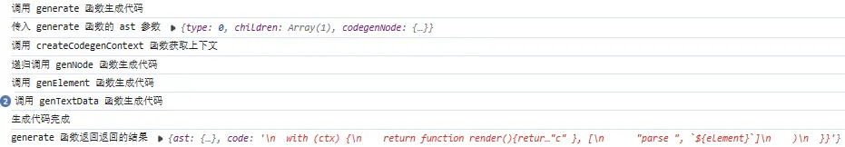
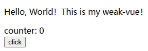

## 16-1 codegen 实现

### 16-1-1 前言

上文实现了 `transform`，现在就进入整个 `compile` 最后的代码生成 `codegen` 环节了，个人感觉和前面的 `transform` 比起来，`codegen` 真的非常简单，源码位置在这里：

> [https://github.com/vuejs/core/blob/main/packages/compiler-core/src/codegen.ts](https://github1s.com/vuejs/core/blob/main/packages/compiler-core/src/codegen.ts)

我的实现和源码实现区别蛮大的，因为源码中考虑了各种 `helper`、`cache`、`hoist` 之类的，而这些我都没实现。经过 `transform` 之后，`AST` 上的 `codegenNode` 节点上挂载的 `type` 属性就是这个节点对应的代码结构，源码就是根据这个来进行代码生成的，具体可以看看源码，这部分还是比较明了的。

前面 `transform` 模块基本完全按照源码的结构来写，生成的 `codegenNode` 结构是和源码基本一致的，但是正因如此，在 `codegen` 环节不得不处理的非常非常非常生硬，希望各位见谅，理解个意思就行了。

由于不需要考虑各种复杂的结构，我这里就简单划分为元素、属性、文本、组合表达式，分别进行代码生成即可。而生成节点的函数也就很自然的想到了之前在 `runtime` 模块暴露出的 `h` 函数，源码中使用的是 `createVNode`，不过这两者区别不大，都能创建 `VNode`，下面这个是 h 函数接收的参数：

```typescript
// weak-vue\packages\runtime-core\src\h.ts
// h函数的作用==>生成vnode（createVNode原理可以回去前面的内容看），核心之一==>处理参数
export function h(type, propsOrChildren, children) {}
```

### 16-1-2 基本逻辑的实现

`codegen` 的生成核心是借助一个 `generate` 函数，在这里面我们需要获取上下文，然后生成代码的初步结构，内容由 ``genNode 递归生成，最后当然也得返回生成的代码。

我们先去查看我们最后需要挂载在组件实例上的 `render` 函数是怎么样的结构，以前面的测试用例为例：

```typescript
// 模版
// <div class="a" v-bind:b="c">parse {{ element }}</div>

// 它对应的render函数应该是下面这个结构：
function render() {
  return h("div", { class: "a", b: "c" }, ["parse ", `${element}`]);
}
```

因此我们根据这个要生成的结果可以轻易知道如何生成 `render` 字符串的大体结构：

```typescript
// weak-vue\packages\compiler-core\src\codegen.ts
// codegen 代码生成
export const generate = (ast) => {
  // 获取上下文（包含生成代码所需的状态和工具函数）
  const context = createCodegenContext();
  // push用于添加代码到上下文中，indent和deindent用于增加或减少代码的缩进级别。
  const { push, indent, deindent } = context;

  indent();
  push("with (ctx) {"); // with语句用于确保ctx中的属性和方法可以在代码块内部直接访问，用于后面的new Function生成代码(因此此时生成的是字符串，里面的h函数、渲染的值以及函数等都需要传入)
  indent();

  push("return function render(){return ");
  if (ast.codegenNode) {
    genNode(ast.codegenNode, context); // 递归生成代码
  } else {
    push("null");
  }

  deindent();
  push("}}");

  return {
    ast,
    code: context.code,
  };
};
```

---

接下来是实现上面 用到的两个函数：`createCodegenContext` 与 `genNode` 。

```typescript
// weak-vue\packages\compiler-core\src\codegen.ts
// 获取上下文
const createCodegenContext = () => {
  const context = {
    // state
    code: "", // 目标代码
    indentLevel: 0, // 缩进等级

    // method
    push(code) {
      context.code += code;
    },
    indent() {
      newline(++context.indentLevel);
    },
    deindent(witoutNewLine = false) {
      if (witoutNewLine) {
        --context.indentLevel;
      } else {
        newline(--context.indentLevel);
      }
    },
    newline() {
      newline(context.indentLevel);
    },
  };
  function newline(n) {
    context.push("\n" + "  ".repeat(n));
  }
  return context;
};
```

`genNode` 里面简单的用 `switch-case` 进行一个流程控制调用不同的方法即可：

```typescript
// weak-vue\packages\compiler-core\src\codegen.ts
// 生成代码
const genNode = (node, context) => {
  // 如果是字符串就直接 push
  if (typeof node === "string") {
    context.push(node);
    return;
  }

  switch (node.type) {
    case NodeTypes.ELEMENT:
      genElement(node, context);
      break;
    case NodeTypes.TEXT:
    case NodeTypes.INTERPOLATION:
      genTextData(node, context);
      break;
    case NodeTypes.COMPOUND_EXPRESSION:
      genCompoundExpression(node, context);
      break;
  }
};
```

此时，`codegen` 的基本逻辑便实现了，下面的工作是实现各个节点类型对应具体 `codegen` 逻辑。

### 16-2-3 核心功能的实现

我们这步依次实现上面的 `genElement` 、`genTextData`、`genCompoundExpression` 三个方法。

#### 16-2-3-1 genElement

开头说到，创建 `VNode` 使用 `h` 函数，也就是说我们需要解析出 `tag`、`props`、`children` 作为参数传入，这里把生成属性和子节点的逻辑抽离了出去，`genElement` 如下：

```typescript
// weak-vue\packages\compiler-core\src\codegen.ts
// 生成元素节点
const genElement = (node, context) => {
  const { push, deindent } = context;
  const { tag, children, props } = node;

  // tag
  push(`h(${tag}, `);

  // props
  if (props) {
    genProps(props.properties, context);
  } else {
    push("null, ");
  }

  // children
  if (children) {
    genChildren(children, context);
  } else {
    push("null");
  }

  deindent();
  push(")");
};
```

其中，`genProps` 要做的就是获取节点中的属性数据，并拼接成一个对象的样子 push 进目标代码，这里看一下在上面 `genElement` 中调用 `genProps` 传入的 `props.properties` 是个什么东西：

```typescript
// <p class="a" @click="fn()">hello {{ World }}</p>
[
  {
    type: "JS_PROPERTY",
    key: {
      type: "SIMPLE_EXPRESSION",
      content: "class",
      isStatic: true,
    },
    value: {
      type: "SIMPLE_EXPRESSION",
      content: {
        type: "TEXT",
        content: "a",
      },
      isStatic: true,
    },
  },
  {
    type: "JS_PROPERTY",
    key: {
      type: "SIMPLE_EXPRESSION",
      content: "onClick",
      isStatic: true,
      isHandlerKey: true,
    },
    value: {
      type: "SIMPLE_EXPRESSION",
      content: "fn()",
      isStatic: false,
    },
  },
];
```

那么我们就只需要按照这个结构来进行操作就可以了，如下：

```typescript
// weak-vue\packages\compiler-core\src\codegen.ts
// 获取节点中的属性数据
const genProps = (props, context) => {
  const { push } = context;

  if (!props.length) {
    push("{}");
    return;
  }

  push("{ ");
  for (let i = 0; i < props.length; i++) {
    // 遍历每个 prop 对象，获取其中的 key 节点和 value 节点
    const prop = props[i];
    const key = prop ? prop.key : "";
    const value = prop ? prop.value : prop;

    if (key) {
      // key
      genPropKey(key, context);
      // value
      genPropValue(value, context);
    } else {
      // 如果 key 不存在就说明是一个 v-bind
      const { content, isStatic } = value;
      const contentStr = JSON.stringify(content);
      push(`${contentStr}: ${isStatic ? contentStr : content}`);
    }

    if (i < props.length - 1) {
      push(", ");
    }
  }
  push(" }, ");
};

// 生成键
const genPropKey = (node, context) => {
  const { push } = context;
  const { isStatic, content } = node;
  push(isStatic ? JSON.stringify(content) : content);
  push(": ");
};

// 生成值
const genPropValue = (node, context) => {
  const { push } = context;
  const { isStatic, content } = node;
  push(isStatic ? JSON.stringify(content.content) : JSON.stringify(content));
};
```

调用后的结果：

```typescript
{ "class": "a", "onClick": "fn()" },
```

---

子节点是一个数组，只需要参考上面 `genProps` 的结构写就可以了，但是，由于我的 `transformText` 偷大懒没有生成 `codegenNode`，不得不单独进行处理，此外组合表达式 `COMPOUND_EXPRESSION` 也单独进行处理，其余正常递归 `genNode` 即可：

```typescript
// weak-vue\packages\compiler-core\src\codegen.ts
// 生成子节点
const genChildren = (children, context) => {
  const { push, indent } = context;

  push("[");
  indent();

  // 单独处理 COMPOUND_EXPRESSION
  if (children.type === NodeTypes.COMPOUND_EXPRESSION) {
    genCompoundExpression(children, context);
  }

  // 单独处理 TEXT
  else if (isObject(children) && children.type === NodeTypes.TEXT) {
    genNode(children, context);
  }

  // 其余节点直接递归
  else {
    for (let i = 0; i < children.length; i++) {
      const child = children[i];
      genNode(child.codegenNode || child.children, context);
      push(", ");
    }
  }

  push("]");
};
```

#### 16-2-3-2 genTextData

插值表达式和文本节点都会由这个函数处理，因为他们两者在代码生成的结果上来说，唯一的区别就是子节点是否是字符串。

```typescript
// weak-vue\packages\compiler-core\src\codegen.ts
// 生成文本节点和插值表达式节点
const genTextData = (node, context) => {
  const { push } = context;
  const { type, content } = node;

  // 如果是文本节点直接拿出 content
  // 如果是插值表达式需要拿出 content.content
  const textContent =
    type === NodeTypes.TEXT
      ? JSON.stringify(content)
      : NodeTypes.INTERPOLATION
      ? content.content
      : "";

  if (type === NodeTypes.TEXT) {
    push(textContent);
  }
  if (type === NodeTypes.INTERPOLATION) {
    push("`${");
    push(`${textContent}`);
    push("}`");
  }
};
```

#### 16-2-3-3 genCompoundExpression

组合表达式其实本质上就是一个节点，几个子节点可能是文本节点或者插值表达式节点，直接递归即可。

```typescript
// weak-vue\packages\compiler-core\src\codegen.ts
// 生成复合表达式
const genCompoundExpression = (node, context) => {
  const { push } = context;
  for (let i = 0; i < node.children.length; i++) {
    const child = node.children[i];
    if (typeof child === "string") {
      push(child);
    } else {
      genNode(child, context);
    }

    if (i !== node.children.length - 1) {
      push(", ");
    }
  }
};
```

### 16-2-4 总结

#### 16-2-4-1 Q&A 环节

Q：`h` 函数和 `createVNode` 的关系？ <br />A：`h` 函数其实底层调用的就是 `createVNode`，属于是父子关系，而 `h` 函数中进行了一些容错处理之类的，比如你用 `h` 函数可以不传 `props` 直接传入 `children`，而这调 `createVNode 会报错。

Q：你这里的实现和源码的实现主要区别在哪？ <br />A：处处都是区别，源码中的实现是完全以 `codegenNode` 的 `type` 属性作为指导来生成对应的结构，而节点的内容不是主要关注点，也就是说，我这里的实现是从功能为出发点，而源码是以结构为出发点，这就造成了一个很明显的区别，源码中根本没有什么 `genChildren`、`genProps`、`genPropKey`，源码中用的是 `genObjectExpression`、`genArrayExpression`、`genNodeListAsArray` 之类的，这样以结构为出发点抽离函数，就可以很大程度复用函数，操作起来也更为灵活，我写的这个确实是笨瓜代码。

Q：那你写的这个有什么用吗？ <br />A：跑通了我自己写的测试，了解了源码运行的大体流程。

#### 16-2-4-2 测试

我们上面实现了 `generate` 方法，此时在我们前面实现的 `baseCompile` 方法里面返回 `generate` 方法的调用结果即可。

```typescript
// weak-vue\packages\compiler-core\src\compile.ts
// 完整编译过程：template -> ast -> codegen -> render
export const baseCompile = (template, options: any = {}) => {
  // 第一步：将模板字符串转换成AST
  const ast = isString(template) ? baseParse(template) : template;
  // 第二步：AST加工
  const [nodeTransforms, directiveTransforms] = getBaseTransformPreset();
  transform(
    ast,
    extend({}, options, {
      nodeTransforms: [...nodeTransforms, ...(options.nodeTransforms || [])],
      directiveTransforms: extend(
        {},
        directiveTransforms,
        options.directiveTransforms || {} // user transforms
      ),
    })
  );

  // 第三步：将AST转换成渲染函数，最终得到一个render渲染函数
  return generate(ast);
};
```

---

此时给我们新增的 `codegen` 方法添加对应的 ``log 调试，重新去 `npm run build` 跑我们上面的测试用例。

```html
<div class="a" v-bind:b="c">parse {{ element }}</div>
```

我们重点查看下面几个打印效果：<br /><br />最后生成的 `generate(ast).code`，即我们需要的 `render` 函数，如下：

```typescript
// generate(ast).code:
'\n  with (ctx) {\n    return function render(){return h("div", { "class": "a", "b": "c" }, [\n      "parse ", `${element}`]\n    )\n  }}';

// 格式化后：
with (ctx) {
  return function render() {
    return h("div", { class: "a", b: "c" }, ["parse ", `${element}`]);
  };
}
```

基本符合预期，生成正确。

## 16-2 compile 实现

### 16-2-1 模块整合

其实关于 `compile` 模块的整合，我们基本已经完成了，即 `weak-vue\packages\compiler-core\src\compile.ts` 文件里面的 `baseCompile` 函数，因为我们秉持着**测试驱动开发**的原则，基本上是实现一个小功能就会进行相应的测试。

我们这里讲的整合指的是当前的 `compile` 模块和前面已经实现的 `runtime` 模块进行整合。

先找到我们前面实现的的 `weak-vue\packages\runtime-core\src\component.ts` 文件里面的 `finishComponentSetup` ，这个方法我们用于处理 `render`（**把 `render` 挂载到实例上去**）：

```typescript
// weak-vue\packages\runtime-core\src\component.ts
// 处理render（把render挂载到实例上去）
function finishComponentSetup(instance) {
  // 判断组件中有没有render方法，没有则
  const Component = instance.type; // createVNode时传入给type的是rootComponent，本质是一个对象，组件的所有属性都在这里，比如setup方法，比如render方法
  if (!instance.render) {
    // 这里的render指的是上面instance实例的render属性，在handlerSetupResult函数中会赋值（赋值的情况：组件有setup且返回函数），如果没有setup则此时会为false，则需要赋组件的render方法
    if (!Component.render && Component.template) {
      // TODO：模版编译
    }
    instance.render = Component.render;
  }
  // console.log(instance.render);
}
```

前面我们渲染的实现是手动给组件实例挂载一个 `render` 函数，其中 `render` 函数返回的就是前面实现的 `render` 函数。然后 `instance.render = Component.render` 这行代码才能生效，使得渲染流程不被阻塞。

```html
<div id="app">111111111111</div>
<script src="../runtime-dom/dist/runtime-dom.global.js"></script>
<script>
  let { createApp, h } = VueRuntimeDom;

  let App = {
    render() {
      return h(
        "div",
        { style: { color: "red" } },
        h("div", {}, ["张三", h("p", {}, "李四")])
      );
    },
  };
  createApp(App, { name: "张三", age: 10 }).mount("#app");
</script>
```

而现在没有手动挂载 `render` 的环节了，应该要进到 `if (!Component.render && Component.template)`这里面的 `TODO` 逻辑处理。而此时我们的组件实例 `Component.template` 也是为空的，所以首先要把 `template` 字符串挂载到组件实例上。而 `Component = instance.type;` ，同时从创建组件实例的方法 `createComponentInstance` 的定义中可以清晰地看到 `instance.type = vnode.type;` 。所以此时要使得组件实例上挂载了 `template` 模版字符串，需要依次做两件事：

```typescript
// weak-vue\packages\runtime-dom\src\index.ts
export const createApp = (rootComponent, rootProps) => {
  // ...
  app.mount = function (container) {
    // 挂载组件之前要清空原来的内容，同时把模版字符串处理后（将标签前后的换行空格去除，压缩成一行，防止对AST生成造成影响）挂载到container上
    container = nodeOps.querySelector(container);
    // 第一件事：将模版字符串挂载到container上（把标签前后的空格换行去除，防止对codegen环节造成影响），因为后续会清空container.innerHTML
    container.template = container.innerHTML
      .replace(/\n\s*/g, "")
      .replace(/\s+</g, "<")
      .replace(/>\s+/g, ">");
    container.innerHTML = "";
    // 渲染新的内容(挂载dom)
    mount(container);
  };
  return app;
};

// weak-vue\packages\runtime-core\src\apiCreateApp.ts
export function apiCreateApp(render) {
  return function createApp(rootComponent, rootProps) {
    let app = {
      // ...
      mount(container) {
        let vnode = createVNode(rootComponent, rootProps);
        // 第二件事：挂载模版到vnode上（container.innerHTML被清空之前，已先把模版字符串挂载到container上）
        vnode.type.template = container.template;
        // ...
      },
    };
    return app;
  };
}
```

此时去 `finishComponentSetup` 里面留下的 `TODO` 传入我们上面 `generate` 方法返回的渲染函数即可：

```typescript
// weak-vue\packages\runtime-core\src\component.ts
if (!Component.render && Component.template) {
  // 模版编译
  let { template } = Component;
  if (template[0] === "#") {
    const el = document.querySelector(template);
    template = el ? el.innerHTML : "";
  }

  const { code } = baseCompile(template);
  // console.log("这是编译后的代码", code);
  const fn = new Function("ctx", code);
  const ctx = extend(
    { h: h },
    instance.attrs,
    instance.props,
    instance.setupState
  );
  const render = fn(ctx); // 将字符串里面的h函数、渲染的值以及函数都变成需要的值，而不是字符串
  Component.render = render;
}
```

> 注意，这里涉及了 new Function 的用法，可以看下面的代码进行了解：

```typescript
// const obj = {}
// const h = () =>{
//     console.log("Hello World!")
// }
// const code = "function render(h){return h()}"
// // 将code转化为函数
// const fn = new Function("return " + code)
// console.log("fn", fn)
// const render = fn()
// console.log("render", render)
// render(h) // 输出：Hello World!
// obj.render = render
// obj.render(h) // 输出：Hello World!

// const obj = {}
// const h = () =>{
//     console.log("Hello World!")
// }
// const ctx = {h: h}
// const code = "function render(){with (ctx) {return h()}}"
// // 将code转化为函数
// const fn = new Function("return " + code)
// console.log("fn", fn)
// const render = fn()
// console.log("render", render)
// obj.render = render
// obj.render.call(ctx) // 输出：Hello World!

const obj = {};
const h = () => {
  console.log("Hello World!");
};
const ctx = { h: h };
const code = "with (ctx) {return function render(){return h()}}";
// 将code转化为函数
const fn = new Function("ctx", code);
console.log("fn", fn);
const render = fn(ctx);
console.log("render", render);
obj.render = render;
render(); // 输出：Hello World!
obj.render(); // 输出：Hello World!
```

### 16-2-2 测试

新建一个测试用例，重新去 `npm run build` 打包：

```html
<!-- weak-vue\packages\examples\10.compiler.html -->
<!-- 用模版来渲染 -->
<script src="../runtime-dom/dist/runtime-dom.global.js"></script>
<div id="template">
  <div>
    <p class="myText">Hello, World！This is my weak-vue！</p>
    <div>counter: {{ counter.value }}</div>
    <button @click="fn()">click</button>
  </div>
</div>
<script>
  let { createApp, ref } = VueRuntimeDom;
  const counter = ref(0);
  // 生成随机颜色的函数
  const getRandomColor = () => {
    const letters = "0123456789ABCDEF";
    let color = "#";
    for (let i = 0; i < 6; i++) {
      color += letters[Math.floor(Math.random() * 16)];
    }
    return color;
  };
  const fn = () => {
    const myText = document.getElementsByClassName("myText")[0];
    myText.style.color = getRandomColor();
    counter.value++;
  };
  let App = {
    setup() {
      return {
        counter,
      };
    },
  };
  createApp(App, {}).mount("#template");
</script>
```

上面的模板直接在组件中书写 `h` 函数来渲染则是下面的结构：

```html
<!-- weak-vue\packages\examples\10.compiler.html -->
<div id="template"></div>
<script src="../runtime-dom/dist/runtime-dom.global.js"></script>
<script>
  let { createApp, h, ref } = VueRuntimeDom;
  const counter = ref(0);
  // 生成随机颜色的函数
  const getRandomColor = () => {
    const letters = "0123456789ABCDEF";
    let color = "#";
    for (let i = 0; i < 6; i++) {
      color += letters[Math.floor(Math.random() * 16)];
    }
    return color;
  };
  const fn = () => {
    const myText = document.getElementsByClassName("myText")[0];
    myText.style.color = getRandomColor();
    counter.value++;
  };
  let App = {
    render() {
      return h("div", null, [
        h("p", { class: "myText" }, ["Hello, World！This is my weak-vue！"]),
        h("div", null, ["counter: ", `${counter.value}`]),
        h("button", { onclick: "fn()" }, ["click"]),
      ]);
    },
  };
  createApp(App, {}).mount("#template");
</script>
```

无论是哪种渲染方式，最终的效果都是符合预期的：<br />

> 注意：<br />笔者在测试该用例时，并不是一次性 `Bug Free` 的，而是发现了前面留下的一个又一个坑，然后依次进行填补，最终才通过测试。因此本章会涉及一些其他模块的代码改动，但是在文章中没有详细地指出来，具体可以看我这章对应的提交记录涉及的代码更改。（**高情商：测试驱动开发；低情商：面向测试用例开发。**
> 总之，如果各位没有通过该测试用例或者控制台报错，可以具体地对比我本章提交的代码与目前代码的不同之处。（调试代码、发现问题产生的原因也是程序员要学会的必备技能之一，发现 Bug 的过程中可以让我们梳理前面所写的逻辑，对原理进一步了解。）

---

自此，这个简易版的 Vue3 我们就基本完成了，这章的代码提交请看提交记录：[16、模版的处理（三）](https://github.com/XC0703/VueSouceCodeStudy/commit/f3d0b427ed933effae6ffbae5e783d64605ae2c8)。
