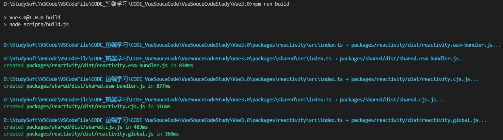
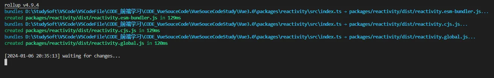
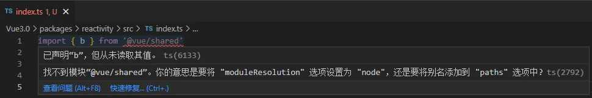

## 1-1 项目初始化

新建一个 `weak-vue` 目录，并建立 `weak-vue\packages\reacticity`（用于实现响应式 api 的包）、`weak-vue\packages\shared`（放一些公共的方法）两个子目录，每个子目录下面有自己的 `intex.ts` 文件，`index.ts` 文件里面写一些简单的导出方便后续调试即可。

```bash
# 初始化，其中-y 选项的意思是在执行命令时自动应答所有的选项，不需要手动输入。（只能通过yarn初始化，因为monorepo不支持npm。）
cd weak-vue
yarn init -y

# 新建reacticity和shared两个子目录并分别初始化
cd reacticity
yarn init -y

cd shared
yarn init -y
```

```typescript
// weak-vue\packages\reactivity\src\index.ts
let a = 1;
export { a };
```

```typescript
// weak-vue\packages\shared\src\index.ts
let b = 1;
export { b };
```

通过 `monorepo` 进行环境的搭建：

- `"private": true` 代表私有，不会发布到 npm 上
- `workspaces` 配置是用于定义 Yarn 工作区的一个选项。它可以让我们在一个仓库中管理多个包（packages），而不必每个包都建立一个单独的仓库。`workspaces` 的值为`["packages/*"]`，这意味着我们将使用 `packages` 目录下的所有包作为工作区，Yarn 会自动识别这些包并将它们链接在一起。
- `"name": "@vue/xxx"`, 名称添加前缀"@vue/"，方便引用

```json
// weak-vue\package.json
{
  "private": true,
  "workspaces": ["packages/*"],
  "type": "module",
  "name": "weak-vue",
  "version": "1.0.0",
  "type": "module",
  "main": "index.js",
  "license": "MIT"
}
```

```json
// weak-vue\packages\reactivity\package.json
{
  "name": "@vue/reactivity",
  "version": "1.0.0",
  "type": "module",
  "main": "index.js",
  "license": "MIT"
}
```

```json
// weak-vue\packages\shared\package.json
{
  "name": "@vue/shared",
  "version": "1.0.0",
  "type": "module",
  "main": "index.js",
  "license": "MIT"
}
```

> **monorepo 介绍**：monorepo 是一种将多个 package 放在一个 repo 中的代码管理模式。（每个 package 都有自己的 package.json 文件，比如编译模块的包、响应式模块的包等，相互隔离开来，方便更新修改）

## 1-2 安装依赖

安装 `ts`：

```bash
# 因为两个子包都用到ts，直接在根目录下安装即可
cd weak-vue
yarn add typescript -D -W
```

- `-D` 或 `--dev` 选项表示将包添加为开发依赖项。开发依赖项是在开发过程中需要使用的依赖，而在实际部署和生产环境中不需要。例如，编译工具、测试框架等通常被添加为开发依赖项。
- `-W` 或 `--workspace` 选项表示将包添加到工作区。这意味着包将被安装在工作区根目录下的 `node_modules` 目录中，并可供工作区内的其他包共享使用。通过使用工作区，我们可以更方便地管理多个包之间的依赖关系。

安装 `tsc`：

```bash
npx tsc --init
```

- TSC（TypeScript Compiler）是用于将 TypeScript 代码编译成 JavaScript 的官方编译器
- 在`weak-vue\tsconfig.json` 文件中，将`"module": "CommonJS"`改成`"module": "ESNext"`，将`"strict": true` 改成`"strict": false`（取消严格模式方便后续编写代码），将`"sourceMap": true` 取消注释开启（`"sourceMap": true` 是在使用 JavaScript 编译器（如 Babel，TypeScript 等）将代码从 ES6 或 TypeScript 等高级语言编译成 ES5 等低版本语言时，生成一个源代码映射文件。该文件可以用于将编译后的代码映射回原始源代码，以便在调试时能够更容易地定位和解决问题）

安装 `rollup` 打包的相关依赖：

```bash
yarn add rollup rollup-plugin-typescript2 @rollup/plugin-node-resolve @rollup/plugin-json execa -D -W
```

解析命令的各个部分如下：

- `rollup-plugin-typescript2`：是一个用于在 Rollup 中编译 TypeScript 的插件。
- `@rollup/plugin-node-resolve`：是一个用于解析 Node.js 模块依赖的插件，解析第三方插件
- `@rollup/plugin-json`：是一个用于在 Rollup 中加载 JSON 文件的插件。
- `execa`：是一个 Node.js 库，可以替代 Node.js 的原生 child_process 模块，用于执行外部命令。此处用于开启一个用于打包的子进程。

## 1-3 配置脚本

根目录下新建一个子目录 `scripts`，然后在里面新建一个 `build.js` 执行文件，并在 `weak-vue\package.json` 下配置脚本执行命令：

```json
// weak-vue\package.json
"scripts": {
  "build": "node scripts/build.js"
},
```

```javascript
// weak-vue\scripts\build.js
// 进行打包  monorepo
import fs from "fs";
import { execa } from "execa";

// （1）获取打包目录
// 注意：文件夹才进行打包，因此写一个filter方法进行过滤
const dirs = fs.readdirSync("packages").filter((p) => {
  return fs.statSync(`packages/${p}`).isDirectory();
});
// console.log(dirs); // [ 'reactivity', 'shared' ]

// （2）进行并行打包
async function build(target) {
  //   console.log(target); // reactivity shared
  // 执行了 execa 函数，调用了 Rollup 命令行工具，
  // 其中-c 参数表示使用当前目录下的 rollup 配置文件进行打包，使用 --bundleConfigAsCjs 标志来指定配置文件为 CommonJS 模块
  // 还传入了 --environment 参数，并指定了一个变量 TARGET 的值为 target，将输出结果显示在当前进程的标准输入输出中（stdio）
  await execa(
    "rollup",
    ["-c", "--bundleConfigAsCjs", "--environment", `TARGET:${target}`],
    {
      stdio: "inherit",
    }
  );
}
async function runParaller(dirs, itemfn) {
  // 遍历打包
  let result = [];
  for (let item of dirs) {
    result.push(itemfn(item));
  }
  return Promise.all(result); //存放打包的promise，等待这里的打包执行完毕之后，调用成功
}
runParaller(dirs, build).then(() => {});
```

然后去两个子库下的 `packages.json` 文件下配置一下打包相关：

```json
// weak-vue\packages\reactivity\package.json
  "buildOptions": {
    "name": "VueReactivity",
    "formats": [
      "esm-bundler",
      "cjs",
      "global"
    ]
  }
```

其中，`name` 指定了构建出的库的名称为 `VueReactivity`。`formats` 则指定了打包出的不同格式，分别是 `esm-bundler`、`cjs` 和 `global`。这三种格式分别对应了不同的使用场景：

- `esm-bundler`：适用于现代化的构建工具如 Rollup 或 Webpack 2+ 等，以 ES6 模块的形式导入导出代码。
- `cjs`：适用于 Node.js 环境，以 CommonJS 的模块形式导入导出代码。
- `global`：适用于在浏览器中通过 script 标签引入库，以全局变量的形式暴露代码。

---

根目录下新建一个 `weak-vue\rollup.config.js` 配置文件：

```javascript
// weak-vue\rollup.config.js
// （1）引入相关依赖
import ts from "rollup-plugin-typescript2";
import json from "@rollup/plugin-json";
import resolvePlugin from "@rollup/plugin-node-resolve";
import path from "path"; // 处理路径

// （2）获取文件路径，并拿到路径下的包
let packagesDir = path.resolve(__dirname, "packages");
const packageDir = path.resolve(packagesDir, process.env.TARGET);
// 获取需要打包的文件的自定义配置
const resolve = (p) => path.resolve(packageDir, p);
const pkg = require(resolve(`package.json`)); // 获取json配置
const options = pkg.buildOptions; // 获取每个子包配置中的buildOptions配置
// 获取文件名字
const name = path.basename(packageDir);

// （3）创建一个映射输出表
const outputOpions = {
  "esm-bundler": {
    // 输出文件的名字
    file: resolve(`dist/${name}.esm-bundler.js`),
    // 输出文件的格式
    format: "es",
  },
  cjs: {
    // 输出文件的名字
    file: resolve(`dist/${name}.cjs.js`),
    // 输出文件的格式
    format: "cjs",
  },
  global: {
    // 输出文件的名字
    file: resolve(`dist/${name}.global.js`),
    // 输出文件的格式
    format: "iife",
  },
};

// （4）创建一个打包的配置对象
function createConfig(format, output) {
  // 进行打包
  output.name = options.name; //指定一个名字
  // 用于调整代码
  output.sourcemap = true;
  // 生成rollup配置
  return {
    // resolve表示当前包
    input: resolve("src/index.ts"), //导入
    // 输出
    output,
    //
    plugins: [
      json(),
      ts({
        //解析ts语法
        tsconfig: path.resolve(__dirname, "tsconfig.json"),
      }),
      resolvePlugin(), //解析第三方插件
    ],
  };
}

// （5）rullup需要导出一个配置
export default options.formats.map((format) =>
  createConfig(format, outputOpions[format])
);
```

---

此时根目录下执行 `npm run build` 即可看到两个子包下面都打包出 dist 目录：



---

此时可以去 `weak-vue\package.json` 下面配置 `dev` 命令，防止每次都需要重新打包。<br />首先在在 `build.js` 同一目录下新建一个 `dev.js` 文件：

```javascript
// weak-vue\scripts\dev.js
import { execa } from "execa";

// 进行并行打包
async function build(target) {
  //   console.log(target); // reactivity shared
  // 执行了 execa 函数，调用了 Rollup 命令行工具，
  // 其中-c 参数表示使用当前目录下的 rollup 配置文件进行打包, 使用 --bundleConfigAsCjs 标志来指定配置文件为 CommonJS 模块
  // 还传入了 --environment 参数，并指定了一个变量 TARGET 的值为 target，将输出结果显示在当前进程的标准输入输出中（stdio）
  await execa(
    "rollup",
    ["-c", "--bundleConfigAsCjs", "--environment", `TARGET:${target}`],
    {
      stdio: "inherit",
    }
  );
}

// 此时仅仅以热更新reactivity包为例子，后面会补充完善
build("reactivity");
```

配置 `dev` 命令（`-w` 表示热更新）：

```javascript
// weak-vue\package.json
  "scripts": {
    "dev": "node scripts/dev.js -w"
  },
```

此时根目录下执行 `npm run dev` 即实现热更新打包：<br />

---

## 1-4 解决 ts 模块引入问题

此时我们若想在子包中引入其他包中导出的东西，可以看到会像下面一样报错：<br /><br />原因是 TS 导致的模块引入错误。<br />而提示也给了我们解决办法提示，在 `weak-vue\tsconfig.json` 增加如下配置即可：

```javascript
// weak-vue\tsconfig.json
    // 解决ts模块引入问题
    "moduleResolution": "node",
    "baseUrl": ".",
    "paths": {
      "@vue/*": ["packages/*/src"]
    }
```

- `"moduleResolution": "node"`：指定模块解析策略为 Node.js 的模块解析方式。在 TypeScript 中，有两种模块解析策略可选，分别是 "node" 和 "classic"。使用 "node" 表示使用 Node.js 的模块解析方式，它可以解析 Node.js 内置的模块和从 npm 安装的第三方模块。
- `"baseUrl": "."**`：指定了模块的基本路径。该配置项可以将非相对路径的模块导入转换为相对于基本路径的路径。这在模块较多、目录结构复杂的情况下非常有用。
- `"paths": {"@vue/_": ["packages/_/src"]}`：配置模块的路径映射。这里定义了一个路径映射规则，将以 "@vue/" 开头的模块路径映射到 "packages/\*/src" 目录下的文件。例如，"@vue/foo" 将会被解析为 "packages/foo/src"。

此时报错便消除了。

---

自此，我们造 weak-vue 轮子的环境便已经搭建好了，到这里的代码请看提交记录：[1、Vue3.0 环境的搭建](https://github.com/XC0703/VueSouceCodeStudy/commit/c850c4d4dc92363dc27a1318efdd59e34db48614)。
