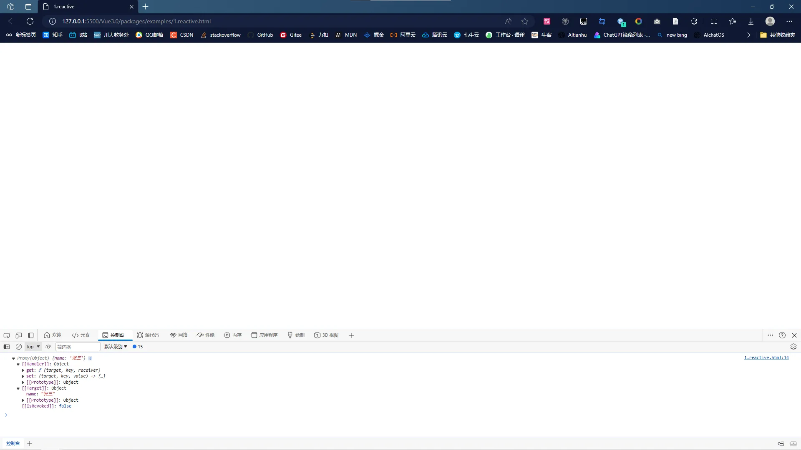

## 2-1 常用响应式 API 的使用

具体见：[响应式 API](https://cn.vuejs.org/api/reactivity-core.html)

- `readonly`：只读，进行代理修改，可用于性能优化
- `reactive`：对数据进行完全代理
- `shallowReactive`：对数据进行浅层（第一层）代理
- `shallowReadonly`：第一层是只读

其中 reactive 和 readonly 是两个最常用的 api，实现原理中进行了一个性能优化处理——建立一个数据结构用来存储已经代理的数据对象，防止重复代理。（面试题常考）

## 2-2 关于 ES6 中的 Proxy 对象

在 JavaScript 中，Proxy 对象用于定义基本操作的自定义行为（如属性查找，赋值，枚举，函数调用等）。<br />如果你想要劫持对象的输入和输出，你可以使用 Proxy 对象。以下是一个基本的例子：

```javascript
//  Proxy 对象的基本使用例子
let obj = {
  a: 1,
  b: 2,
};

let handler = {
  get: function (target, prop, receiver) {
    console.log(`读取了${prop}属性`);
    return Reflect.get(...arguments);
  },
  set: function (target, prop, value, receiver) {
    console.log(`设置了${prop}属性为${value}`);
    return Reflect.set(...arguments);
  },
};

let proxyObj = new Proxy(obj, handler);

proxyObj.a = 10; // 输出：设置了a属性为10
console.log(proxyObj.a); // 输出：读取了a属性 10
```

在这个例子中，我们创建了一个 handler 对象，它有 get 和 set 方法。这些方法在尝试获取或设置属性时被调用。然后我们创建了一个新的 Proxy 对象，将原始对象和 handler 作为参数传递。<br />如果你想要劫持函数的输入和输出，你可以使用类似的方法，但是你需要使用 apply。以下是一个基本的例子：

```javascript
let func = function (x, y) {
  return x + y;
};

let handler = {
  apply: function (target, thisArg, argumentsList) {
    console.log(`函数被调用，参数是${argumentsList}`);
    return Reflect.apply(...arguments);
  },
};

let proxyFunc = new Proxy(func, handler);

console.log(proxyFunc(1, 2)); // 输出：函数被调用，参数是1,2
```

## 2-3 常用响应式 API 的实现

> 四个 api 的实现核心原理可以概括为使用不同的代理配置（四个 api 分为两种情况）：
> （1）是不是只读；
> （2）是不是深层次处理。然后 get()、set()方法不尽相同。）
> 借助 proxy 实现数据劫持，其中会利用柯里化高阶函数实现代码层面的优化（因为 get 操作、set 操作都会有一些很相似的处理），同时会利用 WeakMap 数据结构存储代理实现性能优化。

---

此时新建一个 `weak-vue\packages\reactivity\src\reactivity.ts` 文件，用于实现我们要实现的四个 api：

```typescript
// weak-vue\packages\reactivity\src\reactivity.ts
import { isObject } from "@vue/shared";
export const shallowReadonlyHandlers = {};
import {
  reactiveHandlers,
  shallowReactiveHandlers,
  readonlyHandlers,
} from "./baseHandlers";

// 注意：四个api核心都是proxy（target,{})，因此采取柯里化高阶函数处理
// （柯里化指的是根据参数不同采取不同的处理，高阶函数指的是参数或者返回值为函数的函数）
// 四个api分为两种情况：（1）是不是只读；（2）是不是深层次处理。

// 定义一个数据结构用于存储已经代理的对象,// 用weakmap的好处：1、key必须是对象；2、自动的垃圾回收
const reactiveMap = new WeakMap();
const readonlyeMap = new WeakMap();

// 核心代理实现，baseHandlers用于每个api用的代理配置，用于数据劫持具体操作（get()、set()方法）
function createReactObj(target, isReadonly, baseHandlers) {
  // 1、首先要判断对象，这个是公共的方法，放到shared包中
  if (!isObject(target)) {
    return target;
  }
  // 2、核心--优化处理，已经被代理的对象不能重复代理，因此新建一个数据结构来存储
  const proxyMap = isReadonly ? readonlyeMap : reactiveMap;
  const proxyEs = proxyMap.get(target);
  if (proxyEs) {
    return proxyEs;
  }
  const proxy = new Proxy(target, baseHandlers);
  proxyMap.set(target, proxy);
  return proxy;
}

export function reactive(target) {
  return createReactObj(target, false, reactiveHandlers);
}
export function shallowReactive(target) {
  return createReactObj(target, false, shallowReactiveHandlers);
}
export function readonly(target) {
  return createReactObj(target, true, readonlyHandlers);
}
export function shallowReadonly(target) {
  return createReactObj(target, true, shallowReadonlyHandlers);
}
```

---

其中，四个 api 的代理基本配置放在 `weak-vue\packages\reactivity\src\baseHandlers.ts` 文件中：

```typescript
// weak-vue\packages\reactivity\src\baseHandlers.ts
import { isObject, extend } from "@vue/shared";
import { reactive, readonly } from "./reactivity";

// 定义每个api用的代理配置，用于数据劫持具体操作（get()、set()方法）
// 四个代理配置也是都用到get()、set()操作，因此又可以用柯里化高阶函数处理

// 代理-获取get()配置
function createGetter(isReadonly = false, shallow = false) {
  return function get(target, key, receiver) {
    // proxy一般和Reflect反射使用，用于拿到目标对象中的某个属性
    const res = Reflect.get(target, key, receiver); // 相当于target[key]，但Reflect.get() 方法可以处理更复杂的情况

    // 判断
    if (!isReadonly) {
      // 不是只读
      // TODO：收集依赖
    }
    if (shallow) {
      // 如果只是浅层处理，直接返回浅层代理处理即可
      return res;
    }

    // 如果是一个对象，递归处理。
    // 这里有一个优化处理，判断子对象是否只读，防止没必要的代理，即懒代理处理。————面试题之一
    if (isObject(res)) {
      return isReadonly ? readonly(res) : reactive(res);
    }
    return res;
  };
}
const get = createGetter(); // 不是只读，是深度代理
const shallowGet = createGetter(false, true); // 不是只读，是浅代理
const readonlyGet = createGetter(true, true); // 只读，深度
const shallowReadonlyGet = createGetter(true, true); // 只读，浅层

// 代理-获取set()配置
function createSetter(shallow = false) {
  return function set(target, key, value, receiver) {
    const res = Reflect.set(target, key, value, receiver); // 获取最新的值，相当于target[key] = value

    // TODO：触发更新
    return res;
  };
}
const set = createSetter();
const shallowSet = createSetter(true);

// 代理-readonly只读情况下的set()配置
const readonlyObj = {
  set: (target, key, value) => {
    console.warn(`set ${target} on key ${key} is failed`);
  },
};

export const reactiveHandlers = {
  get,
  set,
};
export const shallowReactiveHandlers = {
  get: shallowGet,
  set: shallowSet,
};
export const readonlyHandlers = extend(
  {
    get: readonlyGet,
  },
  readonlyObj
);
export const shallowReadonlyHandlers = extend(
  {
    get: shallowReadonlyGet,
  },
  readonlyObj
);
```

---

然后在入口文件 `weak-vue\packages\reactivity\src\index.ts` 将四个 api 导出去以供外面使用：

```typescript
// weak-vue\packages\reactivity\src\index.ts
export {
  reactive,
  shallowReactive,
  readonly,
  shallowReadonly,
} from "./reactivity";
```

---

我们用到的公共方法放在 `weak-vue\packages\shared\src\general.ts` 文件下：

```typescript
/**
 * weak-vue\packages\shared\src\general.ts 定义一些公共的方法
 */

// 判断是否为对象
export const isObject = (target) =>
  typeof target === "object" && target !== null;

// 合并两个对象
export const extend = Object.assign;
```

---

> `Reflect.get(target, key, receiver)` 方法用于获取目标对象 target 中的指定属性 key 的值。它类似于直接访问 `target[key]`，但提供了更灵活的使用方式。<br />该方法的参数解释如下：
>
> - `target`：目标对象，即要从中获取属性值的对象。
> - `key`：属性名，表示要获取的属性的名称。
> - `receiver`：可选参数，表示访问属性时的上下文对象，即属性所属的对象。

> `Reflect.get()` 方法的作用是返回目标对象中指定属性的值。与直接使用 `target[key]` 不同的是，Reflect.get() 方法可以处理更复杂的情况，例如：
>
> - 当目标对象不存在指定属性时，使用 Reflect.get() 方法会返回 undefined，而直接访问 target[key] 会抛出错误。
> - 当目标对象中的属性具有 getter 方法时，使用 Reflect.get() 方法会调用 getter 方法并返回其返回值。

```javascript
// Reflect.get(target, key, receiver)方法的使用例子
const obj1 = {
  name: "张三",
  getName() {
    return this.name;
  },
};

const obj2 = {
  name: "李四",
};

console.log(Reflect.get(obj1, "name")); // 输出：'张三'
console.log(Reflect.get(obj1, "getName", obj2)); // 输出：'李四'
```

---

此时新建一个 `weak-vue\packages\examples\1.reactive.html` 测试文件，并在根目录下执行 `npm run build` 命令：

```html
<!-- weak-vue\packages\examples\1.reactive.html -->
<!DOCTYPE html>
<html lang="en">
  <head>
    <meta charset="UTF-8" />
    <meta http-equiv="X-UA-Compatible" content="IE=edge" />
    <meta name="viewport" content="width=device-width, initial-scale=1.0" />
    <title>1.reactive</title>
  </head>
  <body>
    <script src="../reactivity/dist/reactivity.global.js"></script>
    <script>
      const { reactive } = VueReactivity;
      let state = reactive({ name: "张三" });
      console.log(state);
    </script>
  </body>
</html>
```

然后打开该 html 文件，可以看到控制台的输出：<br /><br />说明该数据已经被代理了。

---

自此，我们已经了解响应式 api 的基本实现原理，到这里的代码请看提交记录：[2、响应式 API](https://github.com/XC0703/VueSouceCodeStudy/commit/235980221e85bd0dcfab77a2af076bd216787c35) 。
