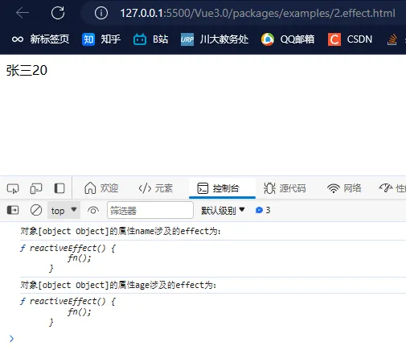
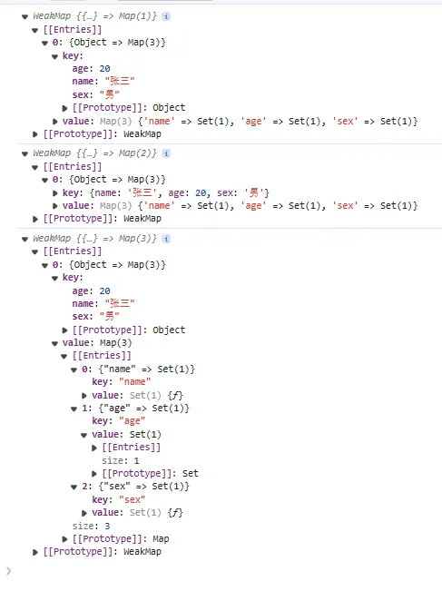

## 3-1 effect 方法的使用

`effect` 本质是一个函数，第一个参数为函数，第二个参数为一个配置对象。第一个传入的参数会默认执行，执行过程中会收集该函数所依赖的响应式数据。当这些响应式数据发生变化时，effect 函数将被重新执行。<br />官方文档见：[https://cn.vuejs.org/api/reactivity-core.html#watcheffect](https://cn.vuejs.org/api/reactivity-core.html#watcheffect)

```html
<!-- effect 函数的基本使用 -->
<!-- weak-vue\packages\examples\2.effect.html -->
<!DOCTYPE html>
<html lang="en">
  <head>
    <meta charset="UTF-8" />
    <meta http-equiv="X-UA-Compatible" content="IE=edge" />
    <meta name="viewport" content="width=device-width, initial-scale=1.0" />
    <title>2.effect</title>
  </head>
  <body>
    <div id="id"></div>
    <script src="../dist/vue.global.js"></script>
    <script>
      let { reactive, effect } = Vue;
      let state = reactive({ name: "张三", age: 20 });
      // effect方法相当于Vue2.0中的watch方法，第一个参数传入函数，默认执行（如果传入了{laze: true}则不是）
      // 观察者模式
      // 默认执行过程：effect是一个依赖收集器，如果执行的函数中用到的数据已经被代理过了，则会去执行get()方法收集effect依赖
      effect(
        () => {
          app.innerHTML = state.name + state.age;
        },
        { laze: true }
      );

      // 1s后修改被代理的数据，导致触发set方法，执行effect
      setTimeout(() => {
        state.name = "lis";
      }, 1000);
    </script>
  </body>
</html>
```

## 3-2 effect 方法的实现

### 3-2-1 effect 方法的定义

首先定义一个响应式创建函数 `createReactEffect(fn, options)`，该高阶函数会将传入的用户方法 `fn` 包装成一个新的 `effect` 函数，并返回这个新的函数。每个 `fn` 都有自己的 `effect`：

```typescript
// weak-vue\packages\reactivity\src\effect.ts
// effect 的基本结构
export function effect(fn, options: any = {}) {
  // 对于每个fn，都能创建自己的effect
  const effect = createReactEffect(fn, options);

  // 判断一下
  if (!options.lazy) {
    effect(); // 默认执行
  }
  return effect;
}
```

`effect `是一个高阶函数，同时也是一个和每个 `fn` 一一对应的对象，这个对象上面有很多属性，比如 `id`（唯一标识）、`_isEffect`（私有属性，区分是不是响应式的 `effect`）、`raw`（保存用户的方法）、`options`（保存用户的 `effect` 配置）：

```typescript
// weak-vue\packages\reactivity\src\effect.ts
// 创建一个依赖收集器effect，并定义相关的属性。每个数据（变量）都有自己的effect。
function createReactEffect(fn, options) {
  // effect是一个高阶函数
  const effect = function reactiveEffect() {
    fn();
  };
  // effect也是一个对象
  effect.id = uid++; // 区分effect
  effect._isEffect = true; // 区分effect是不是响应式的effect
  effect.raw = fn; // 保存用户的方法
  effect.options = options; // 保存用户的effect配置
  activeEffect = effect;
  return effect;
}
```

### 3-2-2 属性和 effect 方法的关系

要实现响应式，首先第一步是收集变量涉及的 `effect`，也就是对于一个变量/对象来说，他是在函数中会被用到的，这个函数会经过我们上面的处理会变成 `effect` 函数，如果变量/对象发生改变（具体的是某个属性 key，比如 `增 GET`、`删 DELETE` 等），则去重新触发对应的 `effect` 函数。在被代理的时候，就去收集相应的 `effect`依赖。<br />这一步是在定义代理- `获取 get()`配置中实现的：

```typescript
// weak-vue\packages\reactivity\src\baseHandlers.ts
// 判断
if (!isReadonly) {
  // 不是只读则收集依赖（三个参数为代理的变量/对象，对该变量做的操作（增删改等），操作对应的属性）
  Track(target, TrackOpType.GET, key);
}
```

---

那怎么找到 `target[key]`涉及的所有 `effect` 呢？首先我们可以借助一个全局变量 `activeEffect` 拿到当前的 `effect`：

```typescript
// weak-vue\packages\reactivity\src\effect.ts
let activeEffect; // 保存当前的effect

export function Track(target, type, key) {
  console.log(`对象${target}的属性${key}涉及的effect为：`);
  console.log(activeEffect); // 拿到当前的effect
}
```

此时去跑一下我们的示例：

```html
<!-- weak-vue\packages\examples\2.effect.html -->
<body>
  <div id="app"></div>
  <script src="../reactivity/dist/reactivity.global.js"></script>
  <script>
    let { reactive, effect } = VueReactivity;
    let state = reactive({ name: "张三", age: 20 });
    // effect方法相当于Vue2.0中的watch方法，第一个参数传入函数，默认执行（如果传入了{laze: true}则不是）
    // 观察者模式
    // 默认执行过程：effect是一个依赖收集器，如果执行的函数中用到的数据已经被代理过了，则会去执行get()方法收集effect依赖
    effect(() => {
      app.innerHTML = state.name + state.age;
    });
  </script>
</body>
```

可以看到，控制台打印了两次我们当前的 `effect`：<br />

### 3-2-3 effect 栈的定义

上面说明被代理的对象属性是能够拿到涉及的 `effec`t 的，但是如果仅凭一个全局变量 `activeEffect` 实现属性的 `effect` 收集，可能会导致一个问题：如果像下面这样存在嵌套结构，则可能会导致 `effect` 收集出错：

```typescript
effect(() => {
  // effect1，activeEffect变为effect1
  state.name; // 触发get收集activeEffect，即effect1
  effect(() => {
    // effect2，activeEffect变为effect2
    state.age; // 触发get收集activeEffect，即effect2
  });
  state.a; // 触发get收集activeEffect，即effect2，出错。应该是effect1！！！
});
```

针对这个问题，说明仅凭一个全局变量 `activeEffect` 实现属性的 `effect` 收集是不够的，应该借助一个栈存储结构来存储我们产生的所有 `effect`，借助入栈出栈操作来避免这个问题：

```typescript
// weak-vue\packages\reactivity\src\effect.ts
const effectStack = []; // 用一个栈来保存所有的effect

const effect = function reactiveEffect() {
  // 确保effect唯一性
  if (!effectStack.includes(effect)) {
    try {
      // 入栈，将activeEffect设置为当前的effect
      effectStack.push(effect);
      activeEffect = effect;
      fn(); // 执行用户的方法
    } finally {
      // 不管如何都会执行里面的方法
      // 出栈，将当前的effect改为栈顶
      effectStack.pop();
      activeEffect = effectStack[effectStack.length - 1];
    }
  }
};
```

此时上面的例子执行过程变成这样，收集正确：

```typescript
effect(() => {
  // effect1，effect1入栈，activeEffect变为effect1，此时栈顶为effect1
  state.name; // 触发get收集activeEffect，即effect1
  effect(() => {
    // effect2，effect2入栈，activeEffect变为effect2，此时栈顶为effect2
    state.age; // 触发get收集activeEffect，即effect2
  }); // effect2执行完毕，即finally，此时effect2出栈，此时栈顶为effect1，activeEffect变为effect1
  state.a; // 触发get收集activeEffect，即effect1，收集正确
});
```

### 3-2-4 key 和 effect 一一对应

上面提到的依赖收集方法 `Track` 只是将每个被代理的属性 `key` 涉及的 `effect `打印出来，那么如果描述这种一对多且不重复的对应关系呢？答案是借助 `weakmap` 结构和 `set` 结构，实现 `target=>Map（key=>Set(n) {effect1, effect2, ..., effectn}）`这种结构。<br />实现 `Track` 方法的逻辑如下：

- 如果 `activeEffect` 不存在，说明当前 `get` 的属性没有在 `effect` 中使用或者变量不存在；

```typescript
// weak-vue\packages\reactivity\src\effect.ts
if (activeEffect === undefined) {
  // 说明没有在effect中使用（变量不是响应式或者变量不存在）
  return;
}
```

- 首先用一个全局 targetMap 对象存储所有 target 对象和各自的 Map（key=>Set(n) {effect1, effect2, ..., effectn}）的映射关系，targetMap 中的 key 为一个 target 对象，value 为依赖 Map（key=>Set(n) {effect1, effect2, ..., effectn}）：

```typescript
// weak-vue\packages\reactivity\src\effect.ts
let targetMap = new WeakMap();
```

- 然后借助 targetMap，可以拿到每个 target 对象的依赖 Map，如果该依赖 Map 不存在则新插入一个：

```typescript
// weak-vue\packages\reactivity\src\effect.ts
let depMap = targetMap.get(target);
if (!depMap) {
  targetMap.set(target, (depMap = new Map()));
}
```

- depMap 是一个依赖 map，它的 key 为 target 对象中的每个属性 key，value 为每个属性涉及的所有不重复 effect。可以借助 depMap 拿到每个属性 key 的所有 effect 的 Set 结构，如果该 Set 不存在则新建一个：

```typescript
// weak-vue\packages\reactivity\src\effect.ts
let dep = depMap.get(key);
if (!dep) {
  // 没有属性
  depMap.set(key, (dep = new Set()));
}
```

- 拿到属性 key 的所有 effect 之后，可以去判断 activeEffect 是否已经在其中，没有则插入，实现 effect 依赖的收集：

```typescript
// weak-vue\packages\reactivity\src\effect.ts
if (!dep.has(activeEffect)) {
  dep.add(activeEffect);
}
```

---

Track 方法的全部代码如下：

```typescript
// weak-vue\packages\reactivity\src\effect.ts
// 收集依赖的操作（触发get()的时候，如果数据（变量）不是只读的，则触发Track，执行对应的依赖收集操作）
let targetMap = new WeakMap();
export function Track(target, type, key) {
  // console.log(`对象${target}的属性${key}涉及的effect为：`);
  // console.log(activeEffect); // 拿到当前的effect

  // key和我们的effect一一对应（map结构）
  if (activeEffect === undefined) {
    // 说明没有在effect中使用（变量不是响应式或者变量不存在）
    return;
  }
  // 获取对应的effect
  let depMap = targetMap.get(target);
  if (!depMap) {
    targetMap.set(target, (depMap = new Map()));
  }
  let dep = depMap.get(key);
  if (!dep) {
    // 没有属性
    depMap.set(key, (dep = new Set()));
  }
  if (!dep.has(activeEffect)) {
    dep.add(activeEffect);
  }

  console.log(targetMap);
}
```

此时执行我们的示例：

```html
<!-- weak-vue\packages\examples\2.effect.html -->
<script>
  let { reactive, effect } = VueReactivity;
  let state = reactive({ name: "张三", age: 20, sex: "男" });
  effect(() => {
    state.name;
    effect(() => {
      state.age;
    });
    state.sex;
  });
</script>
```

可以看到 `targetMap` 是我们想要的结构，能极大方便我们找到依赖关系：<br />。

---

自此，我们对每个变量/属性的依赖收集操作便已完成，到这里的源码请看提交记录：[3、依赖收集](https://github.com/XC0703/VueSouceCodeStudy/commit/0e477cce10ec46b29d4c8be731cfffca2a059fa4)。
