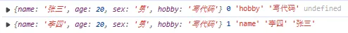
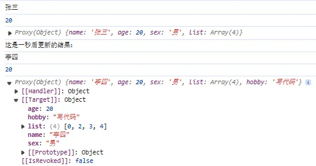
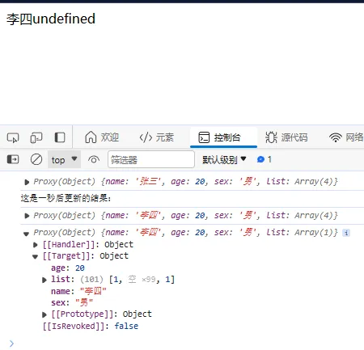

## 4-1 前言

从前面关于响应式 API 的实现中可以知道，Vue3 发布后，在双向数据绑定这里，使用 `Proxy` 代替了 `Object.defineProperty`。

众所周知，`Object.defineProperty` 在对对象属性监听时，必须通过循环遍历对象，对一个个属性进行监听（在 Vue 中考虑性能问题并未采用这种方式，因为可能存在递归层叠地狱，所以需要特殊处理数组的变动，重写了数组的一些方法。）。

`Proxy` 是对一整个对象进行监听，同时 `Proxy` 的一大优势就是可以监听数组。触发 `get`方法时进行依赖收集，触发 `set`方法时进行触发涉及 `effect` 实现更新。

`Proxy` 可以监听数组更新的原理是进行数组的代理时，原理上会将其转化为一个类数组对象的形式，实现整个对象的代理，然后实现监听。因此在触发 `set` 方法时，我们需要区分当前的 `target` 对象是一个真正的对象还是一个数组，方便我们后续的操作。

## 4-2 更新类型判断和触发更新

### 4-2-1 判断数组/是否新增

我们先看曾经定义的 `createSetter` 方法，留了一个 TODO（通过反射器设置完变量的新值后，触发更新）：

```typescript
// weak-vue\packages\reactivity\src\baseHandlers.ts
// 代理-获取set()配置
function createSetter(shallow = false) {
  return function set(target, key, value, receiver) {
    const res = Reflect.set(target, key, value, receiver); // 获取最新的值，相当于target[key] = value

    // TODO：触发更新
    return res;
  };
```

上面的代码的意思是 `proxy` 监听到对`target[key]=value` 的操作，但这个操作可能是新增也可能是修改。因此对于值的更新操作，我们需要从两个维度考虑：（1）是数组还是对象；（2）添加值还是修改值。<br />对于第一个判断，由于 `target` 已经是被代理过的对象了，所以数组所以要另写方法判断：

```typescript
// weak-vue\packages\reactivity\src\baseHandlers.ts
// 代理-获取set()配置
function createSetter(shallow = false) {
  return function set(target, key, value, receiver) {
    // （1）获取老值
    const oldValue = target[key];

    // (2)判断target是数组还是对象，此时target已经是被代理过的对象了，所以要另写方法判断
    // 如果是数组，key的位置小于target.length，说明是修改值；如果是对象，则直接用hasOwn方法判断
    let hasKey = ((isArray(target) && isIntegerKey(key)) as unknown as boolean)
      ? Number(key) < target.length
      : hasOwn(target, key);

    // （3）设置新值
    const res = Reflect.set(target, key, value, receiver); // 获取最新的值，相当于target[key] = value，返回的res是布尔值，设置新值成功之后返回true

    // （4）触发更新
    if (!hasKey) {
      // 此时说明是新增
      trigger(target, TriggerOpType.ADD, key, value);
    } else if (hasChange(value, oldValue)) {
      // 修改的时候，要去判断新值和旧值是否相同
      trigger(target, TriggerOpType.SET, key, value, oldValue);
    }

    return res;
  };
}
```

其中用到的三个方法定义及解释如下：

```typescript
// weak-vue\packages\shared\src\general.ts
// 判断对象是否有某个属性（两个参数，返回值为布尔型，key is keyof typeof val使用了ts的类型守卫语法）
const hasOwnProperty = Object.prototype.hasOwnProperty;
export const hasOwn = (
  val: object,
  key: string | symbol
): key is keyof typeof val => hasOwnProperty.call(val, key);

// 判断数组的key是否是整数
// 数组经过proxy代理之后，会变成对象的形式，如console.log(new Proxy([1,2,3],{})); ===》Proxy(Array) {'0': 1, '1': 2, '2': 3}（js对象的key类型为字符串），因此"" + parseInt(key, 10)这样是为了方便拿到正确的字符串key用于判断
// console.log(Array.isArray(new Proxy([1,2,3],{})))===》true
// 比如此时arr[2]=4，应该是
export const isIntegerKey = (key) => {
  isString(key) &&
    key !== "NaN" &&
    key[0] !== "-" &&
    "" + parseInt(key, 10) === key;
};

// 判断值是否更新
export const hasChange = (value, oldValue) => value !== oldValue;
```

### 4-2-2 判断之后进行更新

在上面我们用 `hasKey` 来判断添加值还是修改值，下面我们就要实现对应的触发更新方法 `trigger`。

```typescript
// weak-vue\packages\reactivity\src\effect.ts
// 触发更新
export function trigger(target, type, key?, newValue?, oldValue?) {
  console.log(target, type, key, newValue, oldValue);
}
```

此时去跑一下我们的测试用例：

```html
<!-- weak-vue\packages\examples\2.effect.html -->
<script>
  let { reactive, effect } = VueReactivity;
  let state = reactive({ name: "张三", age: 20, sex: "男" });

  // 一秒后触发更新==>触发set，执行对应的effect，处理是新增还是修改
  setTimeout(() => {
    state.name = "李四"; // 更新
    state.hobby = "写代码"; // 新增
  }, 1000);
</script>
```

可以看到被打印了出来：<br />

此时我们具体实现一下 `trigger` 方法，其实就是触发对应的 `effect` 方法。在前面，我们已经用了 `Track `方法收集了所有的 `effect` 依赖并存储在 `targetMap` 里面，因此现在我们在 `trigger` 方法里面需要做的就是通过 `targetMap` 找到对应的 `effect` 方法进行触发即可。

```typescript
// weak-vue\packages\reactivity\src\effect.ts
// 触发更新
export function trigger(target, type, key?, newValue?, oldValue?) {
  // console.log(target, type, key, newValue, oldValue);

  // 已经收集好的依赖，是target=>Map（key=>Set(n) {effect1, effect2, ..., effectn}）这种结构。
  // console.log(targetMap);

  // 获取对应的effect
  const depMap = targetMap.get(target);
  if (!depMap) {
    return;
  }
  const effects = depMap.get(key);

  // 不重复执行effect
  let effectSet = new Set();
  const addEffect = (effects) => {
    if (effects) {
      effects.forEach((effect) => effectSet.add(effect));
    }
  };
  addEffect(effects);
  effectSet.forEach((effect: any) => effect());
}
```

此时再去执行我们的测试用例：

```html
<!-- weak-vue\packages\examples\2.effect.html -->
<script>
  let { reactive, effect } = VueReactivity;
  let state = reactive({
    name: "张三",
    age: 20,
    sex: "男",
    list: [1, 2, 3, 4],
  });
  effect(() => {
    console.log(state.name);
    effect(() => {
      console.log(state.age);
    });
    console.log(state);
  });

  // 一秒后触发更新==>触发set，执行对应的effect，处理是新增还是修改
  setTimeout(() => {
    console.log("这是一秒后更新的结果：");
    state.hobby = "写代码"; // 新增ADD
    state.name = "李四"; // 更新SET
    state.list[0] = 0;
  }, 1000);
</script>
```

可以看到结果符合我们的预期：<br />

### 4-2-3 对数组进行特殊处理

但如果我们通过直接改变数组的长度的话，并且 `effect` 中又用到的话，像下面这样：

```html
<!-- weak-vue\packages\examples\2.effect.html -->
<script>
  let { reactive, effect } = VueReactivity;
  let state = reactive({
    name: "张三",
    age: 20,
    sex: "男",
    list: [1, 2, 3, 4],
  });
  effect(() => {
    console.log(state);
    app.innerHTML = state.name + state.list[1];
  });

  // 一秒后触发更新==>触发set，执行对应的effect，处理是新增还是修改
  setTimeout(() => {
    console.log("这是一秒后更新的结果：");
    state.name = "李四";
    state.list.length = 1; // 此时state.list[1]应该是undefined，但屏幕依然显示2，因为没有对数组进行特殊处理，此时仅仅是触发了key为length的effect，key为1的effect没有被触发导致是旧的结果
  }, 1000);
</script>
```

说明此时需要对数组进行进一步处理，还有一种情况通过数组不存在的下标给数组赋值也需要特殊处理：

```typescript
// weak-vue\packages\reactivity\src\effect.ts
// 对数组进行特殊处理，改变的key为length时(即直接修改数组的长度)时，要触发其它key的effect，否则其它key的effect不会被触发的，始终是旧的结果
if (isArray(target) && key === "length") {
  depMap.forEach((dep, key) => {
    // 此时拿到depMap包含target对象所有key（包含'length'等属性以及所有下标'0'、'1'等等）的所有涉及effect
    // 如果下标key大于等于新的长度值，则要执行length的effect和超出length的那些key的effect（再去执行指的是比如刚开始拿到state.list[100]，
    // 现在将state.list.length直接改为1，重新触发state.list[100]这个语句，无法在内存中找到所以显示undefined）
    if (key === "length" || key >= newValue) {
      addEffect(dep);
    }
  });
} else {
  // 数组或对象都会进行的正常操作
  if (key !== undefined) {
    const effects = depMap.get(key);
    addEffect(effects);
  }

  switch (type) {
    case TriggerOpType.ADD:
      // 针对的是通过下标给数组不存在的key赋值，从而改变数组的长度的情况，此时要额外触发"length"的effect
      if (isArray(target) && (isIntegerKey(key) as unknown as boolean)) {
        addEffect(depMap.get("length"));
      }
  }
}
```

此时去执行我们的测试用例：

```html
<!-- weak-vue\packages\examples\2.effect.html -->
<script>
  let { reactive, effect } = VueReactivity;
  let state = reactive({
    name: "张三",
    age: 20,
    sex: "男",
    list: [1, 2, 3, 4],
  });
  effect(() => {
    console.log(state);
    app.innerHTML = state.name + state.list[1];
  });

  // 一秒后触发更新==>触发set，执行对应的effect，处理是新增还是修改
  setTimeout(() => {
    console.log("这是一秒后更新的结果：");
    state.name = "李四";
    state.list.length = 1; // 此时state.list[1]应该是undefined，但屏幕依然显示2，因为没有对数组进行特殊处理，此时仅仅是触发了key为length的effect，key为1的effect没有被触发导致是旧的结果
    state.list[100] = 1; // 此时改变不存在的key，应该去触发key为length的effect，导致的效果是list中间插入空值补全长度
  }, 1000);
</script>
```

可以看到，结果符合预期：<br />

---

自此，我们已经了解触发更新的基本实现原理，到这里的代码请看提交记录：[4、触发更新](https://github.com/XC0703/VueSouceCodeStudy/commit/35ed54e8e97c8123ecbe31527776014e35798f1a) 。
