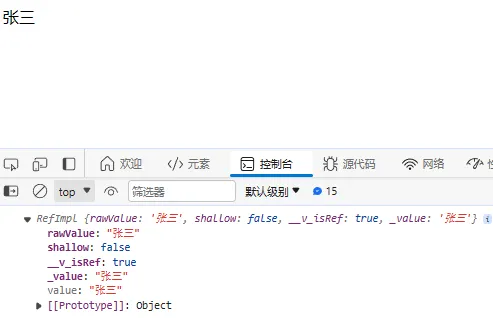
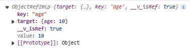
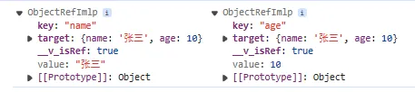

## 5-1 ref

### 5-1-1 ref 的基本使用

在前面，我们借助 `Proxy` 代理实现了对象、数组类型的响应式（`reactive`），而基本数据类型的响应式则要借助 `ref` 实现。`ref` 就是将普通的数据类型实现代理，其原理基于 `Object.defineProperty` 实现（`Proxy` 是代理对象的）。

```html
<!-- weak-vue\packages\examples\3.ref.html -->
<script>
  // ref就是将普通的数据类型实现代理，其原理基于Object.defineProperty实现。
  let { reactive, effect, ref } = VueReactivity;
  let name = ref("张三"); // 返回一个实例对象，添加一个value属性，这个属性就是该普通数据的值
  effect(() => {
    app.innerHTML = name.value; // 显示'张三'
  });
</script>
```

### 5-1-2 ref 实例对象的包装

`ref` 本质是一个方法，将我们需要代理的基本数据包装成一个可以访问 value 属性的实例对象。因此第一步是包装对象。<br />新建一个 `weak-vue\packages\reactivity\src\ref.ts` 文件：

```typescript
// weak-vue\packages\reactivity\src\ref.ts
// 普通ref代理
export function ref(target) {
  return createRef(target);
}

// 如果target是一个对象，则浅层代理
export function shallowRef(target) {
  return createRef(target, true);
}

// 创建ref类
class RefImpl {
  // 给实例添加一些公共属性（实例对象都有的，相当于this.XXX = XXX）
  public __v_isRef = true; // 用来表示target是通过ref实现代理的
  public _value; // 值的声明
  constructor(public rawValue, public shallow) {
    // 参数前面添加public标识相当于在构造函数调用了this.target = target,this.shallow = shallow
    this._value = rawValue; // 用户传入的值赋给_value
  }

  // 借助类的属性访问器实现value属性的访问以及更改
  get value() {
    return this._value;
  }
  set value(newValue) {
    this._value = newValue;
  }
}

// 创建ref实例对象(rawValue表示传入的目标值)
function createRef(rawValue, shallow = false) {
  return new RefImpl(rawValue, shallow);
}
```

此时去跑我们的测试用例：<br /><br />可以看到，ref 实例对象基本实现。

### 5-1-3 ref 的响应式实现

因此在上面我们已经实现将基本数据包装成一个具有 value 属性的示例对象了，所以响应式的实现直接借助我们前面使用过的两个方法：收集依赖（`Track`）和触发更新（`trigger`）即可：

```typescript
// weak-vue\packages\reactivity\src\ref.ts
  // 响应式的实现需要借助两个方法：收集依赖（Track）和触发更新（trigger）。
  // 借助类的属性访问器实现value属性的访问以及更改
  get value() {
    Track(this, TrackOpType.GET, "value"); // get的时候实现依赖收集
    return this._value;
  }
  set value(newValue) {
    // 如果值已变，则赋新值并触发更新
    if (hasChange(newValue, this._value)) {
      this._value = newValue;
      this.rawValue = newValue;
      trigger(this, TriggerOpType.SET, "value", newValue);
    }
  }
```

此时便可以变成响应式了，去跑一下我们新的测试用例：

```html
<!-- weak-vue\packages\examples\3.ref.html -->
<script>
  let { reactive, effect, ref } = VueReactivity;
  let name = ref("张三"); // 返回一个实例对象，添加一个value属性，这个属性就是该普通数据的值
  console.log(name);
  effect(() => {
    app.innerHTML = name.value; // 显示'张三'
  });

  setTimeout(() => {
    name.value = "李四"; // 一秒后显示'李四'
  }, 1000);
</script>
```

可以看到显示结果是会更改的，说明响应式有效。

## 5-2 toRef

### 5-2-1 toRef 的使用

`toRef` 就是将对象的某个属性的值变成 `ref` 对象。

```html
<!-- weak-vue\packages\examples\5.toRefs.html -->
<script>
  // toRef就是将对象的某个属性的值变成ref对象。
  let { reactive, effect, toRef } = VueReactivity;
  let state = { age: 10 };
  let myAge = toRef(state, "age");
  console.log(myAge.value);
</script>
```

<a name="woMr6"></a>

### 5-2-2 toRef 实例对象的包装

像前面一样，我们需要将值包装成一个对象，并且可以拿到正确的值。

```typescript
// weak-vue\packages\reactivity\src\ref.ts
class ObjectRefImlp {
  public __v_isRef = true; // 用来表示target是通过ref实现代理的
  constructor(public target, public key) {}

  // 获取值
  get value() {
    return this.target[this.key];
  }
  // 设置值
  set value(newValue) {
    this.target[this.key] = newValue;
  }
}

// 创建toRef对象
export function toRef(target, key) {
  return new ObjectRefImlp(target, key);
}
```

此时去跑一下我们的测试用例：<br /><br />可以看到，打印正确。

### 5-2-3 toRef 的响应式实现

官网对 toRef 的作用解释为：

> 基于响应式对象上的一个属性，创建一个对应的 ref。这样创建的 ref 与其源属性保持同步：改变源属性的值将更新 ref 的值，反之亦然。

可以看到，如果我们源对象是响应式的（经过 `reactive` 代理），此时的 `ref` 对象才是响应式的，否则不是。像下面这样：

```html
<!-- weak-vue\packages\examples\5.toRefs.html -->
<script>
  // toRef就是将对象的某个属性的值变成ref对象。
  let { reactive, effect, toRef } = VueReactivity;
  let state = { age: 10 }; // 非响应的普通对象，如果是reactive( { age: 10 } )则是响应式的。
  let myAge = toRef(state, "age");
  console.log(myAge);
  effect(() => {
    app.innerHTML = myAge.value;
  });

  setTimeout(() => {
    myAge.value = 50; // 显示不变，因为此时不是响应式的
  }, 1000);
</script>
```

<a name="tLIi8"></a>

## 5-3 toRefs

### 5-3-1 toRefs 的基本原理

`toRefs` 是我们日常开发中用得比较多的一个 api。官方对 `toRefs` 的作用解释为：

> 将一个响应式对象转换为一个普通对象，这个普通对象的每个属性都是指向源对象相应属性的 ref。每个单独的 ref 都是使用 [toRef()](https://cn.vuejs.org/api/reactivity-utilities.html#toref) 创建的。

所以 `toRefs` 的实现原理是基于 `toRef` 的，只不过多了一层属性的遍历：

```typescript
// weak-vue\packages\reactivity\src\ref.ts
// 实现toRefs
export function toRefs(target) {
  // 判断是否为数组
  let ret = isArray(target) ? new Array(target.length) : {};
  // 遍历target对象的每个属性key
  for (const key in target) {
    ret[key] = toRef(target, key); // 每个属性都有自己的toRef实例对象
  }

  return ret;
}
```

此时去跑一下我们的测试用例：

```html
<!-- weak-vue\packages\examples\5.toRefs.html -->
<script>
  // toRefs就是将对象的所有属性的值变成ref
  let { reactive, effect, toRefs } = VueReactivity;
  let state = { name: "张三", age: 10 };
  let { name, age } = toRefs(state);
  console.log(name, age);
</script>
```

可以看到打印出正确的结果：<br />

### 5-3-2 toRefs 在实际开发中的使用

上面提到，`toRefs` 是我们日常开发中用得比较多的一个 api。那具体怎么使用，下面请先看一个常见场景：

```html
<!-- weak-vue\packages\examples\5.toRefs.html -->
<div id="app">{{state.name}}</div>
<script>
  // toRefs就是将对象的所有属性的值变成ref
  let { reactive, effect, toRefs, createApp } = Vue;
  let APP = {
    // Vue3组件的入口函数
    setup() {
      let state = reactive({ name: "张三", age: 10 });
      return { state };
    },
  };
  createApp(App).mount("#app");
</script>
```

此时确实实现了 `state.name` 的响应式，但是我们如果不想通过 `state.name` 这种方式访问 name，而是通过解构响应式对象来直接访问：

```html
<!-- weak-vue\packages\examples\5.toRefs.html -->
<div id="app">{{name}}</div>
<script>
  // toRefs就是将对象的所有属性的值变成ref
  let { reactive, effect, toRefs, createApp } = Vue;
  let APP = {
    // Vue3组件的入口函数
    setup() {
      let { name, age } = reactive({ name: "张三", age: 10 });
      return { name };
    },
  };
  createApp(App).mount("#app");
</script>
```

此时会报错 undefined，无法访问。此时便可通过 `toRefs` 解决：

```html
<!-- weak-vue\packages\examples\5.toRefs.html -->
<div id="app">{{name}}</div>
<script>
  // toRefs就是将对象的所有属性的值变成ref
  let { reactive, effect, toRefs, createApp } = Vue;
  let APP = {
    // Vue3组件的入口函数
    setup() {
      let state = reactive({ name: "张三", age: 10 });
      // 返回解构的所有属性的ref示例对象
      return { ...toRefs(state) };
    },
  };
  createApp(App).mount("#app");
</script>
```

此时便不会报错了。

---

自此，我们关于 `ref`、`toRef` 与 `toRefs` 的基本实现便已经结束了，到这里的源码请看提交记录：[5、ref、toRef 与 toRefs](https://github.com/XC0703/VueSouceCodeStudy/commit/0a0179058cce812bf6f5632385aae75242cfc2e5)。
<a name="OhwTU"></a>
