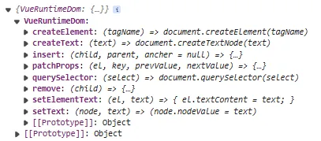

## 7-1 runtime-dom 的作用

`Vue3` 的 `runtime-dom` 模块是 `Vue3` 中的一个核心模块，它的作用是提供了一些运行时的功能来实现组件的创建、更新和销毁等操作：

1. 组件的创建：在 `Vue3` 中，组件被创建为一个渲染函数，当使用该组件时，`runtime-dom` 模块会根据渲染函数生成组件的虚拟节点（`VNode`），并将其添加到组件实例中。
2. 组件的更新：当组件的状态发生变化时，`runtime-dom` 模块会根据新的状态重新执行渲染函数，并生成新的虚拟节点。然后，它会使用 `diff` 算法比较新旧虚拟节点的差异，并将差异应用到实际的 `DOM` 上，以更新页面的显示。
3. 组件的销毁：当组件不再需要时，`runtime-dom` 模块会调用相应的钩子函数来执行组件的销毁操作，包括解绑事件、清除定时器等。

```html
<!-- weak-vue\packages\examples\7.createApp.html -->
<div id="app"></div>
<script src="../../runtime-dom/dist/runtime-dom.global.js"></script>
<script>
  let { createApp, reactive, h } = VueRuntimeDOM; // createApp和h这两个函数都是Vue3中runtime-dom模块的方法，用于处理组件渲染（创建组件、渲染dom）

  //  创建组件（composition组合式api）
  let App = {
    // data和methods是Vue2.0选项式api的写法，Vue3虽然兼容但是不建议在Vue3中这样写
    // data() {
    //   return {
    //     a: 1,
    //   };
    // },
    // methods: {
    //   xx: () => {},
    // },

    // Vue3组件的入口函数，默认执行一次，相当于vue2中的beforeCreate、created，可以返回代理的一些响应式属性以供渲染函数使用，也可以直接返回渲染函数
    setup(props, context) {
      // 参数、上下文对象（包含了父组件传递下来的非 prop 属性attrs、可以用来触发父组件中绑定的事件函数emit、一个指向当前组件实例的引用root、用来获取插槽内容的函数slot等）
      console.log();
      let state = reactive({ age: 2 });
      const fn = () => {
        state.age++;
      };

      // 返回代理的响应式属性以供渲染函数使用
      return {
        state,
      };

      // 直接返回渲染函数
      return () => {
        console.log(state);
        return h(
          // h是渲染函数
          "div",
          { style: { color: "red" }, onClick: fn },
          `hello ${state.age}`
        );
      };
    },

    // Vue3组件的渲染函数，其实proxy参数将上面定义的所有属性合并了，等效于在setup入口函数里面返回一个函数（和上面等效，上面还不用用proxy.来获取属性）
    render(proxy) {
      console(proxy.state.age);
      return h(
        "div",
        { style: { color: "red" }, onClick: fn },
        `hello ${proxy.state.age}`
      );
    },
  };
</script>
```

## 7-2 节点与属性的操作

### 7-2-1 包初始化

在 `weak-vue\packages` 目录下新建两个子目录 `runtime-core` 和 `runtime-dom`，并分别创建自己的 `src\index.ts` 和进行 `npm init` 初始化并配置 `package.json` 文件。

```json
// weak-vue\packages\runtime-core\package.json
{
  "name": "@vue/runtime-dom",
  "version": "1.0.0",
  "description": "",
  "main": "index.js",
  "scripts": {
    "test": "echo \"Error: no test specified\" && exit 1"
  },
  "author": "",
  "license": "ISC",
  "buildOptions": {
    "name": "VueRuntimeDom",
    "formats": ["esm-bundler", "global"]
  }
}
```

```json
// weak-vue\packages\runtime-dom\package.json
{
  "name": "@vue/runtime-core",
  "version": "1.0.0",
  "description": "",
  "main": "index.js",
  "scripts": {
    "test": "echo \"Error: no test specified\" && exit 1"
  },
  "author": "",
  "license": "ISC",
  "buildOptions": {
    "name": "VueRuntimeCore",
    "formats": ["global"]
  }
}
```

<a name="USghh"></a>

### 7-2-2 方法的定义

`runtime-dom` 是用于操作 dom（节点、属性）的模块。创建两个文件，分别用于处理节点(`nodeOps.ts`) 与属性 （`patchProp.ts`）：（内容不用背，了解大概原理即可）

```typescript
// weak-vue\packages\runtime-dom\src\nodeOps.ts
// 操作节点（增删改查）
export const nodeOps = {
  // 对节点的一些操作
  // 创建元素，createElement(runtime-dom本质是运行时操作dom，但因为每个平台操作dom的方法不同，vue的runtime-dom模块的createElement方法是针对浏览器的)
  createElement: (tagName) => document.createElement(tagName),
  // 删除元素
  remove: (child) => {
    const parent = child.parentNode;
    if (parent) {
      parent.removeChild(child);
    }
  },
  // 插入元素
  insert: (child, parent, ancher = null) => {
    parent.insertBefore(child, ancher); // ancher为空相当于appendchild
  },
  // 选择节点
  querySelector: (select) => document.querySelector(select),
  // 设置节点的文本
  setElementText: (el, text) => {
    el.textContent = text;
  },

  // 对文本的一些操作
  createText: (text) => document.createTextNode(text),
  setText: (node, text) => (node.nodeValue = text),
};
```

使用策略模式操作属性：（即包装一下，传入参数返回对应的处理函数）

```typescript
// weak-vue\packages\runtime-dom\src\patchProp.ts
// 操作属性（增删改查）
import { patchClass } from "./modules/class";
import { patchStyle } from "./modules/style";
import { patchAttr } from "./modules/attrt";
import { patchEvent } from "./modules/event";
export const patchProps = (el, key, prevValue, nextValue) => {
  switch (key) {
    case "class":
      patchClass(el, nextValue); // 只用传节点和新的class值
      break;
    case "style":
      patchStyle(el, prevValue, nextValue);
      break;
    default:
      // 事件要另外处理(事件的特征：@、onclick等==>正则匹配，如以on开头，后面跟小写字母，这里简化判断，知道思想即可)
      if (/^on[^a-z]/.test(key)) {
        patchEvent(el, key, nextValue);
      } else {
        patchAttr(el, key, nextValue);
      }
  }
};
```

---

其中关于类名 class、样式 style、自定义属性 attribute、事件 event 的处理如下：

```typescript
// weak-vue\packages\runtime-dom\src\modules\class.ts
// 处理class
export const patchClass = (el, value) => {
  // 对这个标签的class赋值（如果没有赋值为空，如果有则直接打点获取属性后覆盖）
  if (value === null) {
    value = "";
  }
  el.className = value;
};
```

```typescript
// weak-vue\packages\runtime-dom\src\modules\style.ts
// 处理style
// 已经渲染到页面上{style：{color:'red'}}=>当前（新的）样式{style:{background:'green'，font-size:20px}}
export const patchStyle = (el, prev, next) => {
  const style = el.style;

  // 说明样式删除
  if (next === null) {
    el.removeAttribute("style");
  } else {
    // 如果是已经渲染的样式有某样式，但是新的样式没有，则要清除老的样式
    if (prev) {
      for (const key in prev) {
        if (next[key] === null) {
          style[key] = "";
        }
      }
    }
    // 如果是新的有，老的没有，则直接打点获取属性后覆盖
    for (const key in next) {
      style[key] = next[key];
    }
  }
};
```

```typescript
// weak-vue\packages\runtime-dom\src\modules\attrt.ts
// 处理一些自定义的属性
export const patchAttr = (el, key, value) => {
  if (value === null) {
    el.removeAttribute(key);
  } else {
    el.setAttribute(key，value);
  }
};
```

**注意**：对事件的处理比较特殊，因为事件和样式类名自定义属性不一样，绑定不同的事件不能直接覆盖，如`@click="fn1"`、`@click = "fn2"`。因为 `addEventListener` 重复添加事件监听时，不能替换之前的监听，导致有多个监听同时存在。所以这里借助一个 `map` 结构存储所有的事件映射，然后 `addEventListener` 监听对应的映射值，然后重复绑定时直接改变映射值即可（相当于改变引用）。

```typescript
// weak-vue\packages\runtime-dom\src\modules\event.ts
// 对事件的处理（注意，事件和样式类名自定义属性不一样，绑定不同的事件不能进行覆盖，如@click="fn1"、@click = "fn2"，因为addEventListener重复添加事件监听时，不能替换之前的监听，导致有多个监听同时存在
// 源码对这个处理使用了缓存，用一个map结构存储元素key上面绑定的元素
// 例子：假如当前要处理的元素el，已经绑定了@click="fn1"，现在可能要添加@click = "fn2"（情况1），也可能添加@hover = "fn3"（情况2），也可能添加@click = ""（情况3）

// el为元素，key是触发事件的方法，即事件名（如click），value为绑定的函数方法
export const patchEvent = (el, key, value) => {
  const invokers = el._vei || (el._vei = {}); // el._vei相当于一个元素的事件map缓存结构，可能为空{}。拿上面的例子来说的话，此时应该是{"click":{value:fn1}}
  const exists = invokers[key]; // 拿上面的例子来说的话，此时应该是 {value:fn1}
  if (exists && value) {
    // 不能进行覆盖（情况1）==>改变缓存中的value指向最新的事件即可，相当于改变exists的fn引用
    exists.value = value;
  } else {
    // 如果该触发方式还未绑定事件或者传入的函数为空，可能是新的绑定，也可能是清除事件
    const eventName = key.slice(2).toLowerCase();
    if (value) {
      //  新的事件绑定，且将该绑定放入缓存器（情况2）
      let invoker = (invokers[eventName] = createInvoker(value)); // 返回一个包装后的函数
      el.addEventListener(eventName, invoker);
    } else {
      //  移除事件（情况3）
      el.removeEventListener(eventName, exists);
      invokers[eventName] = null;
    }
  }
};

function createInvoker(value) {
  const invoker = (e) => {
    invoker.value(e);
  };
  invoker.value = value;
  return invoker;
}
```

---

此时将我们实现的方法导出，并测试：

```typescript
// weak-vue\packages\runtime-dom\src\index.ts
import { extend } from "@vue/shared";
// runtime-dom是用于操作dom（节点、属性）的模块
// 创建两个文件，分别用于处理节点nodeOps.ts与属性patchProp.ts
import { nodeOps } from "./nodeOps";
import { patchProps } from "./patchProp";

// Vue3的全部dom操作
const VueRuntimeDom = extend({ patchProps }, nodeOps);

export { VueRuntimeDom };
```

```html
<!-- weak-vue\packages\examples\7.createApp.html -->
<div id="id"></div>
<script src="../runtime-dom/dist/runtime-dom.global.js"></script>
<script>
  console.log(VueRuntimeDom);
</script>
```

可以看到打印成功（**patchProps 使用了策略模式，实际会执行对应情况下的处理方法**）：<br />

---

自此，我们关于 `runtime-dom` 的讲解便已结束，到这里的源码请看提交记录：[7、runtime-dom 的实现](https://github.com/XC0703/VueSouceCodeStudy/commit/3b5b88148c32a059851210971860784df71a4ebd)。
