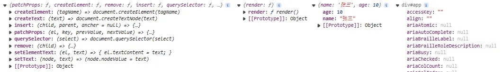
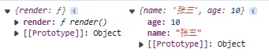
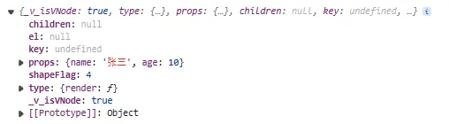

## 8-1 定义渲染的 createRender 方法

上面我们实现了 `runtime-dom` 模块来定义了一些操作 dom 的方法，这一节主要讲组件的渲染（`createApp`方法）。

---

注意，之所以这里将上面实现的 `renderOptionDom` 作为参数传递进 `createRender` 方法，这是因为我们前面实现的 `renderOptionDom` 只是在浏览器平台对于 dom 的一些操作，在其它平台中对于 dom 的操作可能不同，作为参数传递进去增加了代码的灵活度。

```typescript
// weak-vue\packages\runtime-dom\src\index.ts
// Vue3的全部dom操作
const renderOptionDom = extend({ patchProps }, nodeOps);

export const createApp = (rootComponent, rootProps) => {
  // 创建一个渲染的容器
  let app = createRender(renderOptionDom).createApp(rootComponent, rootProps); // createRender返回的是一个具有createApp属性方法的对象，打点执行该createApp方法后返回一个app对象，里面有一个mount属性方法
  let { mount } = app;
  app.mount = function (container) {
    // 挂载组件之前要清空原来的内容
    container = nodeOps.querySelector(container);
    container.innerHTML = "";
    // 渲染新的内容(挂载dom)
    mount(container);
  };
  return app;
};

// 实现渲染--最后会放在runtime-core模块中
function createRender(renderOptionDom) {
  // 返回一个对象
  return {
    // createApp方法用于指明渲染的组件以及上面的属性
    createApp(rootComponent, rootProps) {
      let app = {
        mount(container) {
          // 挂载的位置
          console.log(renderOptionDom, rootComponent, rootProps, container);
        },
      };
      return app;
    },
  };
}
```

此时可以看到我们的打印结果：<br />

## 8-2 创建虚拟 dom

在 `runtime-core` 目录下新建一个 `render.ts` 文件，存放我们上面定义的 `createRender` 方法并在 `index.ts` 中导出。然后在 `weak-vue\packages\runtime-dom\src\index.ts` 文件中通过`@vue` 方式引入：（注意，引入前要执行 `npm run build`、`yarn install`，因为采用 `monorepo` 结构，此时相当于用新的包的东西了）

```typescript
// weak-vue\packages\runtime-dom\src\index.ts
import { createRender } from "@vue/runtime-core";
```

此时具体去执行我们的 `mount` 渲染方法。<br />**Vue 组件的渲染流程为：组件==>vnode==>render**。<br />所以先写一个负责创建虚拟 dom 的函数（返回一个对象，对象具有 `mount` 挂载方法，该挂载方法做了两件事：**1、生成 vnode；2、render 渲染 vnode**）：

```typescript
// weak-vue\packages\runtime-core\src\apiCreateApp.ts
import { createVNode } from "./vnode";

// apiCreateApp是起到将组件变成虚拟dom的作用（返回一个对象，对象具有mount挂载方法，该挂载方法做了两件事：1、生成vnode；2、render渲染vnode）
export function apiCreateApp(render) {
  // createApp方法用于指明渲染的组件以及上面的属性
  return function createApp(rootComponent, rootProps) {
    let app = {
      // 添加相关的属性
      _components: rootComponent,
      _props: rootProps,
      _container: null,
      mount(container) {
        // 挂载的位置
        // console.log(renderOptionDom, rootComponent, rootProps, container);
        // 1、创建虚拟dom vnode
        let vnode = createVNode(rootComponent, rootProps);
        // 2、将虚拟dom渲染到实际的位置
        render(vnode, container);
        app._container = container;
      },
    };
    return app;
  };
}
```

其中渲染的 `render` 方式是通过参数传入的：

```typescript
// weak-vue\packages\runtime-core\src\render.ts
import { apiCreateApp } from "./apiCreateApp";

// 实现渲染Vue3组件==>vnode==>render
export function createRender(renderOptionDom) {
  // 真正实现渲染的函数（渲染vnode)
  let render = (vnode, containers) => {};

  // 返回一个具有createApp方法的对象，其中createApp负责生成一个具有mount挂载方法的app对象（包含属性、方法等），进而实现1、生成vnode；2、render渲染vnode
  return {
    createApp: apiCreateApp(render),
  };
}
```

---

其中，创建虚拟 dom 的 createVNode 方法定义如下：

```typescript
// weak-vue\packages\runtime-core\src\vnode.ts
// 生成vnode
export const createVNode = (rootComponent, rootProps) => {
  console.log(rootComponent, rootProps);
};
```

此时执行 `npm run build` 后运行我们上面的测试用例，可以看到结果被正确打印了出来，说明目前的链路是正确的：<br />

---

<a name="N4mTd"></a>

## 8-3 区分是元素还是数组

注意，我们前面在测试用例使用过一个 `h` 函数来进行组件的渲染。实际上它也进行了创建虚拟 dom 的操作，本质也是调用了 `createVNode` 方法：

```typescript
// h函数的基本使用
h("div", { style: { color: "red" }, onClick: fn }, `hello ${proxy.state.age}`);
```

可以看到，第一个参数不一定为根组件而是元素，第二个参数是包含一些属性的对象，第三个参数为渲染的子内容（可能是文本/元素/自内容数组），因此我们的 `createVNode` 方法在参数上可以更改一下：

```typescript
// weak-vue\packages\runtime-core\src\vnode.ts
export const createVNode = (type, props, children = null) => {};
```

上面说到，第一个参数 type 不一定为根组件也可能是元素，生成的虚拟 dom 也要据此做出区分。至于怎么区分，源码里面为了精确地获取节点的特性信息的同时提高渲染性能，借助了枚举，每个枚举值都是一个二进制位掩码（至于为什么用二进制源码表示，这是因为经过大量的实践证明，二进制表示、位运算可以节省内存空间的同时大大优化对比性能，同时也可以方便组合、提高代码简洁度），可以用于标记虚拟节点的具体类型和特性：

```typescript
// weak-vue\packages\shared\src\shapeFlags.ts
export enum ShapeFlags {
  ELEMENT = 1, // 表示该虚拟节点是一个普通的 HTML 元素节点
  FUNCTIONAL_COMPONENT = 1 << 1, // 表示该虚拟节点是一个函数式组件节点
  STATEFUL_COMPONENT = 1 << 2, // 表示该虚拟节点是一个有状态的组件节点
  TEXT_CHILDREN = 1 << 3, // 表示该虚拟节点包含纯文本子节点
  ARRAY_CHILDREN = 1 << 4, // 表示该虚拟节点包含数组形式的子节点
  SLOTS_CHILDREN = 1 << 5, // 表示该虚拟节点包含插槽形式的子节点
  TELEPORT = 1 << 6, // 表示该虚拟节点是一个传送门（Teleport）节点
  SUSPENSE = 1 << 7, // 表示该虚拟节点是一个异步加载（Suspense）节点
  COMPONENT_SHOULD_KEEP_ALIVE = 1 << 8, // 表示该虚拟节点的组件应该被缓存而不是销毁
  COMPONENT_KEPT_ALIVE = 1 << 9, // 表示该虚拟节点的组件已被缓存
  COMPONENT = ShapeFlags.STATEFUL_COMPONENT | ShapeFlags.FUNCTIONAL_COMPONENT, // 表示该虚拟节点是一个组件节点，可以是函数式组件或者有状态的组件
}
```

此时 `createVNode` 更加完善了：

```typescript
// weak-vue\packages\runtime-core\src\vnode.ts
import { isArray, isObject, isString, ShapeFlags } from "@vue/shared";
// 生成vnode(本质是一个对象)
export const createVNode = (type, props, children = null) => {
  // console.log(rootComponent, rootProps);

  // 区分是组件的虚拟dom还是元素的虚拟dom
  // 如果是字符串，说明是是一个普通的 HTML 元素节点；如果不是字符串且是一个对象，说明是一个组件（这里简化处理，直接默认有状态组件）
  let shapeFlag = isString(type)
    ? ShapeFlags.ELEMENT
    : isObject(type)
    ? ShapeFlags.STATEFUL_COMPONENT
    : 0;
  const vnode = {
    _v_isVNode: true, //表示是一个虚拟dom
    type,
    props,
    children,
    key: props && props.key, // 后面的diff算法会用到
    el: null, // 虚拟dom对应的真实dom
    shapeFlag,
  };

  // 儿子标识
  normalizeChildren(vnode, children);
  return vnode;
};

function normalizeChildren(vnode, children) {
  let type = 0;
  if (children === null) {
  } else if (isArray(children)) {
    // 说明该虚拟节点包含数组形式的子节点
    type = ShapeFlags.ARRAY_CHILDREN;
  } else {
    // 简化处理，表示该虚拟节点包含纯文本子节点
    type = ShapeFlags.TEXT_CHILDREN;
  }
  vnode.shapeFlag = vnode.shapeFlag | type; // 可能标识会受儿子影响
}
```

此时，去我们的 `weak-vue\packages\runtime-core\src\apiCreateApp.ts` 文件打印我们的 `vnode`，打包后执行测试用例：

```typescript
// weak-vue\packages\runtime-core\src\apiCreateApp.ts
let vnode = createVNode(rootComponent, rootProps);
console.log(vnode);
```

```html
<!-- weak-vue\packages\examples\7.createApp.html -->
<div id="app">111111111111</div>
<script src="../runtime-dom/dist/runtime-dom.global.js"></script>
<script>
  let { createApp } = VueRuntimeDom;

  let App = {
    render() {
      console.log(100);
    },
  };
  createApp(App, { name: "张三", age: 10 }).mount("#app");
</script>
```

可以看到打印出预期的 `vnode` 结果：<br /><br />后面的工作便是实现我们 `weak-vue\packages\runtime-core\src\render.ts` 文件里面的真正实现渲染的函数 `render`（**渲染 vnode**）了。

---

## 8-4 总结

我们可以围绕我们的测试用例去总结我们上面讲的关于组件渲染的知识点。

首先知道 `runtime-dom` 和 `runtime-core` 是负责组件渲染的，在` runtime-dom` 负责定义一些对真实 dom 进行的操作方法，在 `runtime-core` 定义一些核心方法（如虚拟 dom 的生成及渲染等）。

创建一个组件核心方法是 `createApp` 方法（用于创建一个渲染的容器），即一个具有挂载方法的对象，其中挂载的过程可以简化为：**组件==>vnode（本次重点）==>render**。可以根据这个主线对上面的内容重新过一遍。

---

自此，我们关于 `runtime-core` 的讲解基本结束。到此处的源码请看提交记录：[8、runtime-core 的实现](https://github.com/XC0703/VueSouceCodeStudy/commit/befca8c57a0eb76542f5c6ea1e1a91da8480c36a)。
