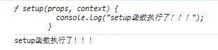
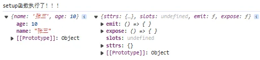
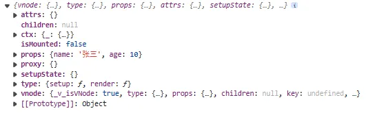
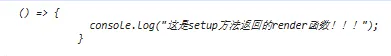
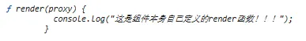

## 9-1 组件渲染的流程

在上面我们创建了 `vnode`，那么接下来顺其自然就应该到渲染 `vnode` 到我们的页面上，即实现 `render` 方法。

```typescript
// weak-vue\packages\runtime-core\src\render.ts
import { apiCreateApp } from "./apiCreateApp";

// 实现渲染Vue3组件==>vnode==>render
export function createRender(renderOptionDom) {
  // 真正实现渲染的函数（渲染vnode)
  let render = (vnode, container) => {
    // 第一次渲染（三个参数：旧的节点、当前节点、位置）
    patch(null, vnode, container);
  };

  // 返回一个具有createApp方法的对象，其中createApp负责生成一个具有mount挂载方法的app对象（包含属性、方法等），进而实现1、生成vnode；2、render渲染vnode
  return {
    createApp: apiCreateApp(render),
  };
}
```

`render` 渲染函数调用 `patch` 函数，`patch` 函数负责根据 `vnode` 的不同情况（组件、元素）来实现对应的渲染：

```typescript
// weak-vue\packages\runtime-core\src\render.ts
// patch函数负责根据vnode的不同情况（组件、元素）来实现对应的渲染
const patch = (n1, n2, container) => {
  // 针对不同的类型采取不同的渲染方式（vonode有一个shapeFlag标识来标识组件/元素）
  const { shapeFlag } = n2;
  // 等效于shapeFlag && shapeFlag === ShapeFlags.ELEMENT
  if (shapeFlag & ShapeFlags.ELEMENT) {
    // 处理元素
    // console.log("元素");
  } else if (shapeFlag & ShapeFlags.STATEFUL_COMPONENT) {
    // 处理组件
    processComponent(n1, n2, container);
  }
};
```

其中 `processComponent` 方法是负责处理组件的渲染的（分为初次渲染和更新两种情况）：

```typescript
// weak-vue\packages\runtime-core\src\render.ts
// 组件的创建方法（分为初次渲染和更新两种情况）
const processComponent = (n1, n2, container) => {
  if (n1 === null) {
    // 组件第一次加载
    mountComponent(n2, container);
  } else {
    // 更新
  }
};
```

其中 `mountComponent` 方法负责组件的真正渲染（实现由虚拟 dom 变成真实 dom），因为是第一次，要做的事情更多（比如`绑定 effect`），如果是更新，则触发 effect 即可：

```typescript
// weak-vue\packages\runtime-core\src\render.ts
// 组件渲染的真正方法（实现由虚拟dom变成真实dom），步骤（核心）：
const mountComponent = (InitialVnode, container) => {
  // 1、先有一个组件的实例对象（即Vue3组件渲染函数render传入的第一个参数proxy，其实proxy参数将组件定义的所有属性合并了，等效于在setup入口函数里面返回一个函数，可以用proxy.来获取属性）
  const instanece = (InitialVnode.component =
    createComponentInstance(InitialVnode)); // 记得在Vue3\packages\runtime-core\src\vnode.ts文件给vnode定义中加上这个属性
  // 2、解析数据到这个实例对象中
  setupComponet(instanece);
  // 3、创建一个effect让render函数执行
  setupRenderEffect();
};
```

<a name="KAOrE"></a>

## 9-2 组件渲染的具体实现

### 9-2-1 组件渲染的三个步骤方法的实现

上面说到，组件渲染分为三步，下面我们就分别实现这三个方法。<br />创建组件实例的 `createComponentInstance` 方法：

```typescript
// weak-vue\packages\runtime-core\src\component.ts
// 创建组件实例
export const createComponentInstance = (vnode) => {
  // instance本质是一个对象(包含组件的vnode，前面实现的组件的一些属性如参数props、自定义属性attrs，setup入口函数的状态等)
  const instance = {
    vnode,
    type: vnode.type, // 组件的所有属性都在这里面
    props: {}, // 组件的参数
    attrs: {}, // 自定义属性
    setupState: {}, // 用来存储setup入口函数的返回值
    ctx: {}, // 用来处理代理，保存实例的值，和下面的proxy一起用。没有这个会导致用类似instance.props.xxx才能获取属性，有了之后直接proxy.xxx便能直接获取了
    proxy: {}, // 和上面的ctx一起用
    render: false, // 存储组件实例的渲染函数
    isMounted: false, // 是否挂载
  };
  instance.ctx = { _: instance };
  return instance;
};
```

---

解析数据到该组件实例的 `setupComponet` 方法：

```typescript
// weak-vue\packages\runtime-core\src\component.ts
// 解析数据到该组件实例
export const setupComponet = (instance) => {
  // 代理
  instance.proxy = new Proxy(instance.ctx, componentPublicInstance as any);

  // 拿到值（上面instance的props等）
  const { props, children } = instance.vnode;
  // 把值设置到组件实例上
  instance.props = props;
  instance.children = children; // 相当于slot插槽
  // 看一下这个组件有无状态（有状态代表有setup入口函数或者render函数）
  const shapeFlag = instance.vnode.shapeFlag & ShapeFlags.STATEFUL_COMPONENT;
  if (shapeFlag) {
    setupStateComponent(instance);
  } else {
    // 如果无状态，说明是简单组件，直接渲染即可。
  }
};
```

<a name="EDDIB"></a>

### 9-2-2 对 setup 进行处理

其中，处理有状态的组件 `setupStateComponent` 方法定义如下，从上面知道：

```typescript
// weak-vue\packages\runtime-core\src\component.ts
// 处理有状态的组件
function setupStateComponent(instance) {
  // setup方法的返回值是我们的render函数的参数
  // 拿到组件的setup方法
  //   其中我们可以知道：
  // 1、setup方法的参数是组件参数props、上下文对象context（包含了父组件传递下来的非 prop 属性attrs、可以用来触发父组件中绑定的事件函数emit、一个指向当前组件实例的引用root、用来获取插槽内容的函数slot等）
  // 2、setup方法的返回值可以是一个对象（包含代理的响应式属性以供渲染函数使用），也可以是直接返回渲染函数
  const Component = instance.type; // createVNode时传入给type的是rootComponent，本质是一个对象，组件的所有属性都在这里，比如setup方法，比如render方法
  const { setup } = Component;
  console.log(setup);
  setup();
}
```

此时 `npm run build` 后去执行我们的测试用例：

```html
<!-- weak-vue\packages\examples\7.createApp.html -->
<div id="app">111111111111</div>
<script src="../runtime-dom/dist/runtime-dom.global.js"></script>
<script>
  let { createApp } = VueRuntimeDom;

  let App = {
    setup(props, context) {
      console.log("setup函数执行了！！！");
    },
  };
  createApp(App, { name: "张三", age: 10 }).mount("#app");
</script>
```

可以看到打印出预期的结果，说明我们目前的链路是正确的，此时拿到了 `setup` 入口函数。<br /><br />拿到 `setup` 函数后就要对传入的参数进行处理了。因为我们知道，`setup` 函数定义时传入的 `props` 与 `context` 实际上是两个形参，实际执行时要去处理真正的实参。

```typescript
// weak-vue\packages\runtime-core\src\component.ts
//  2、处理参数
const setupContext = createContext(instance); // 返回一个上下文对象
setup(instance.props, setupContext); // 实际执行的setup函数（实参）

// 处理context上下文对象（包含了父组件传递下来的非 prop 属性attrs、可以用来触发父组件中绑定的事件函数emit、一个指向当前组件实例的引用root、用来获取插槽内容的函数slot等）
function createContext(instance) {
  return {
    sttrs: instance.attrs,
    slots: instance.slots,
    emit: () => {},
    expose: () => {},
  };
}
```

此时去执行我们的测试用例：

```html
<!-- weak-vue\packages\examples\7.createApp.html -->
<script>
  setup(props, context) {
    console.log("setup函数执行了！！！");
    console.log(props,context);
  },
</script>
```

可以看到，`props` 与 `context` 被打印了出来：

说明我们目前的链路是正确的，此时正确处理了 `setup` 入口函数的参数。

---

<a name="oSqDX"></a>

### 9-2-3 对 render 进行处理

在上面我们正确处理了有状态的组件，即有 `setup` 入口函数的情况。如果没有 `setup` 入口函数，则会有 `render 渲染函数方法，执行即可。`render 方法传入的参数是 `proxy`，与获取 `setup `的步骤类似，可以在 `setupStateComponent` 方面里面直接拿到 `render` 方法。执行时也是将 `proxy` 的形参转化为实参 `instance.proxy`。

```typescript
// weak-vue\packages\runtime-core\src\component.ts
// 获取
const Component = instance.type; // createVNode时传入给type的是rootComponent，本质是一个对象，组件的所有属性都在这里，比如setup方法，比如render方法
const { setup, render } = Component;

// 执行
render(instance.proxy);
```

此时去执行我们的测试用例可以看到打印出我们的正确结果：<br /><br />此时其实得使用类似 `proxy.props.xxx` 这种方式才能拿到属性，如果想实现 `proxy.xxx` 这种方式实现，则需要借助代理，即把我们的实参 `instance.proxy` 进行代理，直接打点获取值时去 `get` 到正确的值返回。

```typescript
// weak-vue\packages\runtime-core\src\component.ts
// 代理
instance.proxy = new Proxy(instance.ctx, componentPublicInstance as any);
```

其中代理配置如下：

```typescript
// weak-vue\packages\runtime-core\src\componentPublicInstance.ts
import { hasOwn } from "@vue/shared";

// 处理组件实例代理时的配置对象
export const componentPublicInstance = {
  // target即{ _: instance }
  get({ _: instance }, key) {
    // 获取值的时候返回正确的结果，如proxy.xxx==>proxy.props.xxx
    const { props, data, setupState } = instance;
    if (key[0] === "$") {
      // 表示该属性不能获取
      return;
    }
    if (hasOwn(props, key)) {
      return props[key];
    } else if (hasOwn(setupState, key)) {
      return setupState[key];
    }
  },
  set({ _: instance }, key, value) {
    const { props, data, setupState } = instance;

    if (hasOwn(props, key)) {
      props[key] = value;
    } else if (hasOwn(setupState, key)) {
      setupState[key] = value;
    }
  },
};
```

---

在上面我们知道，Vue3 组件可以有 `setup` 入口函数，也可以没有。如果没有 `setup` 入口函数，则会有 `render` 渲染函数方法。而 `setup` 入口函数可以返回一个函数（此时相当于优先级高的 `render`，即使下面有 `render` 也不会执行了），也可以返回一个对象（存放响应式数据）。那为什么 `setup` 入口函数返回一个函数时相当于 `render` 渲染函数呢？为什么没有 `setup` 时会去执行 `render` 呢？这里会详细讲解。

在上面，我们在用于处理有状态组件的方法 `setupStateComponent` 中，拿到了 `setup`，因此可以判断组件上面是不是挂载了 `setup` 方法，然后不同情况不同处理：

```typescript
// weak-vue\packages\runtime-core\src\component.ts
if (setup) {
  const setupContext = createContext(instance); // 返回一个上下文对象
  const setupResult = setup(instance.props, setupContext); // 实际执行的setup函数（实参）
  // setup返回值有两种情况：1、对象；2、函数==>根据不同情况进行处理
  handlerSetupResult(instance, setupResult); // 如果是对象，则将值放在instance.setupState；如果是函数，则就是render函数
} else {
  // 没有setup则会有instance.type.render方法的（处理无setup有render的情况）
  finishComponentSetup(instance); // 通过vnode拿到render方法
}
```

其中，处理 setup 函数的返回结果的函数如下：

```typescript
// weak-vue\packages\runtime-core\src\component.ts
// 处理setup函数的返回结果
function handlerSetupResult(instance, setupResult) {
  if (isFunction(setupResult)) {
    instance.render = setupResult; // 处理有setup且返回函数的情况==>没必要使用组件的render方法了
  } else if (isObject(setupResult)) {
    instance.setupState = setupResult; // 处理有setup且返回对象的情况==>要使用组件的render方法了
  }

  // 最终也会走render（把render挂载到实例上去）
  finishComponentSetup(instance);
}
```

可以看到，有 `setup` 实际上最终也可能会去走 `render`，只不过这个 `render` 是 `setup` 自己返回的。

```typescript
// weak-vue\packages\runtime-core\src\component.ts
// 处理render（把render挂载到实例上去）
function finishComponentSetup(instance) {
  // 判断组件中有没有render方法，没有则
  const Component = instance.type; // createVNode时传入给type的是rootComponent，本质是一个对象，组件的所有属性都在这里，比如setup方法，比如render方法
  if (!instance.render) {
    // 这里的render指的是上面instance实例的render属性，在handlerSetupResult函数中会赋值（赋值的情况：组件有setup且返回函数），如果没有setup则此时会为false，则需要赋组件的render方法
    if (!Component.render && Component.template) {
      // TODO：模版编译
    }
    instance.render = Component.render;
  }
  console.log(instance.render);
}
```

此时去执行我们的测试用例：

```html
<!-- weak-vue\packages\examples\7.createApp.html -->
<div id="app">111111111111</div>
<script src="../runtime-dom/dist/runtime-dom.global.js"></script>
<script>
  let { createApp } = VueRuntimeDom;

  let App = {
    setup(props, context) {
      return () => {
        console.log("这是setup方法返回的render函数！！！");
      };
      //return {
      //   props,
      // };
    },

    render(proxy) {
      console.log("这是组件本身自己定义的render函数！！！");
    },
  };
  createApp(App, { name: "张三", age: 10 }).mount("#app");
</script>
```

可以看到打印出预期的结果：<br /><br />如果我们将 setup 返回值为对象，则打印结果为：<br /><br />说明目前链路正确，`render` 渲染方法已经正确地挂载到我们的组件实例上。

---

<a name="IJO7N"></a>

## 9-3 总结

其实目前就干了四件事，具体请看源码和注释：

1. 给组件创建一个 `instance` 实例并添加相关属性信息
2. 处理 `setup` 方法中的参数（传递 `props`、封装 `context`）
3. 处理 `render` 方法中的参数（代理 `proxy`）
4. 处理 `setup` 方法的返回值（函数或者对象）

---

到这里，组件渲染的大体流程讲得差不多了，源码请看提交记录：[9、组件的渲染（一）](https://github.com/XC0703/VueSouceCodeStudy/commit/a6b38f55be0a8ce698536525bf87e213bd026268)
